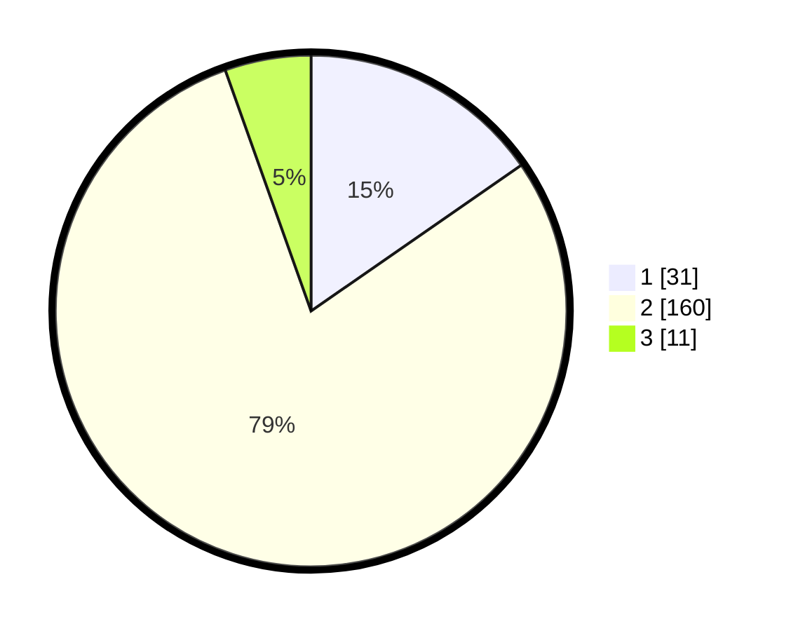

# Hasil

## Grafik

## Tabel

| No. | Nama Paslon    | Suara | Suara (raw) | Persentase |
|:--- |:-------------- | -----:| -----------:| ----------:|
| 1   | ANIES MUHAIMIN | 31    | [31][p-1]   | 15,35      |
| 2   | PRABOWO GIBRAN | 160   | [160][p-2]  | 79,21      |
| 3   | GANJAR MAHFUD  | 11    | [11][p-3]   | 5,45       |

[p-1]: https://github.com/gigit-pemilu/pemilu-2024/blob/main/pilpres/hitung-suara/sub/32-jawa-barat/sub/13-subang/sub/09-ciasem/sub/2001-ciasem-girang/sub/013-tps/sub/paslon-1.txt
[p-2]: https://github.com/gigit-pemilu/pemilu-2024/blob/main/pilpres/hitung-suara/sub/32-jawa-barat/sub/13-subang/sub/09-ciasem/sub/2001-ciasem-girang/sub/013-tps/sub/paslon-2.txt
[p-3]: https://github.com/gigit-pemilu/pemilu-2024/blob/main/pilpres/hitung-suara/sub/32-jawa-barat/sub/13-subang/sub/09-ciasem/sub/2001-ciasem-girang/sub/013-tps/sub/paslon-3.txt

## Foto C Plano

https://sirekap-obj-formc.kpu.go.id/7cea/pemilu/ppwp/32/13/09/20/01/3213092001013-20240214-160110--2bb3a2f6-ea67-472b-9523-91249f7de335.jpg

https://sirekap-obj-formc.kpu.go.id/7cea/pemilu/ppwp/32/13/09/20/01/3213092001013-20240214-155823--65c47878-d8b2-4299-b95a-a613638ae726.jpg

https://sirekap-obj-formc.kpu.go.id/7cea/pemilu/ppwp/32/13/09/20/01/3213092001013-20240214-160056--b30e272f-33a7-43ba-b99d-e6abca360d9d.jpg

## Metadata

| Key        | Value               |
| ---------- | ------------------- |
| Time Stamp | 2024-02-19 14:00:00 |

