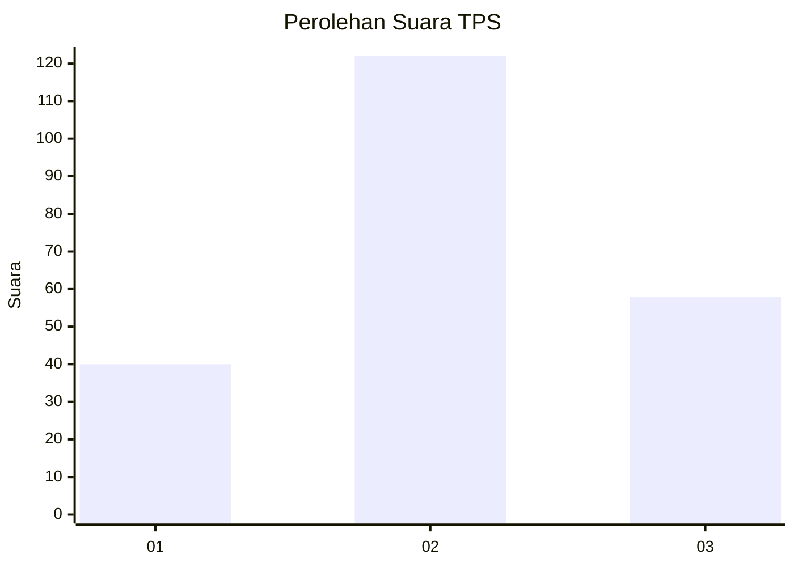
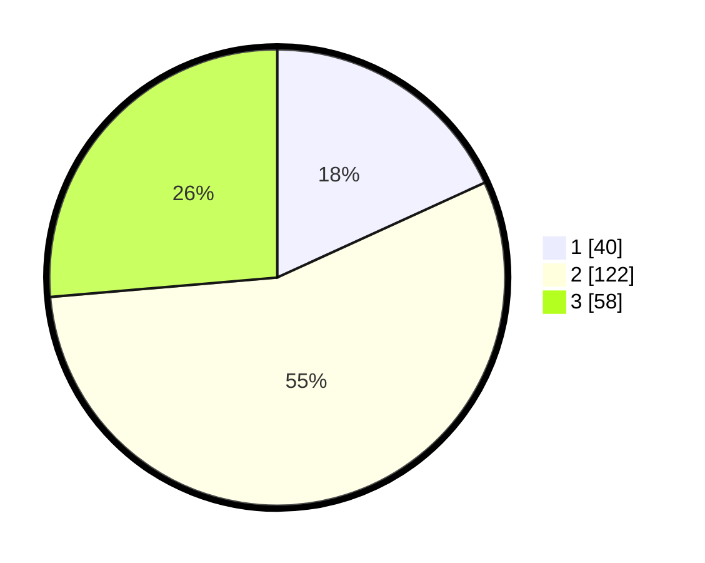

# Hasil

## Grafik

## Tabel

| No. | Nama Paslon    | Suara | Suara (raw) | Persentase |
|:--- |:-------------- | -----:| -----------:| ----------:|
| 1   | ANIES MUHAIMIN | 40    | [40][p-1]   | 18,18      |
| 2   | PRABOWO GIBRAN | 122   | [122][p-2]  | 55,45      |
| 3   | GANJAR MAHFUD  | 58    | [58][p-3]   | 26,36      |

[p-1]: https://github.com/gigit-pemilu/pemilu-2024/blob/main/pilpres/hitung-suara/sub/32-jawa-barat/sub/13-subang/sub/10-pusakanagara/sub/2005-pusakaratu/sub/001-tps/sub/paslon-1.txt
[p-2]: https://github.com/gigit-pemilu/pemilu-2024/blob/main/pilpres/hitung-suara/sub/32-jawa-barat/sub/13-subang/sub/10-pusakanagara/sub/2005-pusakaratu/sub/001-tps/sub/paslon-2.txt
[p-3]: https://github.com/gigit-pemilu/pemilu-2024/blob/main/pilpres/hitung-suara/sub/32-jawa-barat/sub/13-subang/sub/10-pusakanagara/sub/2005-pusakaratu/sub/001-tps/sub/paslon-3.txt

## Foto C Plano

https://sirekap-obj-formc.kpu.go.id/af9a/pemilu/ppwp/32/13/10/20/05/3213102005001-20240214-222144--fc9dbe49-c65c-4a81-8a14-4dbc8a437728.jpg

https://sirekap-obj-formc.kpu.go.id/af9a/pemilu/ppwp/32/13/10/20/05/3213102005001-20240214-222253--9fed76f0-5c56-4615-b089-d54c251e809a.jpg

https://sirekap-obj-formc.kpu.go.id/af9a/pemilu/ppwp/32/13/10/20/05/3213102005001-20240214-222331--9feaccf0-be4e-4d42-b4d0-76f523691f57.jpg

## Metadata

| Key        | Value               |
| ---------- | ------------------- |
| Time Stamp | 2024-02-20 12:00:00 |

