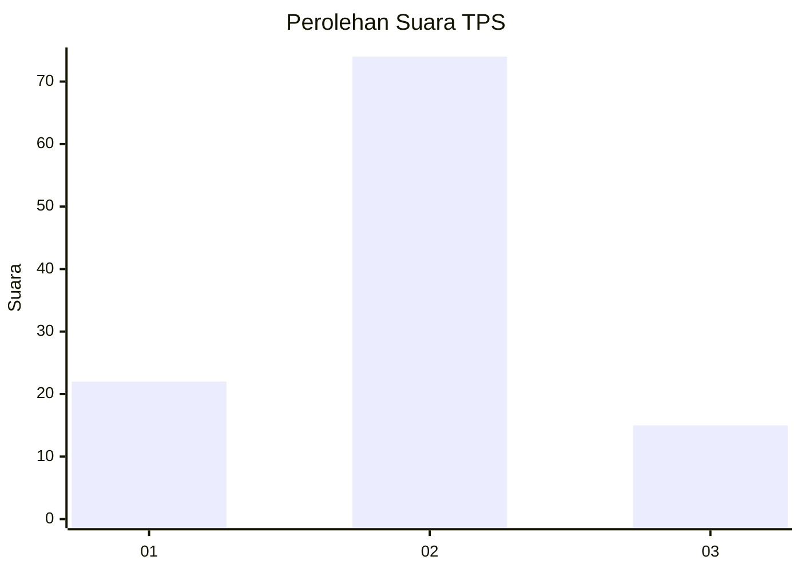
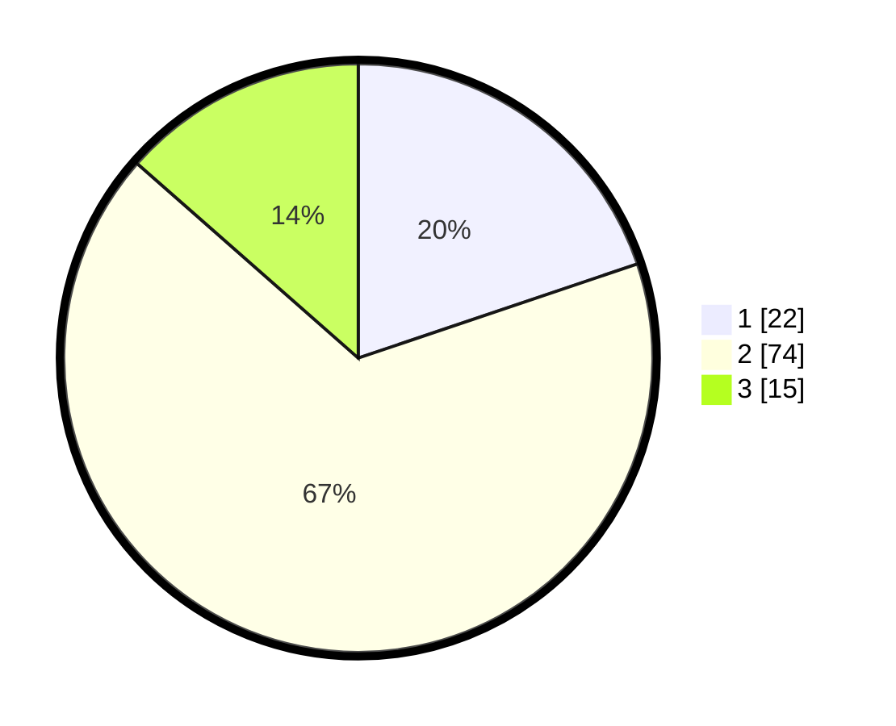

# Hasil

## Grafik

## Tabel

| No. | Nama Paslon    | Suara | Suara (raw) | Persentase |
|:--- |:-------------- | -----:| -----------:| ----------:|
| 1   | ANIES MUHAIMIN | 22    | [22][p-1]   | 19,82      |
| 2   | PRABOWO GIBRAN | 74    | [74][p-2]   | 66,67      |
| 3   | GANJAR MAHFUD  | 15    | [15][p-3]   | 13,51      |

[p-1]: https://github.com/gigit-pemilu/pemilu-2024-32-jawa-barat/blob/main/pilpres/hitung-suara/sub/32-jawa-barat/sub/13-subang/sub/10-pusakanagara/sub/2005-pusakaratu/sub/006-tps/sub/paslon-1.txt
[p-2]: https://github.com/gigit-pemilu/pemilu-2024-32-jawa-barat/blob/main/pilpres/hitung-suara/sub/32-jawa-barat/sub/13-subang/sub/10-pusakanagara/sub/2005-pusakaratu/sub/006-tps/sub/paslon-2.txt
[p-3]: https://github.com/gigit-pemilu/pemilu-2024-32-jawa-barat/blob/main/pilpres/hitung-suara/sub/32-jawa-barat/sub/13-subang/sub/10-pusakanagara/sub/2005-pusakaratu/sub/006-tps/sub/paslon-3.txt

## Foto C Plano

https://sirekap-obj-formc.kpu.go.id/2544/pemilu/ppwp/32/13/10/20/05/3213102005006-20240215-000007--127c4583-4dc5-4ff4-a2dd-4816f002fa10.jpg

https://sirekap-obj-formc.kpu.go.id/2544/pemilu/ppwp/32/13/10/20/05/3213102005006-20240215-000134--13fc1747-82fd-4d73-9e8b-1950ae74a6d1.jpg

https://sirekap-obj-formc.kpu.go.id/2544/pemilu/ppwp/32/13/10/20/05/3213102005006-20240215-000148--60bc4dfd-2ab6-465d-a7bb-63d346704cfe.jpg

## Metadata

| Key        | Value               |
| ---------- | ------------------- |
| Time Stamp | 2024-02-19 14:00:00 |

