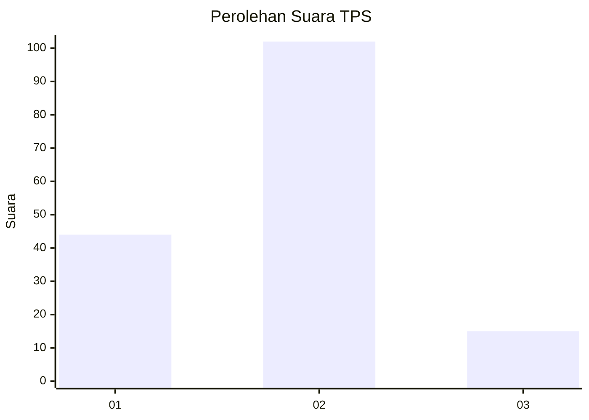
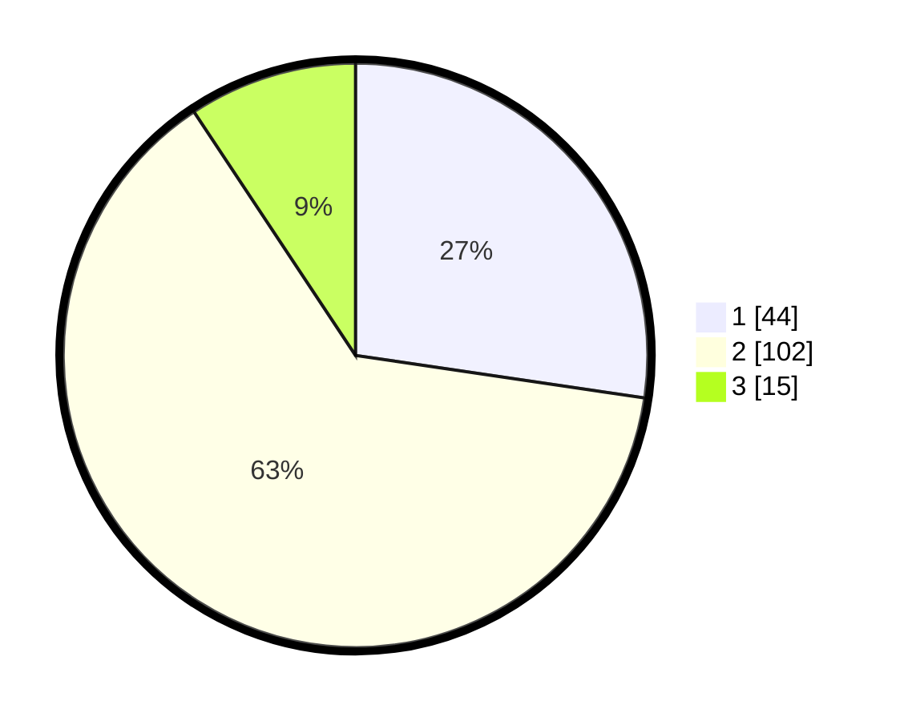

# Hasil

## Grafik

## Tabel

| No. | Nama Paslon    | Suara | Suara (raw) | Persentase |
|:--- |:-------------- | -----:| -----------:| ----------:|
| 1   | ANIES MUHAIMIN | 44    | [44][p-1]   | 27,33      |
| 2   | PRABOWO GIBRAN | 102   | [102][p-2]  | 63,35      |
| 3   | GANJAR MAHFUD  | 15    | [15][p-3]   | 9,32       |

[p-1]: https://github.com/gigit-pemilu/pemilu-2024/blob/main/pilpres/hitung-suara/sub/32-jawa-barat/sub/13-subang/sub/10-pusakanagara/sub/2005-pusakaratu/sub/007-tps/sub/paslon-1.txt
[p-2]: https://github.com/gigit-pemilu/pemilu-2024/blob/main/pilpres/hitung-suara/sub/32-jawa-barat/sub/13-subang/sub/10-pusakanagara/sub/2005-pusakaratu/sub/007-tps/sub/paslon-2.txt
[p-3]: https://github.com/gigit-pemilu/pemilu-2024/blob/main/pilpres/hitung-suara/sub/32-jawa-barat/sub/13-subang/sub/10-pusakanagara/sub/2005-pusakaratu/sub/007-tps/sub/paslon-3.txt

## Foto C Plano

https://sirekap-obj-formc.kpu.go.id/99f1/pemilu/ppwp/32/13/10/20/05/3213102005007-20240214-203629--4e7a1e49-4581-4879-a491-d17cc7b9bb4f.jpg

https://sirekap-obj-formc.kpu.go.id/99f1/pemilu/ppwp/32/13/10/20/05/3213102005007-20240214-205628--20cd81cb-5824-4e11-873e-7527245eb0ea.jpg

https://sirekap-obj-formc.kpu.go.id/99f1/pemilu/ppwp/32/13/10/20/05/3213102005007-20240214-203817--30ae536c-2cb8-47a0-8ca7-8a919832b11a.jpg

## Metadata

| Key        | Value               |
| ---------- | ------------------- |
| Time Stamp | 2024-02-15 00:41:44 |

