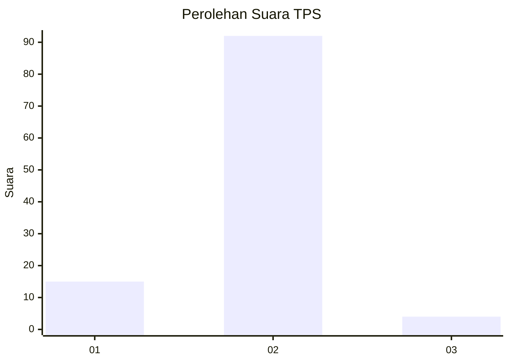
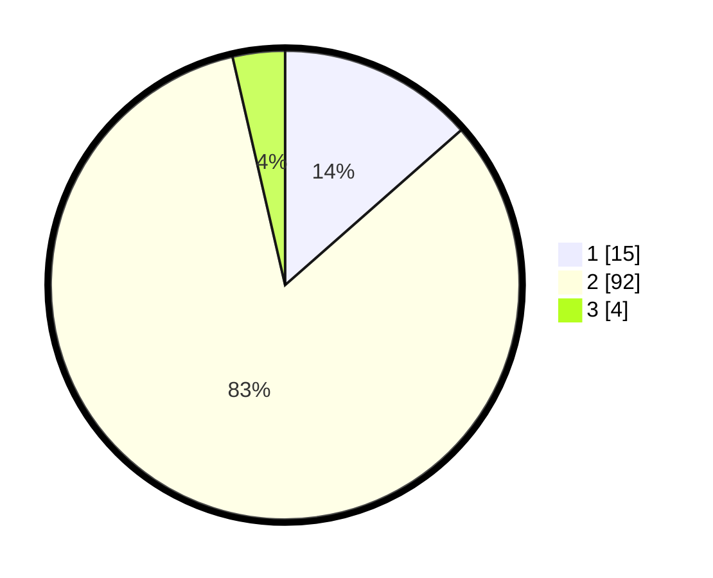

# Hasil

## Grafik

## Tabel

| No. | Nama Paslon    | Suara | Suara (raw) | Persentase |
|:--- |:-------------- | -----:| -----------:| ----------:|
| 1   | ANIES MUHAIMIN | 15    | [15][p-1]   | 13,51      |
| 2   | PRABOWO GIBRAN | 92    | [92][p-2]   | 82,88      |
| 3   | GANJAR MAHFUD  | 4     | [4][p-3]    | 3,60       |

[p-1]: https://github.com/gigit-pemilu/pemilu-2024/blob/main/pilpres/hitung-suara/sub/32-jawa-barat/sub/13-subang/sub/10-pusakanagara/sub/2008-patimban/sub/002-tps/sub/paslon-1.txt
[p-2]: https://github.com/gigit-pemilu/pemilu-2024/blob/main/pilpres/hitung-suara/sub/32-jawa-barat/sub/13-subang/sub/10-pusakanagara/sub/2008-patimban/sub/002-tps/sub/paslon-2.txt
[p-3]: https://github.com/gigit-pemilu/pemilu-2024/blob/main/pilpres/hitung-suara/sub/32-jawa-barat/sub/13-subang/sub/10-pusakanagara/sub/2008-patimban/sub/002-tps/sub/paslon-3.txt

## Foto C Plano

https://sirekap-obj-formc.kpu.go.id/3f7b/pemilu/ppwp/32/13/10/20/08/3213102008002-20240214-223112--9254cf45-84f8-4d3d-95ac-d11e21ac72da.jpg

https://sirekap-obj-formc.kpu.go.id/3f7b/pemilu/ppwp/32/13/10/20/08/3213102008002-20240214-223225--a8cb50d9-22b6-4f84-89a7-a18c1387550f.jpg

https://sirekap-obj-formc.kpu.go.id/3f7b/pemilu/ppwp/32/13/10/20/08/3213102008002-20240214-223306--a669453b-1f5a-464b-9f62-36672fc20847.jpg

## Metadata

| Key        | Value               |
| ---------- | ------------------- |
| Time Stamp | 2024-02-20 12:00:00 |

