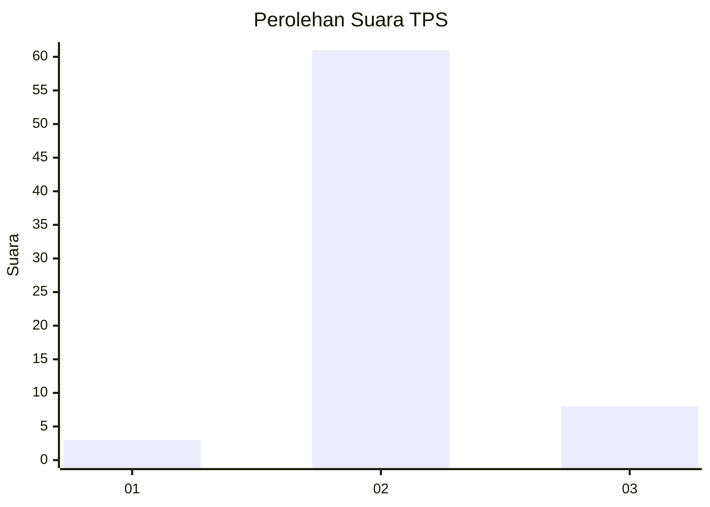
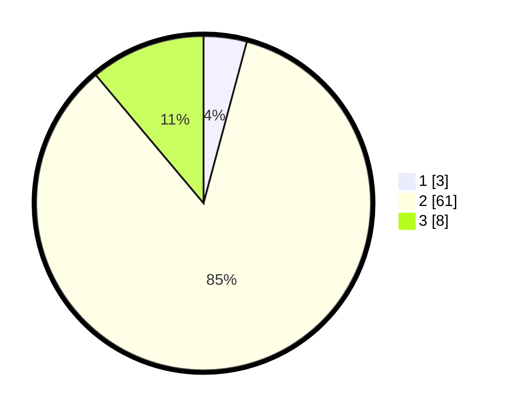

# Hasil

## Grafik

## Tabel

| No. | Nama Paslon    | Suara | Suara (raw) | Persentase |
|:--- |:-------------- | -----:| -----------:| ----------:|
| 1   | ANIES MUHAIMIN | 3     | [3][p-1]    | 4,17       |
| 2   | PRABOWO GIBRAN | 61    | [61][p-2]   | 84,72      |
| 3   | GANJAR MAHFUD  | 8     | [8][p-3]    | 11,11      |

[p-1]: https://github.com/gigit-pemilu/pemilu-2024-32-jawa-barat/blob/main/pilpres/hitung-suara/sub/32-jawa-barat/sub/13-subang/sub/10-pusakanagara/sub/2012-rancadaka/sub/020-tps/sub/paslon-1.txt
[p-2]: https://github.com/gigit-pemilu/pemilu-2024-32-jawa-barat/blob/main/pilpres/hitung-suara/sub/32-jawa-barat/sub/13-subang/sub/10-pusakanagara/sub/2012-rancadaka/sub/020-tps/sub/paslon-2.txt
[p-3]: https://github.com/gigit-pemilu/pemilu-2024-32-jawa-barat/blob/main/pilpres/hitung-suara/sub/32-jawa-barat/sub/13-subang/sub/10-pusakanagara/sub/2012-rancadaka/sub/020-tps/sub/paslon-3.txt

## Foto C Plano

https://sirekap-obj-formc.kpu.go.id/629f/pemilu/ppwp/32/13/10/20/12/3213102012020-20240214-203020--3f2f95c1-ebbc-4eeb-afac-32d31c6c8608.jpg

https://sirekap-obj-formc.kpu.go.id/629f/pemilu/ppwp/32/13/10/20/12/3213102012020-20240214-210945--2d633dff-b9a9-433a-97ac-fc31cfd7c4ed.jpg

https://sirekap-obj-formc.kpu.go.id/629f/pemilu/ppwp/32/13/10/20/12/3213102012020-20240214-195906--fc5a78b1-f3a5-41b4-9a21-47ea37918eb5.jpg

## Metadata

| Key        | Value               |
| ---------- | ------------------- |
| Time Stamp | 2024-02-19 15:00:00 |

