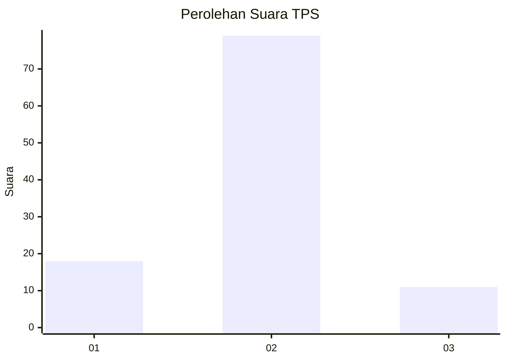
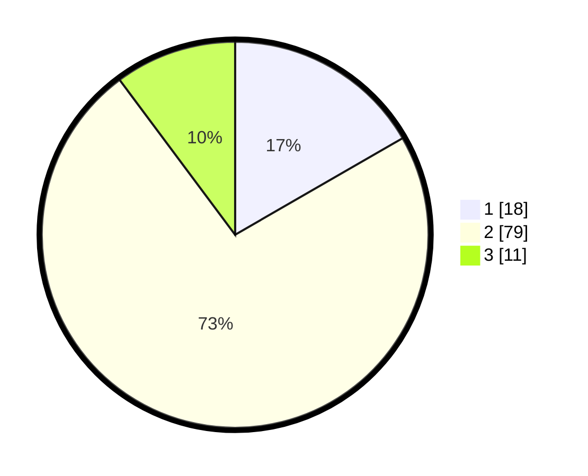

# Hasil

## Grafik

## Tabel

| No. | Nama Paslon    | Suara | Suara (raw) | Persentase |
|:--- |:-------------- | -----:| -----------:| ----------:|
| 1   | ANIES MUHAIMIN | 18    | [18][p-1]   | 16,67      |
| 2   | PRABOWO GIBRAN | 79    | [79][p-2]   | 73,15      |
| 3   | GANJAR MAHFUD  | 11    | [11][p-3]   | 10,19      |

[p-1]: https://github.com/gigit-pemilu/pemilu-2024/blob/main/pilpres/hitung-suara/sub/32-jawa-barat/sub/13-subang/sub/10-pusakanagara/sub/2015-mundusari/sub/009-tps/sub/paslon-1.txt
[p-2]: https://github.com/gigit-pemilu/pemilu-2024/blob/main/pilpres/hitung-suara/sub/32-jawa-barat/sub/13-subang/sub/10-pusakanagara/sub/2015-mundusari/sub/009-tps/sub/paslon-2.txt
[p-3]: https://github.com/gigit-pemilu/pemilu-2024/blob/main/pilpres/hitung-suara/sub/32-jawa-barat/sub/13-subang/sub/10-pusakanagara/sub/2015-mundusari/sub/009-tps/sub/paslon-3.txt

## Foto C Plano

https://sirekap-obj-formc.kpu.go.id/18ff/pemilu/ppwp/32/13/10/20/15/3213102015009-20240214-220914--3d9575af-f541-4d16-9b8b-866bfb7665cc.jpg

https://sirekap-obj-formc.kpu.go.id/18ff/pemilu/ppwp/32/13/10/20/15/3213102015009-20240214-220918--34cc71b1-4492-46ce-a79c-9904dc7bdde7.jpg

https://sirekap-obj-formc.kpu.go.id/18ff/pemilu/ppwp/32/13/10/20/15/3213102015009-20240214-220932--a57f5027-af96-47c0-98ee-2781d3b0d39e.jpg

## Metadata

| Key        | Value               |
| ---------- | ------------------- |
| Time Stamp | 2024-02-20 12:00:00 |

