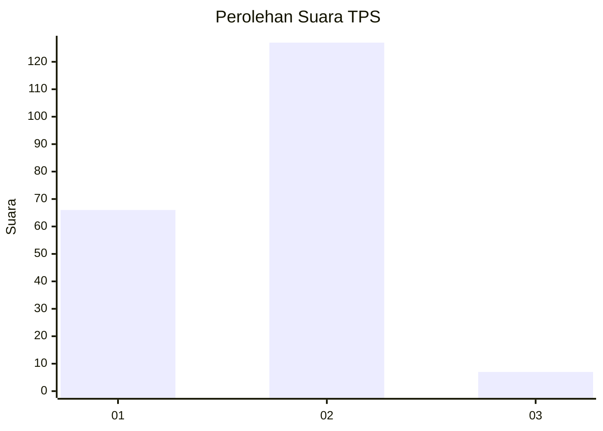
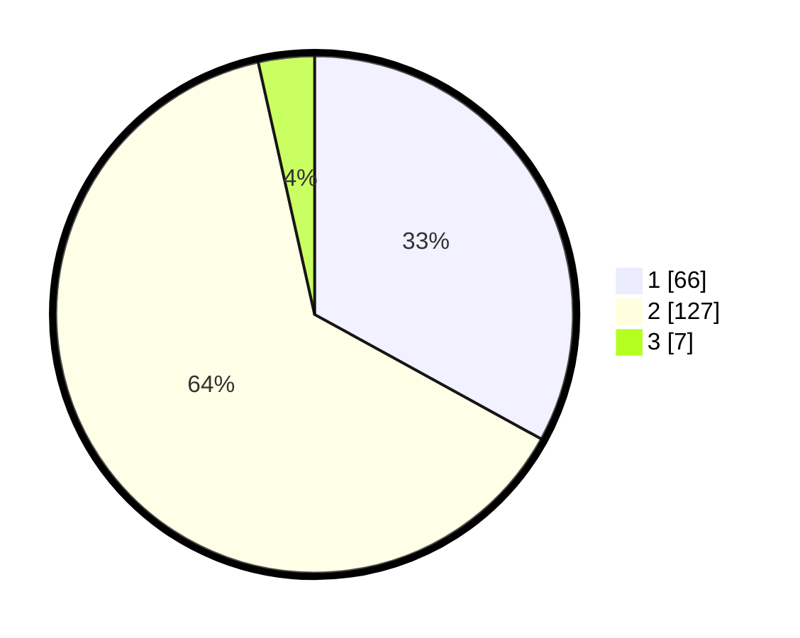

# Hasil

## Grafik

## Tabel

| No. | Nama Paslon    | Suara | Suara (raw) | Persentase |
|:--- |:-------------- | -----:| -----------:| ----------:|
| 1   | ANIES MUHAIMIN | 66    | [66][p-1]   | 33,00      |
| 2   | PRABOWO GIBRAN | 127   | [127][p-2]  | 63,50      |
| 3   | GANJAR MAHFUD  | 7     | [7][p-3]    | 3,50       |

[p-1]: https://github.com/gigit-pemilu/pemilu-2024-32-jawa-barat/blob/main/pilpres/hitung-suara/sub/32-jawa-barat/sub/13-subang/sub/11-pamanukan/sub/2002-rancasari/sub/001-tps/sub/paslon-1.txt
[p-2]: https://github.com/gigit-pemilu/pemilu-2024-32-jawa-barat/blob/main/pilpres/hitung-suara/sub/32-jawa-barat/sub/13-subang/sub/11-pamanukan/sub/2002-rancasari/sub/001-tps/sub/paslon-2.txt
[p-3]: https://github.com/gigit-pemilu/pemilu-2024-32-jawa-barat/blob/main/pilpres/hitung-suara/sub/32-jawa-barat/sub/13-subang/sub/11-pamanukan/sub/2002-rancasari/sub/001-tps/sub/paslon-3.txt

## Foto C Plano

https://sirekap-obj-formc.kpu.go.id/49c3/pemilu/ppwp/32/13/11/20/02/3213112002001-20240214-191509--6e7fd26e-ed9a-4139-b4b7-dd6547cd8278.jpg

https://sirekap-obj-formc.kpu.go.id/49c3/pemilu/ppwp/32/13/11/20/02/3213112002001-20240214-155621--c8c23685-ec5c-4dac-ab6e-f245aaac6755.jpg

https://sirekap-obj-formc.kpu.go.id/49c3/pemilu/ppwp/32/13/11/20/02/3213112002001-20240214-191922--9680d940-83dd-4d95-91d5-66c337892f0b.jpg

## Metadata

| Key        | Value               |
| ---------- | ------------------- |
| Time Stamp | 2024-02-14 21:46:01 |

