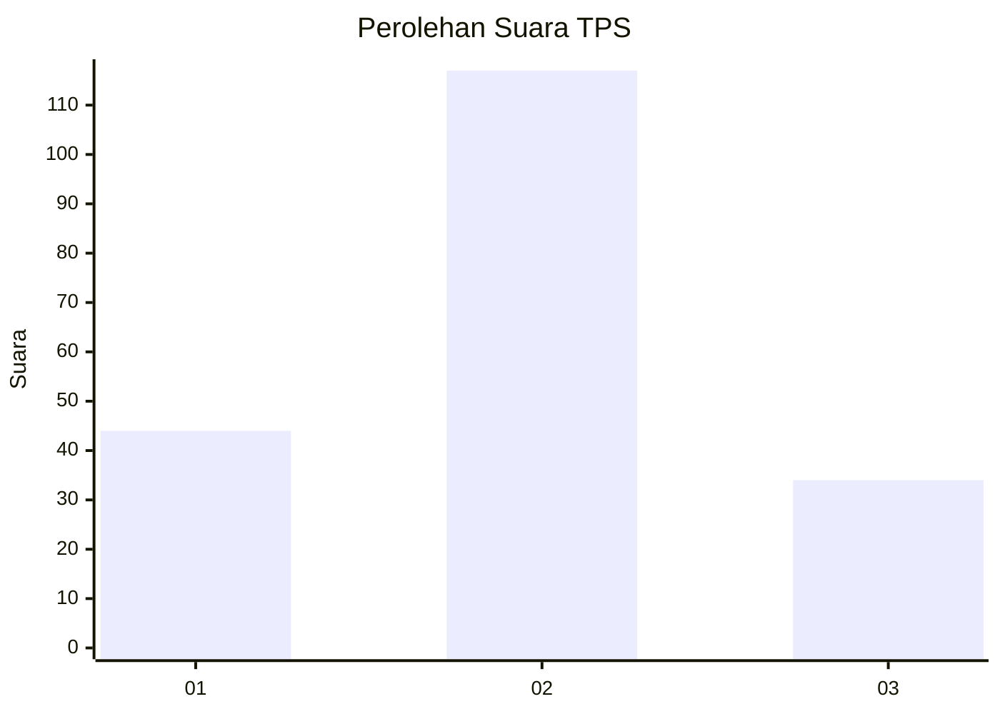

# Hasil

## Grafik

## Tabel

| No. | Nama Paslon    | Suara | Suara (raw) | Persentase |
|:--- |:-------------- | -----:| -----------:| ----------:|
| 1   | ANIES MUHAIMIN | 44    | [44][p-1]   | 22,56      |
| 2   | PRABOWO GIBRAN | 117   | [117][p-2]  | 60,00      |
| 3   | GANJAR MAHFUD  | 34    | [34][p-3]   | 17,44      |

[p-1]: https://github.com/gigit-pemilu/pemilu-2024-32-jawa-barat/blob/main/pilpres/hitung-suara/sub/32-jawa-barat/sub/13-subang/sub/11-pamanukan/sub/2002-rancasari/sub/003-tps/sub/paslon-1.txt
[p-2]: https://github.com/gigit-pemilu/pemilu-2024-32-jawa-barat/blob/main/pilpres/hitung-suara/sub/32-jawa-barat/sub/13-subang/sub/11-pamanukan/sub/2002-rancasari/sub/003-tps/sub/paslon-2.txt
[p-3]: https://github.com/gigit-pemilu/pemilu-2024-32-jawa-barat/blob/main/pilpres/hitung-suara/sub/32-jawa-barat/sub/13-subang/sub/11-pamanukan/sub/2002-rancasari/sub/003-tps/sub/paslon-3.txt

## Foto C Plano

https://sirekap-obj-formc.kpu.go.id/4f0d/pemilu/ppwp/32/13/11/20/02/3213112002003-20240215-005115--537a70c9-f969-4d4a-b197-7d1288c60de6.jpg

https://sirekap-obj-formc.kpu.go.id/4f0d/pemilu/ppwp/32/13/11/20/02/3213112002003-20240215-005256--cb1aba41-7ca8-43b9-9b77-f43d9aed7dfb.jpg

https://sirekap-obj-formc.kpu.go.id/4f0d/pemilu/ppwp/32/13/11/20/02/3213112002003-20240215-005756--ce8d3b75-fbda-4696-9378-13ec3f5f0836.jpg

## Metadata

| Key        | Value               |
| ---------- | ------------------- |
| Time Stamp | 2024-02-19 13:00:00 |

