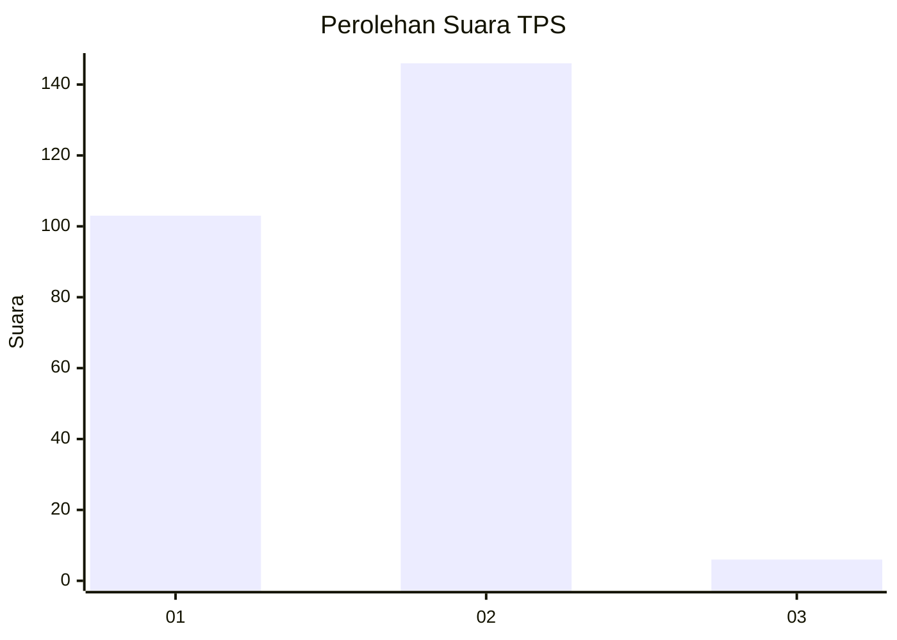
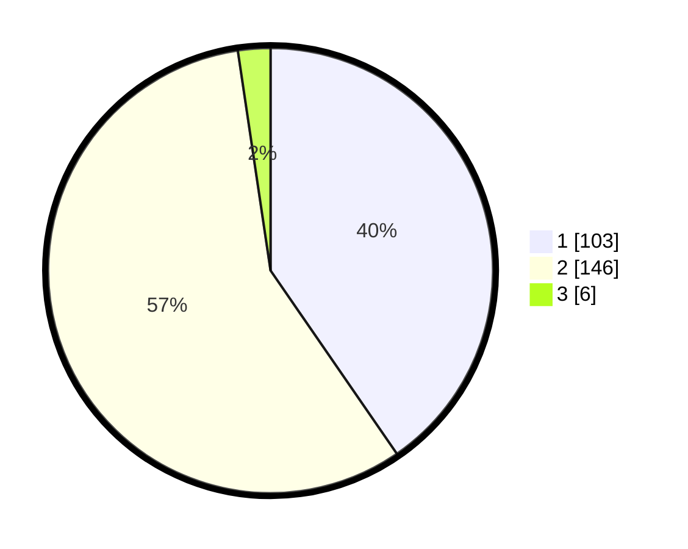

# Hasil

## Grafik

## Tabel

| No. | Nama Paslon    | Suara | Suara (raw) | Persentase |
|:--- |:-------------- | -----:| -----------:| ----------:|
| 1   | ANIES MUHAIMIN | 103   | [103][p-1]  | 40,39      |
| 2   | PRABOWO GIBRAN | 146   | [146][p-2]  | 57,25      |
| 3   | GANJAR MAHFUD  | 6     | [6][p-3]    | 2,35       |

[p-1]: https://github.com/gigit-pemilu/pemilu-2024-32-jawa-barat/blob/main/pilpres/hitung-suara/sub/32-jawa-barat/sub/13-subang/sub/12-jalancagak/sub/2014-tambakmekar/sub/007-tps/sub/paslon-1.txt
[p-2]: https://github.com/gigit-pemilu/pemilu-2024-32-jawa-barat/blob/main/pilpres/hitung-suara/sub/32-jawa-barat/sub/13-subang/sub/12-jalancagak/sub/2014-tambakmekar/sub/007-tps/sub/paslon-2.txt
[p-3]: https://github.com/gigit-pemilu/pemilu-2024-32-jawa-barat/blob/main/pilpres/hitung-suara/sub/32-jawa-barat/sub/13-subang/sub/12-jalancagak/sub/2014-tambakmekar/sub/007-tps/sub/paslon-3.txt

## Foto C Plano

https://sirekap-obj-formc.kpu.go.id/6d96/pemilu/ppwp/32/13/12/20/14/3213122014007-20240215-025432--da4a4db7-ff7c-4be8-b942-efa0f2089439.jpg

https://sirekap-obj-formc.kpu.go.id/6d96/pemilu/ppwp/32/13/12/20/14/3213122014007-20240215-025527--11e76246-0334-460a-8372-382be6807f00.jpg

https://sirekap-obj-formc.kpu.go.id/6d96/pemilu/ppwp/32/13/12/20/14/3213122014007-20240214-223550--2c668138-08aa-4b26-ab70-a14a92527f07.jpg

## Metadata

| Key        | Value               |
| ---------- | ------------------- |
| Time Stamp | 2024-02-15 12:00:28 |

