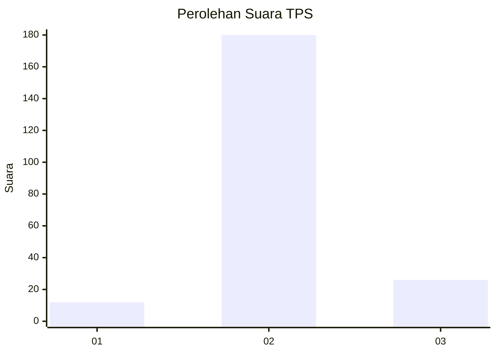
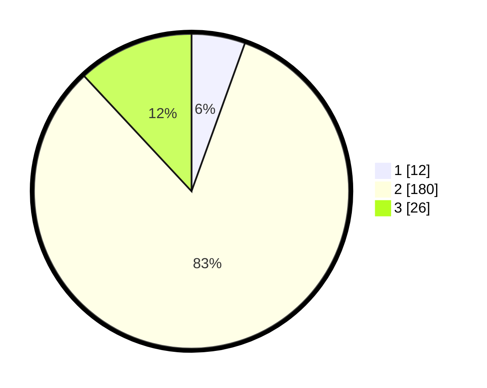

# Hasil

## Grafik

## Tabel

| No. | Nama Paslon    | Suara | Suara (raw) | Persentase |
|:--- |:-------------- | -----:| -----------:| ----------:|
| 1   | ANIES MUHAIMIN | 12    | [12][p-1]   | 5,50       |
| 2   | PRABOWO GIBRAN | 180   | [180][p-2]  | 82,57      |
| 3   | GANJAR MAHFUD  | 26    | [26][p-3]   | 11,93      |

[p-1]: https://github.com/gigit-pemilu/pemilu-2024-32-jawa-barat/blob/main/pilpres/hitung-suara/sub/32-jawa-barat/sub/13-subang/sub/13-blanakan/sub/2001-tanjungtiga/sub/008-tps/sub/paslon-1.txt
[p-2]: https://github.com/gigit-pemilu/pemilu-2024-32-jawa-barat/blob/main/pilpres/hitung-suara/sub/32-jawa-barat/sub/13-subang/sub/13-blanakan/sub/2001-tanjungtiga/sub/008-tps/sub/paslon-2.txt
[p-3]: https://github.com/gigit-pemilu/pemilu-2024-32-jawa-barat/blob/main/pilpres/hitung-suara/sub/32-jawa-barat/sub/13-subang/sub/13-blanakan/sub/2001-tanjungtiga/sub/008-tps/sub/paslon-3.txt

## Foto C Plano

https://sirekap-obj-formc.kpu.go.id/2ee2/pemilu/ppwp/32/13/13/20/01/3213132001008-20240215-042604--827cd60e-4e49-4195-9758-b6ec870620d0.jpg

https://sirekap-obj-formc.kpu.go.id/2ee2/pemilu/ppwp/32/13/13/20/01/3213132001008-20240215-042406--2dc11948-bea9-43d6-adf5-fb904463fca5.jpg

https://sirekap-obj-formc.kpu.go.id/2ee2/pemilu/ppwp/32/13/13/20/01/3213132001008-20240215-042302--eb063e41-aa6e-4305-b913-48e7b812b7b3.jpg

## Metadata

| Key        | Value               |
| ---------- | ------------------- |
| Time Stamp | 2024-02-19 14:00:00 |

