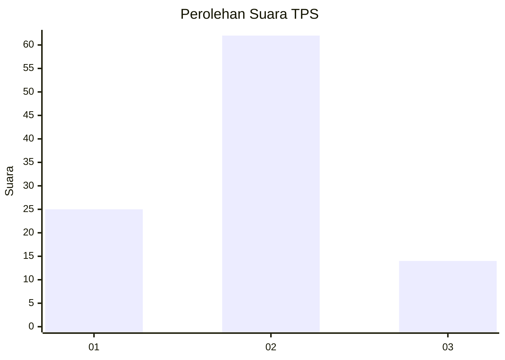
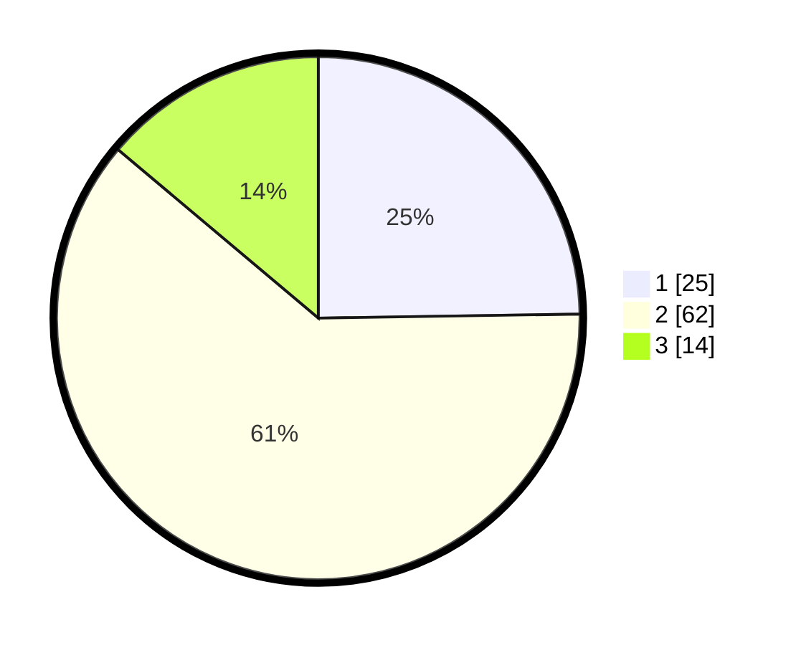

# Hasil

## Grafik

## Tabel

| No. | Nama Paslon    | Suara | Suara (raw) | Persentase |
|:--- |:-------------- | -----:| -----------:| ----------:|
| 1   | ANIES MUHAIMIN | 25    | [25][p-1]   | 24,75      |
| 2   | PRABOWO GIBRAN | 62    | [62][p-2]   | 61,39      |
| 3   | GANJAR MAHFUD  | 14    | [14][p-3]   | 13,86      |

[p-1]: https://github.com/gigit-pemilu/pemilu-2024-32-jawa-barat/blob/main/pilpres/hitung-suara/sub/32-jawa-barat/sub/13-subang/sub/13-blanakan/sub/2001-tanjungtiga/sub/011-tps/sub/paslon-1.txt
[p-2]: https://github.com/gigit-pemilu/pemilu-2024-32-jawa-barat/blob/main/pilpres/hitung-suara/sub/32-jawa-barat/sub/13-subang/sub/13-blanakan/sub/2001-tanjungtiga/sub/011-tps/sub/paslon-2.txt
[p-3]: https://github.com/gigit-pemilu/pemilu-2024-32-jawa-barat/blob/main/pilpres/hitung-suara/sub/32-jawa-barat/sub/13-subang/sub/13-blanakan/sub/2001-tanjungtiga/sub/011-tps/sub/paslon-3.txt

## Foto C Plano

https://sirekap-obj-formc.kpu.go.id/3d99/pemilu/ppwp/32/13/13/20/01/3213132001011-20240215-010857--7b174ba9-32f5-4d1c-8bdd-66e3c74e42c3.jpg

https://sirekap-obj-formc.kpu.go.id/3d99/pemilu/ppwp/32/13/13/20/01/3213132001011-20240215-022808--33e82b4d-3e43-4bb7-b79c-ac7fe3039ab3.jpg

https://sirekap-obj-formc.kpu.go.id/3d99/pemilu/ppwp/32/13/13/20/01/3213132001011-20240215-011158--7ca20523-5334-4d7d-8c63-302cc18eb9a4.jpg

## Metadata

| Key        | Value               |
| ---------- | ------------------- |
| Time Stamp | 2024-02-20 12:00:00 |

