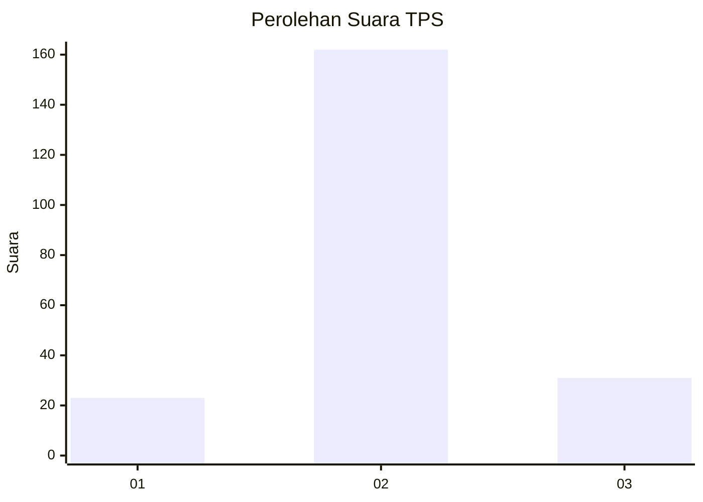
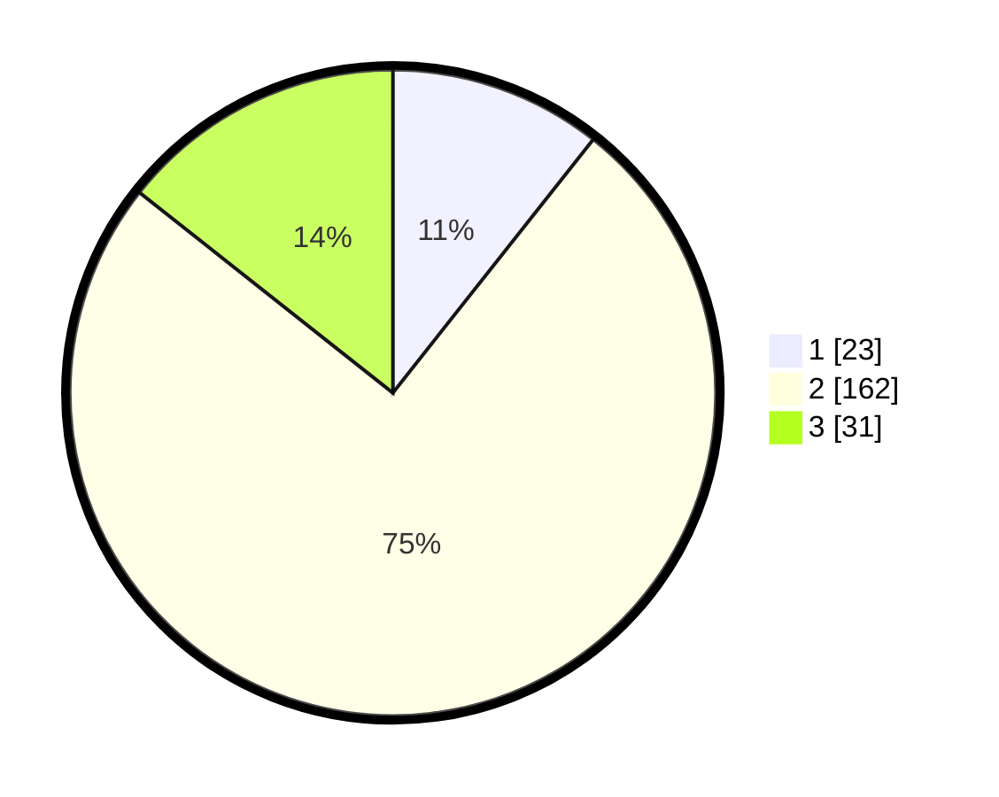

# Hasil

## Grafik

## Tabel

| No. | Nama Paslon    | Suara | Suara (raw) | Persentase |
|:--- |:-------------- | -----:| -----------:| ----------:|
| 1   | ANIES MUHAIMIN | 23    | [23][p-1]   | 10,65      |
| 2   | PRABOWO GIBRAN | 162   | [162][p-2]  | 75,00      |
| 3   | GANJAR MAHFUD  | 31    | [31][p-3]   | 14,35      |

[p-1]: https://github.com/gigit-pemilu/pemilu-2024-32-jawa-barat/blob/main/pilpres/hitung-suara/sub/32-jawa-barat/sub/13-subang/sub/13-blanakan/sub/2001-tanjungtiga/sub/014-tps/sub/paslon-1.txt
[p-2]: https://github.com/gigit-pemilu/pemilu-2024-32-jawa-barat/blob/main/pilpres/hitung-suara/sub/32-jawa-barat/sub/13-subang/sub/13-blanakan/sub/2001-tanjungtiga/sub/014-tps/sub/paslon-2.txt
[p-3]: https://github.com/gigit-pemilu/pemilu-2024-32-jawa-barat/blob/main/pilpres/hitung-suara/sub/32-jawa-barat/sub/13-subang/sub/13-blanakan/sub/2001-tanjungtiga/sub/014-tps/sub/paslon-3.txt

## Foto C Plano

https://sirekap-obj-formc.kpu.go.id/f547/pemilu/ppwp/32/13/13/20/01/3213132001014-20240214-155405--68972e58-2124-433d-ae52-7ceb26496ca8.jpg

https://sirekap-obj-formc.kpu.go.id/f547/pemilu/ppwp/32/13/13/20/01/3213132001014-20240214-160106--873e7f00-c699-4a4e-9587-26744f8ca922.jpg

https://sirekap-obj-formc.kpu.go.id/f547/pemilu/ppwp/32/13/13/20/01/3213132001014-20240215-120840--c6f1206d-8f4b-4372-9f7e-ff149e6907f7.jpg

## Metadata

| Key        | Value               |
| ---------- | ------------------- |
| Time Stamp | 2024-02-20 12:00:00 |

