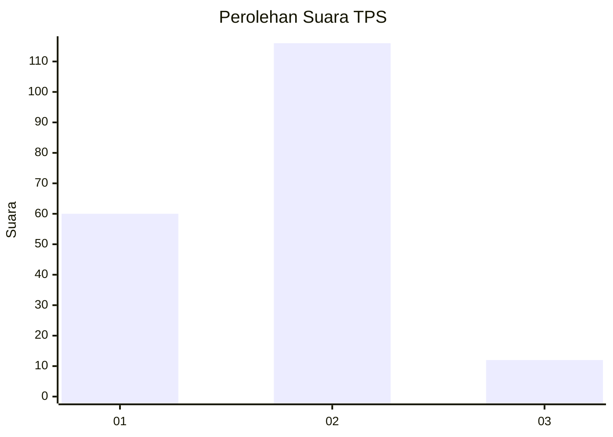
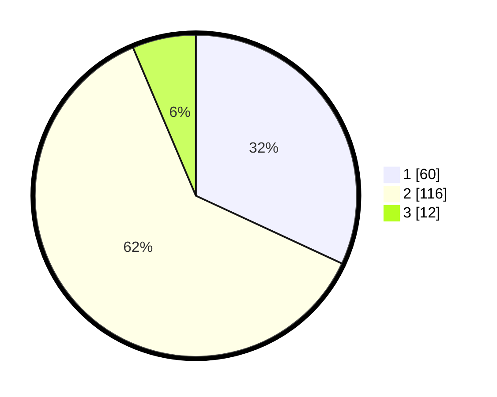

# Hasil

## Grafik

## Tabel

| No. | Nama Paslon    | Suara | Suara (raw) | Persentase |
|:--- |:-------------- | -----:| -----------:| ----------:|
| 1   | ANIES MUHAIMIN | 60    | [60][p-1]   | 31,91      |
| 2   | PRABOWO GIBRAN | 116   | [116][p-2]  | 61,70      |
| 3   | GANJAR MAHFUD  | 12    | [12][p-3]   | 6,38       |

[p-1]: https://github.com/gigit-pemilu/pemilu-2024/blob/main/pilpres/hitung-suara/sub/32-jawa-barat/sub/13-subang/sub/14-tanjungsiang/sub/2001-buniara/sub/006-tps/sub/paslon-1.txt
[p-2]: https://github.com/gigit-pemilu/pemilu-2024/blob/main/pilpres/hitung-suara/sub/32-jawa-barat/sub/13-subang/sub/14-tanjungsiang/sub/2001-buniara/sub/006-tps/sub/paslon-2.txt
[p-3]: https://github.com/gigit-pemilu/pemilu-2024/blob/main/pilpres/hitung-suara/sub/32-jawa-barat/sub/13-subang/sub/14-tanjungsiang/sub/2001-buniara/sub/006-tps/sub/paslon-3.txt

## Foto C Plano

https://sirekap-obj-formc.kpu.go.id/43cd/pemilu/ppwp/32/13/14/20/01/3213142001006-20240214-231422--ab832d75-aeed-4d3b-9811-884a998b58a8.jpg

https://sirekap-obj-formc.kpu.go.id/43cd/pemilu/ppwp/32/13/14/20/01/3213142001006-20240214-231557--feef625f-56cb-4122-8eb1-2159fcacd09f.jpg

https://sirekap-obj-formc.kpu.go.id/43cd/pemilu/ppwp/32/13/14/20/01/3213142001006-20240214-231644--207df799-8c8b-407b-b70a-2c8ebf9fb6bc.jpg

## Metadata

| Key        | Value               |
| ---------- | ------------------- |
| Time Stamp | 2024-02-19 20:00:00 |

