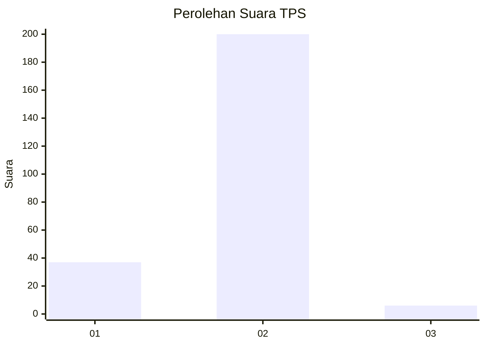
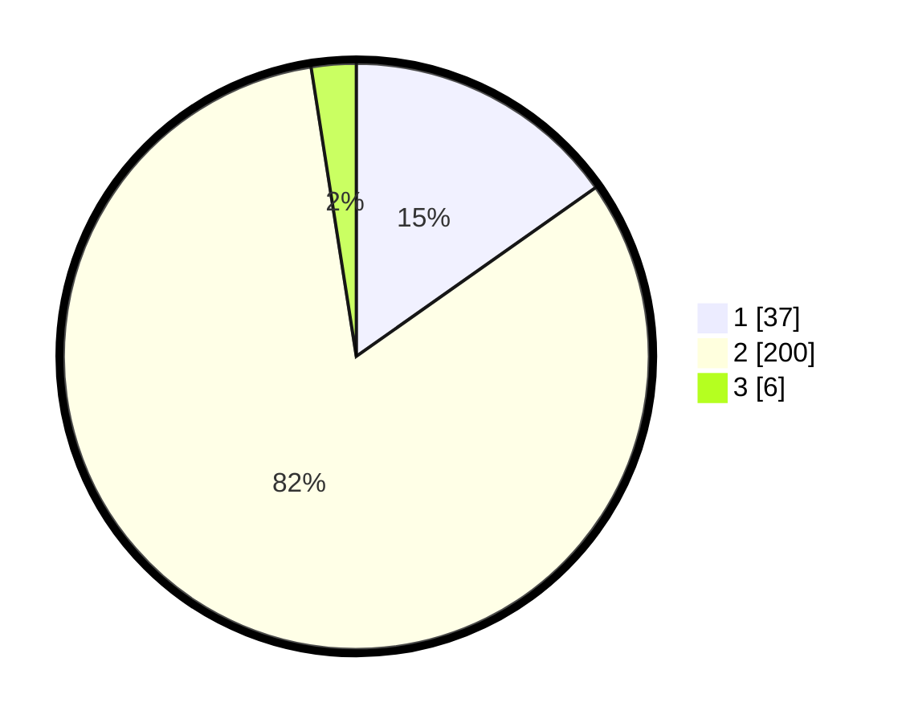

# Hasil

## Grafik

## Tabel

| No. | Nama Paslon    | Suara | Suara (raw) | Persentase |
|:--- |:-------------- | -----:| -----------:| ----------:|
| 1   | ANIES MUHAIMIN | 37    | [37][p-1]   | 15,23      |
| 2   | PRABOWO GIBRAN | 200   | [200][p-2]  | 82,30      |
| 3   | GANJAR MAHFUD  | 6     | [6][p-3]    | 2,47       |

[p-1]: https://github.com/gigit-pemilu/pemilu-2024-32-jawa-barat/blob/main/pilpres/hitung-suara/sub/32-jawa-barat/sub/13-subang/sub/14-tanjungsiang/sub/2001-buniara/sub/014-tps/sub/paslon-1.txt
[p-2]: https://github.com/gigit-pemilu/pemilu-2024-32-jawa-barat/blob/main/pilpres/hitung-suara/sub/32-jawa-barat/sub/13-subang/sub/14-tanjungsiang/sub/2001-buniara/sub/014-tps/sub/paslon-2.txt
[p-3]: https://github.com/gigit-pemilu/pemilu-2024-32-jawa-barat/blob/main/pilpres/hitung-suara/sub/32-jawa-barat/sub/13-subang/sub/14-tanjungsiang/sub/2001-buniara/sub/014-tps/sub/paslon-3.txt

## Foto C Plano

https://sirekap-obj-formc.kpu.go.id/1e01/pemilu/ppwp/32/13/14/20/01/3213142001014-20240216-173206--e7c218d8-678c-4d51-92b0-0377f20fc0d6.jpg

https://sirekap-obj-formc.kpu.go.id/1e01/pemilu/ppwp/32/13/14/20/01/3213142001014-20240216-173217--2e4d0d0d-c342-4c1b-a7b5-28b732af064f.jpg

https://sirekap-obj-formc.kpu.go.id/1e01/pemilu/ppwp/32/13/14/20/01/3213142001014-20240216-173223--c8ee5fe3-3b7d-4290-96ae-2673925b882f.jpg

## Metadata

| Key        | Value               |
| ---------- | ------------------- |
| Time Stamp | 2024-02-19 14:00:00 |

