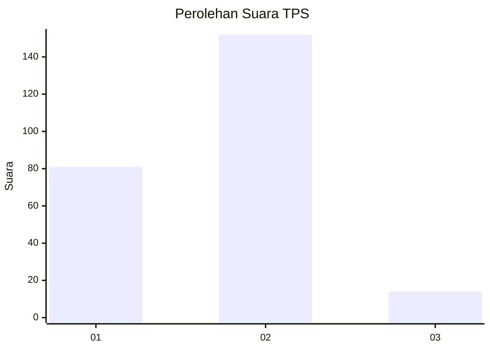
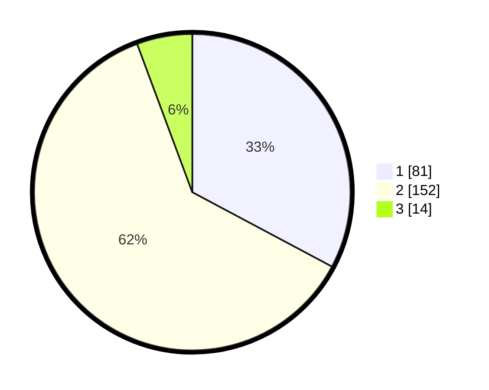

# Hasil

## Grafik

## Tabel

| No. | Nama Paslon    | Suara | Suara (raw) | Persentase |
|:--- |:-------------- | -----:| -----------:| ----------:|
| 1   | ANIES MUHAIMIN | 81    | [81][p-1]   | 32,79      |
| 2   | PRABOWO GIBRAN | 152   | [152][p-2]  | 61,54      |
| 3   | GANJAR MAHFUD  | 14    | [14][p-3]   | 5,67       |

[p-1]: https://github.com/gigit-pemilu/pemilu-2024/blob/main/pilpres/hitung-suara/sub/32-jawa-barat/sub/13-subang/sub/14-tanjungsiang/sub/2002-tanjungsiang/sub/005-tps/sub/paslon-1.txt
[p-2]: https://github.com/gigit-pemilu/pemilu-2024/blob/main/pilpres/hitung-suara/sub/32-jawa-barat/sub/13-subang/sub/14-tanjungsiang/sub/2002-tanjungsiang/sub/005-tps/sub/paslon-2.txt
[p-3]: https://github.com/gigit-pemilu/pemilu-2024/blob/main/pilpres/hitung-suara/sub/32-jawa-barat/sub/13-subang/sub/14-tanjungsiang/sub/2002-tanjungsiang/sub/005-tps/sub/paslon-3.txt

## Foto C Plano

https://sirekap-obj-formc.kpu.go.id/0f4c/pemilu/ppwp/32/13/14/20/02/3213142002005-20240215-145415--2b17f97e-e8e6-4396-89a9-639b48e92e42.jpg

https://sirekap-obj-formc.kpu.go.id/0f4c/pemilu/ppwp/32/13/14/20/02/3213142002005-20240215-131439--6e6b1f75-81c0-4287-bf82-c7dd95430cd9.jpg

https://sirekap-obj-formc.kpu.go.id/0f4c/pemilu/ppwp/32/13/14/20/02/3213142002005-20240215-145041--a591d3fa-7893-4ae1-adca-2d19ff3bf603.jpg

## Metadata

| Key        | Value               |
| ---------- | ------------------- |
| Time Stamp | 2024-02-19 20:00:00 |

