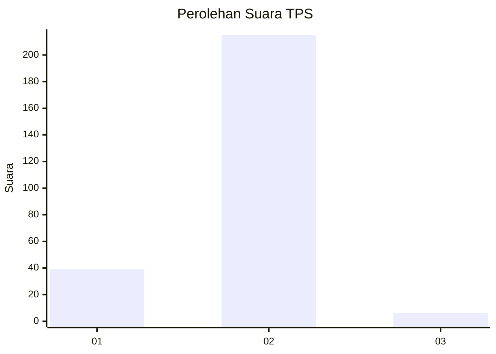
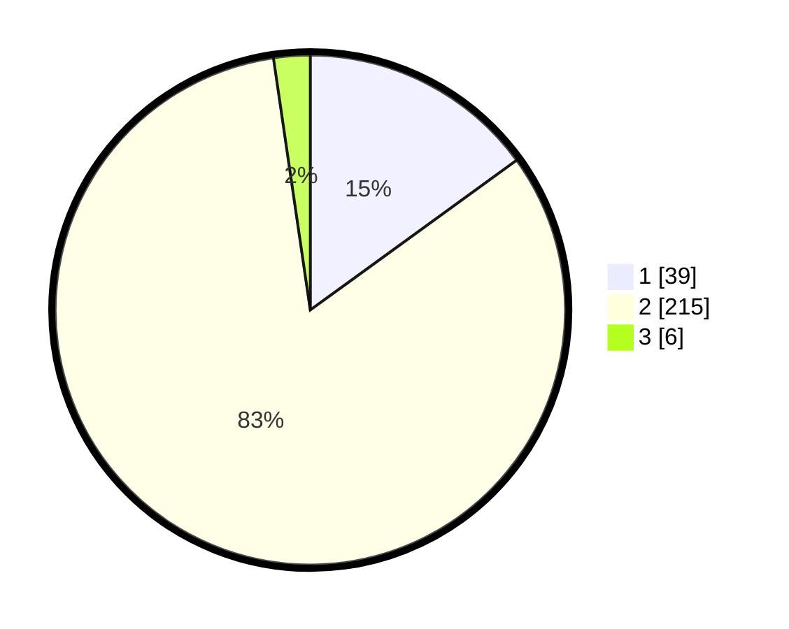

# Hasil

## Grafik

## Tabel

| No. | Nama Paslon    | Suara | Suara (raw) | Persentase |
|:--- |:-------------- | -----:| -----------:| ----------:|
| 1   | ANIES MUHAIMIN | 39    | [39][p-1]   | 15,00      |
| 2   | PRABOWO GIBRAN | 215   | [215][p-2]  | 82,69      |
| 3   | GANJAR MAHFUD  | 6     | [6][p-3]    | 2,31       |

[p-1]: https://github.com/gigit-pemilu/pemilu-2024/blob/main/pilpres/hitung-suara/sub/32-jawa-barat/sub/13-subang/sub/14-tanjungsiang/sub/2007-sindanglaya/sub/009-tps/sub/paslon-1.txt
[p-2]: https://github.com/gigit-pemilu/pemilu-2024/blob/main/pilpres/hitung-suara/sub/32-jawa-barat/sub/13-subang/sub/14-tanjungsiang/sub/2007-sindanglaya/sub/009-tps/sub/paslon-2.txt
[p-3]: https://github.com/gigit-pemilu/pemilu-2024/blob/main/pilpres/hitung-suara/sub/32-jawa-barat/sub/13-subang/sub/14-tanjungsiang/sub/2007-sindanglaya/sub/009-tps/sub/paslon-3.txt

## Foto C Plano

https://sirekap-obj-formc.kpu.go.id/e7ee/pemilu/ppwp/32/13/14/20/07/3213142007009-20240215-021004--47467477-f25c-4c51-8174-638f005f9ef1.jpg

https://sirekap-obj-formc.kpu.go.id/e7ee/pemilu/ppwp/32/13/14/20/07/3213142007009-20240215-021359--e2c3d092-e782-4feb-8b33-0f8e1a006097.jpg

https://sirekap-obj-formc.kpu.go.id/e7ee/pemilu/ppwp/32/13/14/20/07/3213142007009-20240215-021445--58b812a3-7648-4e8e-b660-8fb50265128e.jpg

## Metadata

| Key        | Value               |
| ---------- | ------------------- |
| Time Stamp | 2024-02-19 20:00:00 |

