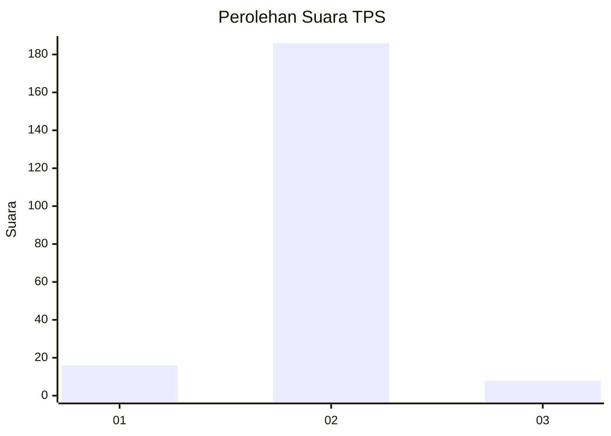
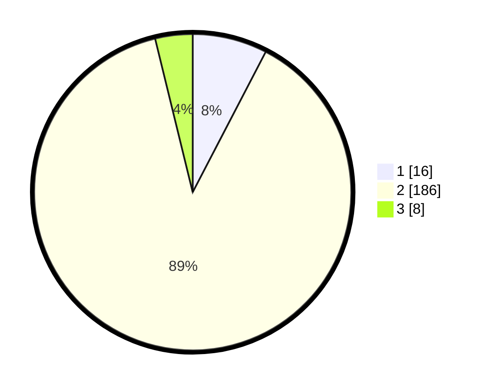

# Hasil

## Grafik

## Tabel

| No. | Nama Paslon    | Suara | Suara (raw) | Persentase |
|:--- |:-------------- | -----:| -----------:| ----------:|
| 1   | ANIES MUHAIMIN | 16    | [16][p-1]   | 7,62       |
| 2   | PRABOWO GIBRAN | 186   | [186][p-2]  | 88,57      |
| 3   | GANJAR MAHFUD  | 8     | [8][p-3]    | 3,81       |

[p-1]: https://github.com/gigit-pemilu/pemilu-2024/blob/main/pilpres/hitung-suara/sub/32-jawa-barat/sub/13-subang/sub/15-compreng/sub/2001-jatimulya/sub/001-tps/sub/paslon-1.txt
[p-2]: https://github.com/gigit-pemilu/pemilu-2024/blob/main/pilpres/hitung-suara/sub/32-jawa-barat/sub/13-subang/sub/15-compreng/sub/2001-jatimulya/sub/001-tps/sub/paslon-2.txt
[p-3]: https://github.com/gigit-pemilu/pemilu-2024/blob/main/pilpres/hitung-suara/sub/32-jawa-barat/sub/13-subang/sub/15-compreng/sub/2001-jatimulya/sub/001-tps/sub/paslon-3.txt

## Foto C Plano

https://sirekap-obj-formc.kpu.go.id/2e9e/pemilu/ppwp/32/13/15/20/01/3213152001001-20240215-072310--7a49f6af-3bc6-40f4-864c-2da316409d1a.jpg

https://sirekap-obj-formc.kpu.go.id/2e9e/pemilu/ppwp/32/13/15/20/01/3213152001001-20240215-062102--20156bee-1bed-493b-a478-91f52adb0d4c.jpg

https://sirekap-obj-formc.kpu.go.id/2e9e/pemilu/ppwp/32/13/15/20/01/3213152001001-20240215-090728--29cc63ef-844a-4232-b886-ce08ae88eec6.jpg

## Metadata

| Key        | Value               |
| ---------- | ------------------- |
| Time Stamp | 2024-02-24 22:31:28 |

