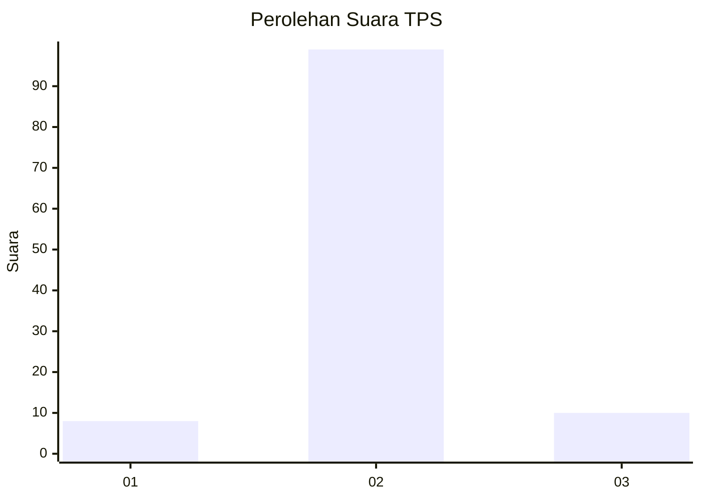
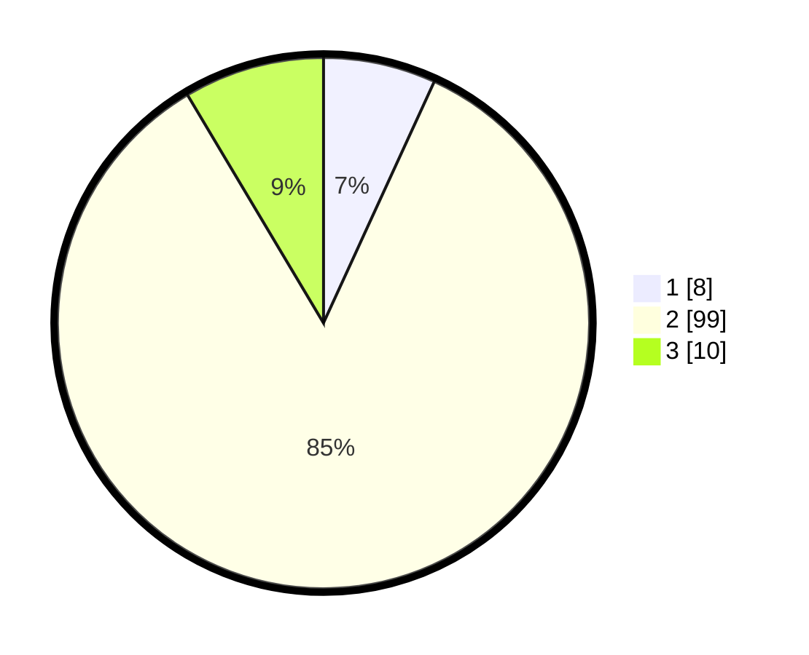

# Hasil

## Grafik

## Tabel

| No. | Nama Paslon    | Suara | Suara (raw) | Persentase |
|:--- |:-------------- | -----:| -----------:| ----------:|
| 1   | ANIES MUHAIMIN | 8     | [8][p-1]    | 6,84       |
| 2   | PRABOWO GIBRAN | 99    | [99][p-2]   | 84,62      |
| 3   | GANJAR MAHFUD  | 10    | [10][p-3]   | 8,55       |

[p-1]: https://github.com/gigit-pemilu/pemilu-2024/blob/main/pilpres/hitung-suara/sub/32-jawa-barat/sub/13-subang/sub/15-compreng/sub/2001-jatimulya/sub/006-tps/sub/paslon-1.txt
[p-2]: https://github.com/gigit-pemilu/pemilu-2024/blob/main/pilpres/hitung-suara/sub/32-jawa-barat/sub/13-subang/sub/15-compreng/sub/2001-jatimulya/sub/006-tps/sub/paslon-2.txt
[p-3]: https://github.com/gigit-pemilu/pemilu-2024/blob/main/pilpres/hitung-suara/sub/32-jawa-barat/sub/13-subang/sub/15-compreng/sub/2001-jatimulya/sub/006-tps/sub/paslon-3.txt

## Foto C Plano

https://sirekap-obj-formc.kpu.go.id/434b/pemilu/ppwp/32/13/15/20/01/3213152001006-20240215-011537--b6aca178-19ef-4e4f-9688-9a6ba1102b8f.jpg

https://sirekap-obj-formc.kpu.go.id/434b/pemilu/ppwp/32/13/15/20/01/3213152001006-20240215-011822--cf4b6e14-3253-4ba7-9d45-369b1e31610c.jpg

https://sirekap-obj-formc.kpu.go.id/434b/pemilu/ppwp/32/13/15/20/01/3213152001006-20240215-012132--81ec4bf9-a277-45e7-8c92-85312a71ad64.jpg

## Metadata

| Key        | Value               |
| ---------- | ------------------- |
| Time Stamp | 2024-02-19 15:00:00 |

