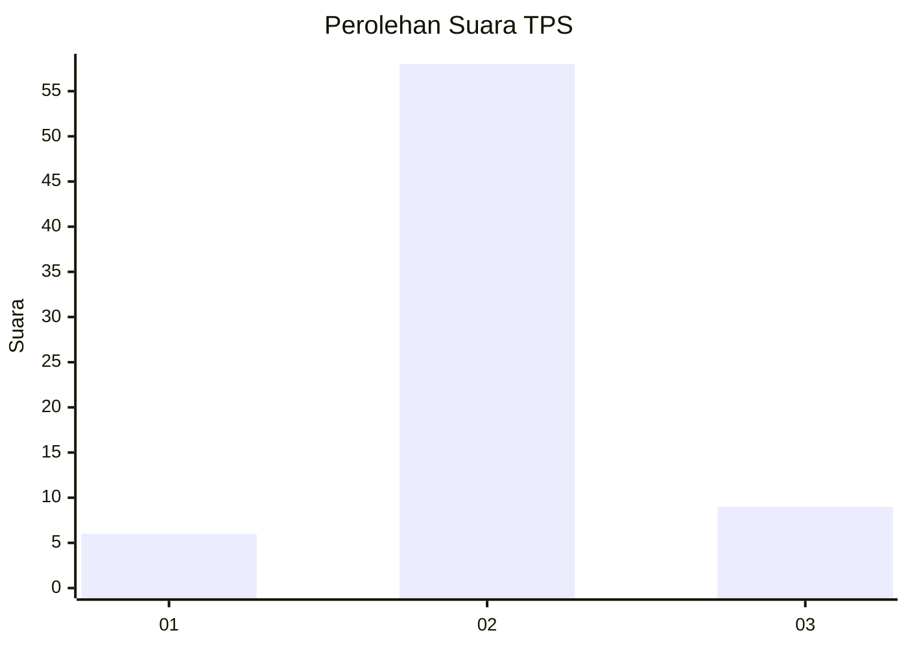
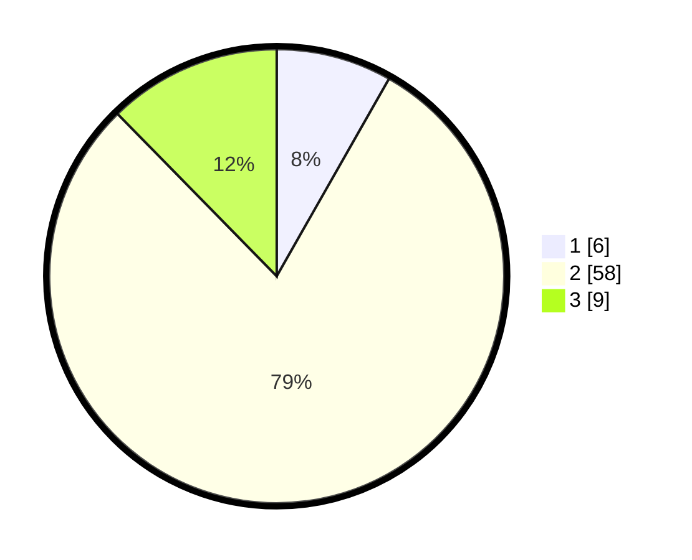

# Hasil

## Grafik

## Tabel

| No. | Nama Paslon    | Suara | Suara (raw) | Persentase |
|:--- |:-------------- | -----:| -----------:| ----------:|
| 1   | ANIES MUHAIMIN | 6     | [6][p-1]    | 8,22       |
| 2   | PRABOWO GIBRAN | 58    | [58][p-2]   | 79,45      |
| 3   | GANJAR MAHFUD  | 9     | [9][p-3]    | 12,33      |

[p-1]: https://github.com/gigit-pemilu/pemilu-2024/blob/main/pilpres/hitung-suara/sub/32-jawa-barat/sub/13-subang/sub/15-compreng/sub/2001-jatimulya/sub/013-tps/sub/paslon-1.txt
[p-2]: https://github.com/gigit-pemilu/pemilu-2024/blob/main/pilpres/hitung-suara/sub/32-jawa-barat/sub/13-subang/sub/15-compreng/sub/2001-jatimulya/sub/013-tps/sub/paslon-2.txt
[p-3]: https://github.com/gigit-pemilu/pemilu-2024/blob/main/pilpres/hitung-suara/sub/32-jawa-barat/sub/13-subang/sub/15-compreng/sub/2001-jatimulya/sub/013-tps/sub/paslon-3.txt

## Foto C Plano

https://sirekap-obj-formc.kpu.go.id/4723/pemilu/ppwp/32/13/15/20/01/3213152001013-20240215-063558--c5cab05b-77b7-4edf-a8b9-174168c91257.jpg

https://sirekap-obj-formc.kpu.go.id/4723/pemilu/ppwp/32/13/15/20/01/3213152001013-20240215-063727--6ac018fb-fd3d-474c-b138-4967b4a6d8f9.jpg

https://sirekap-obj-formc.kpu.go.id/4723/pemilu/ppwp/32/13/15/20/01/3213152001013-20240215-063811--ed9f7837-9cf2-4a68-abc5-05462cc2ba12.jpg

## Metadata

| Key        | Value               |
| ---------- | ------------------- |
| Time Stamp | 2024-02-20 14:00:00 |

