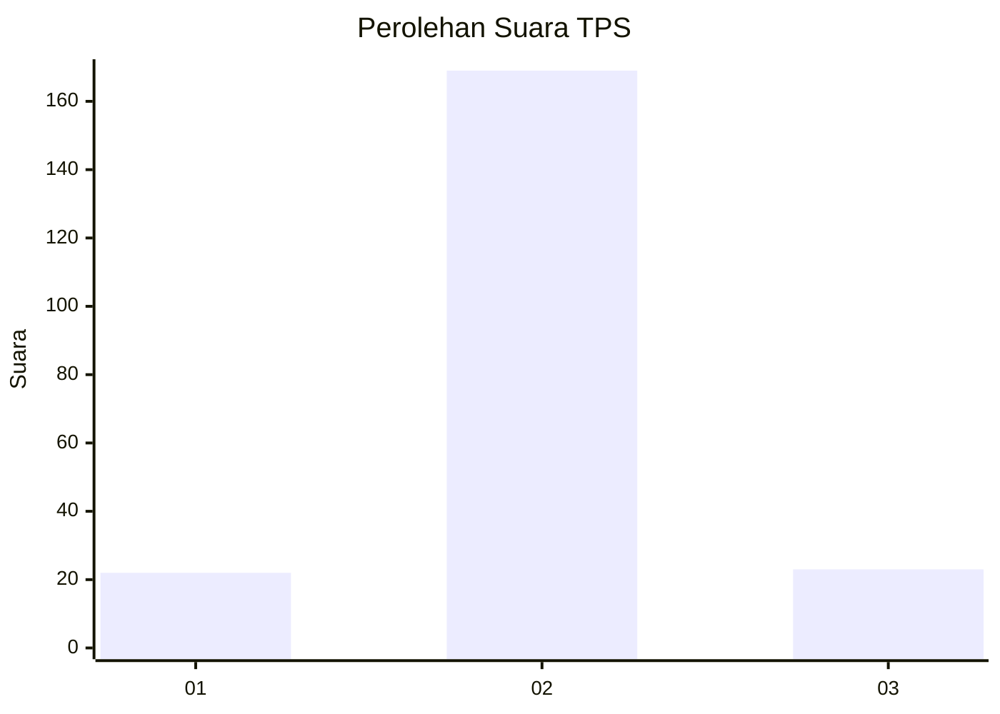
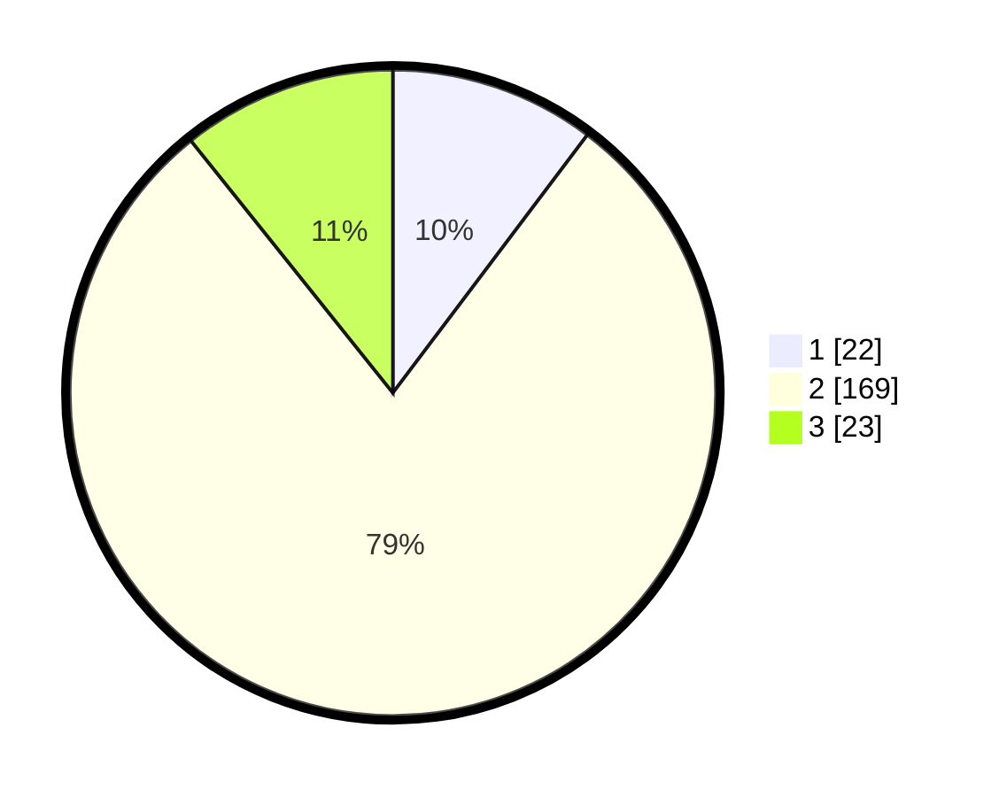

# Hasil

## Grafik

## Tabel

| No. | Nama Paslon    | Suara | Suara (raw) | Persentase |
|:--- |:-------------- | -----:| -----------:| ----------:|
| 1   | ANIES MUHAIMIN | 22    | [22][p-1]   | 10,28      |
| 2   | PRABOWO GIBRAN | 169   | [169][p-2]  | 78,97      |
| 3   | GANJAR MAHFUD  | 23    | [23][p-3]   | 10,75      |

[p-1]: https://github.com/gigit-pemilu/pemilu-2024/blob/main/pilpres/hitung-suara/sub/32-jawa-barat/sub/13-subang/sub/15-compreng/sub/2007-kiarasari/sub/003-tps/sub/paslon-1.txt
[p-2]: https://github.com/gigit-pemilu/pemilu-2024/blob/main/pilpres/hitung-suara/sub/32-jawa-barat/sub/13-subang/sub/15-compreng/sub/2007-kiarasari/sub/003-tps/sub/paslon-2.txt
[p-3]: https://github.com/gigit-pemilu/pemilu-2024/blob/main/pilpres/hitung-suara/sub/32-jawa-barat/sub/13-subang/sub/15-compreng/sub/2007-kiarasari/sub/003-tps/sub/paslon-3.txt

## Foto C Plano

https://sirekap-obj-formc.kpu.go.id/6902/pemilu/ppwp/32/13/15/20/07/3213152007003-20240214-231430--edf4a183-f1fc-49ea-80ee-7f8dd990a1e3.jpg

https://sirekap-obj-formc.kpu.go.id/6902/pemilu/ppwp/32/13/15/20/07/3213152007003-20240214-231617--2ecf59c1-ec9a-4b47-b297-963b0c34e9f8.jpg

https://sirekap-obj-formc.kpu.go.id/6902/pemilu/ppwp/32/13/15/20/07/3213152007003-20240214-231718--85569ba9-95ec-4fbd-ae57-6d3781ff7591.jpg

## Metadata

| Key        | Value               |
| ---------- | ------------------- |
| Time Stamp | 2024-02-20 14:00:00 |

