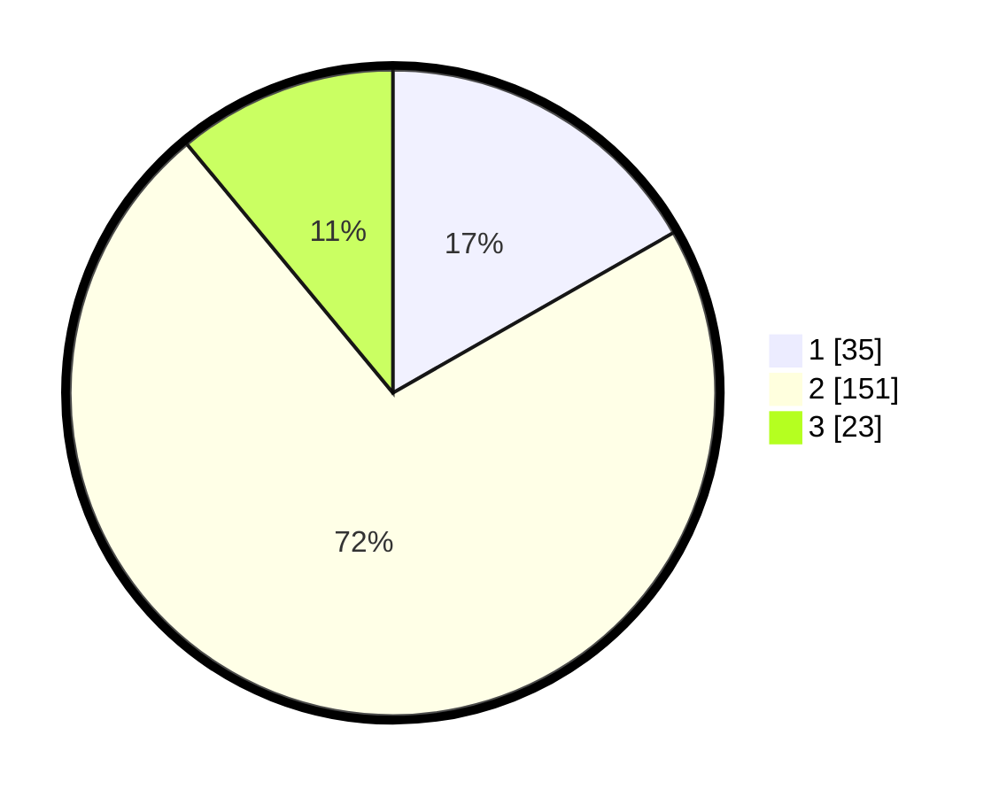

# Hasil

## Grafik

## Tabel

| No. | Nama Paslon    | Suara | Suara (raw) | Persentase |
|:--- |:-------------- | -----:| -----------:| ----------:|
| 1   | ANIES MUHAIMIN | 35    | [35][p-1]   | 16,75      |
| 2   | PRABOWO GIBRAN | 151   | [151][p-2]  | 72,25      |
| 3   | GANJAR MAHFUD  | 23    | [23][p-3]   | 11,00      |

[p-1]: https://github.com/gigit-pemilu/pemilu-2024-32-jawa-barat/blob/main/pilpres/hitung-suara/sub/32-jawa-barat/sub/13-subang/sub/16-patokbeusi/sub/2001-rancabango/sub/004-tps/sub/paslon-1.txt
[p-2]: https://github.com/gigit-pemilu/pemilu-2024-32-jawa-barat/blob/main/pilpres/hitung-suara/sub/32-jawa-barat/sub/13-subang/sub/16-patokbeusi/sub/2001-rancabango/sub/004-tps/sub/paslon-2.txt
[p-3]: https://github.com/gigit-pemilu/pemilu-2024-32-jawa-barat/blob/main/pilpres/hitung-suara/sub/32-jawa-barat/sub/13-subang/sub/16-patokbeusi/sub/2001-rancabango/sub/004-tps/sub/paslon-3.txt

## Foto C Plano

https://sirekap-obj-formc.kpu.go.id/2a40/pemilu/ppwp/32/13/16/20/01/3213162001004-20240215-015739--e105c73e-80cd-4b52-8d5e-02c3d9d275cd.jpg

https://sirekap-obj-formc.kpu.go.id/2a40/pemilu/ppwp/32/13/16/20/01/3213162001004-20240215-022855--8ffc7783-6ecd-4bb0-b848-7ef5a6fc1d5d.jpg

https://sirekap-obj-formc.kpu.go.id/2a40/pemilu/ppwp/32/13/16/20/01/3213162001004-20240215-020050--b3ee69a3-a746-4862-a9a9-679c21ad584e.jpg

## Metadata

| Key        | Value               |
| ---------- | ------------------- |
| Time Stamp | 2024-02-20 15:00:00 |

