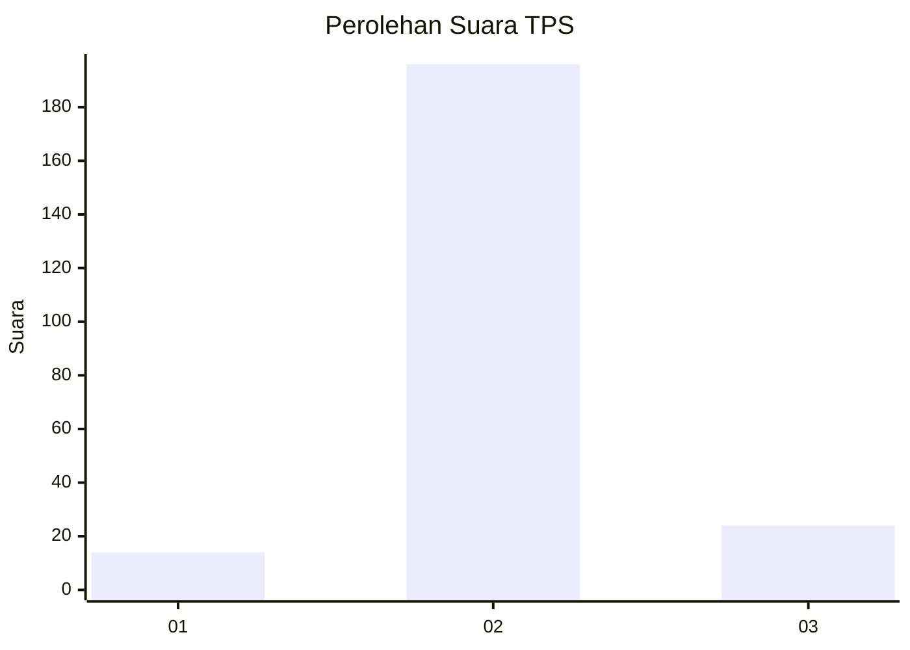
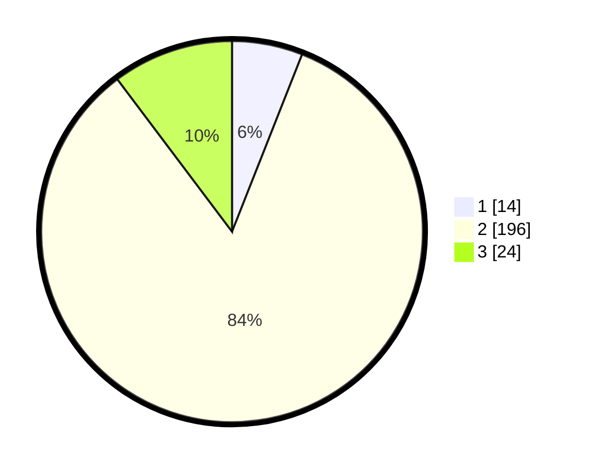

# Hasil

## Grafik

## Tabel

| No. | Nama Paslon    | Suara | Suara (raw) | Persentase |
|:--- |:-------------- | -----:| -----------:| ----------:|
| 1   | ANIES MUHAIMIN | 14    | [14][p-1]   | 5,98       |
| 2   | PRABOWO GIBRAN | 196   | [196][p-2]  | 83,76      |
| 3   | GANJAR MAHFUD  | 24    | [24][p-3]   | 10,26      |

[p-1]: https://github.com/gigit-pemilu/pemilu-2024-32-jawa-barat/blob/main/pilpres/hitung-suara/sub/32-jawa-barat/sub/13-subang/sub/16-patokbeusi/sub/2001-rancabango/sub/009-tps/sub/paslon-1.txt
[p-2]: https://github.com/gigit-pemilu/pemilu-2024-32-jawa-barat/blob/main/pilpres/hitung-suara/sub/32-jawa-barat/sub/13-subang/sub/16-patokbeusi/sub/2001-rancabango/sub/009-tps/sub/paslon-2.txt
[p-3]: https://github.com/gigit-pemilu/pemilu-2024-32-jawa-barat/blob/main/pilpres/hitung-suara/sub/32-jawa-barat/sub/13-subang/sub/16-patokbeusi/sub/2001-rancabango/sub/009-tps/sub/paslon-3.txt

## Foto C Plano

https://sirekap-obj-formc.kpu.go.id/48ef/pemilu/ppwp/32/13/16/20/01/3213162001009-20240215-022048--2a57e75d-a74d-4ba0-a472-9899cc504cad.jpg

https://sirekap-obj-formc.kpu.go.id/48ef/pemilu/ppwp/32/13/16/20/01/3213162001009-20240215-024540--286225c4-9696-4136-b3ea-c1df0550ad6c.jpg

https://sirekap-obj-formc.kpu.go.id/48ef/pemilu/ppwp/32/13/16/20/01/3213162001009-20240215-023107--51595fc5-1b49-445b-9643-3f4119812d8e.jpg

## Metadata

| Key        | Value               |
| ---------- | ------------------- |
| Time Stamp | 2024-02-20 15:00:00 |

