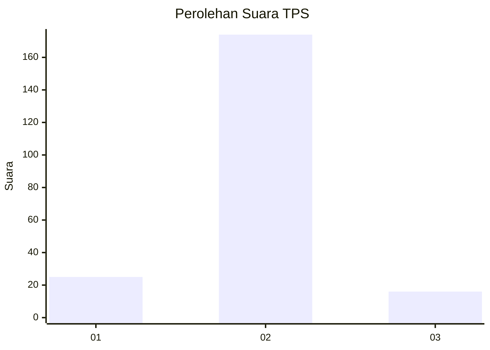
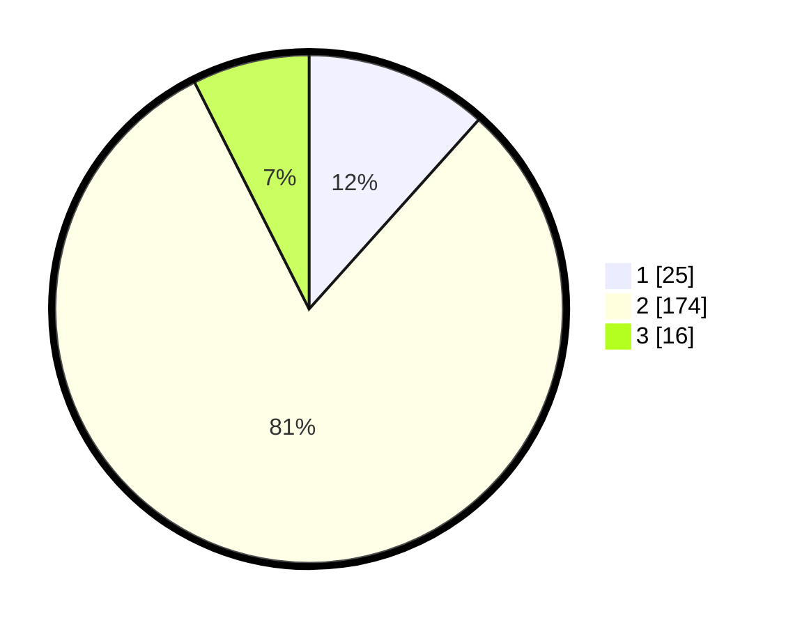

# Hasil

## Grafik

## Tabel

| No. | Nama Paslon    | Suara | Suara (raw) | Persentase |
|:--- |:-------------- | -----:| -----------:| ----------:|
| 1   | ANIES MUHAIMIN | 25    | [25][p-1]   | 11,63      |
| 2   | PRABOWO GIBRAN | 174   | [174][p-2]  | 80,93      |
| 3   | GANJAR MAHFUD  | 16    | [16][p-3]   | 7,44       |

[p-1]: https://github.com/gigit-pemilu/pemilu-2024-32-jawa-barat/blob/main/pilpres/hitung-suara/sub/32-jawa-barat/sub/13-subang/sub/16-patokbeusi/sub/2001-rancabango/sub/013-tps/sub/paslon-1.txt
[p-2]: https://github.com/gigit-pemilu/pemilu-2024-32-jawa-barat/blob/main/pilpres/hitung-suara/sub/32-jawa-barat/sub/13-subang/sub/16-patokbeusi/sub/2001-rancabango/sub/013-tps/sub/paslon-2.txt
[p-3]: https://github.com/gigit-pemilu/pemilu-2024-32-jawa-barat/blob/main/pilpres/hitung-suara/sub/32-jawa-barat/sub/13-subang/sub/16-patokbeusi/sub/2001-rancabango/sub/013-tps/sub/paslon-3.txt

## Foto C Plano

https://sirekap-obj-formc.kpu.go.id/b907/pemilu/ppwp/32/13/16/20/01/3213162001013-20240215-020836--7f682905-376a-4cc5-99da-e5a91000c458.jpg

https://sirekap-obj-formc.kpu.go.id/b907/pemilu/ppwp/32/13/16/20/01/3213162001013-20240215-021003--224ee412-d8df-4bf0-a46c-aa1d31b979d8.jpg

https://sirekap-obj-formc.kpu.go.id/b907/pemilu/ppwp/32/13/16/20/01/3213162001013-20240215-021901--c882e332-ff71-4c52-b11a-498039a061c7.jpg

## Metadata

| Key        | Value               |
| ---------- | ------------------- |
| Time Stamp | 2024-02-19 14:00:00 |

