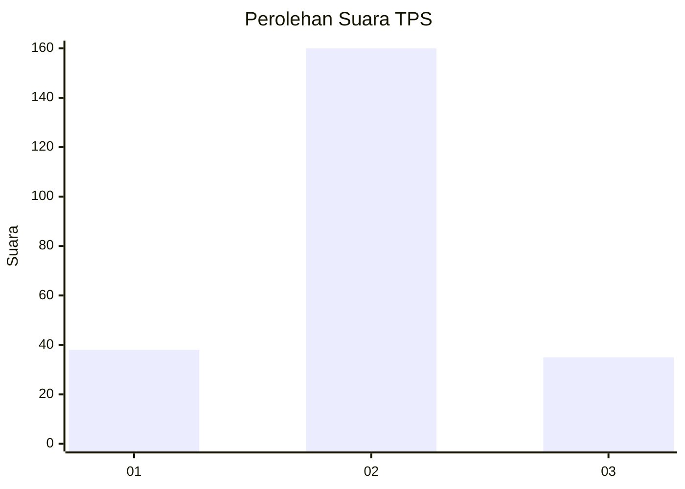

# Hasil

## Grafik

## Tabel

| No. | Nama Paslon    | Suara | Suara (raw) | Persentase |
|:--- |:-------------- | -----:| -----------:| ----------:|
| 1   | ANIES MUHAIMIN | 38    | [38][p-1]   | 16,31      |
| 2   | PRABOWO GIBRAN | 160   | [160][p-2]  | 68,67      |
| 3   | GANJAR MAHFUD  | 35    | [35][p-3]   | 15,02      |

[p-1]: https://github.com/gigit-pemilu/pemilu-2024/blob/main/pilpres/hitung-suara/sub/32-jawa-barat/sub/13-subang/sub/16-patokbeusi/sub/2004-jatiragas-hilir/sub/009-tps/sub/paslon-1.txt
[p-2]: https://github.com/gigit-pemilu/pemilu-2024/blob/main/pilpres/hitung-suara/sub/32-jawa-barat/sub/13-subang/sub/16-patokbeusi/sub/2004-jatiragas-hilir/sub/009-tps/sub/paslon-2.txt
[p-3]: https://github.com/gigit-pemilu/pemilu-2024/blob/main/pilpres/hitung-suara/sub/32-jawa-barat/sub/13-subang/sub/16-patokbeusi/sub/2004-jatiragas-hilir/sub/009-tps/sub/paslon-3.txt

## Foto C Plano

https://sirekap-obj-formc.kpu.go.id/b825/pemilu/ppwp/32/13/16/20/04/3213162004009-20240214-190607--1124a6d3-b0f5-472a-aff5-5bb86b7f6ad6.jpg

https://sirekap-obj-formc.kpu.go.id/b825/pemilu/ppwp/32/13/16/20/04/3213162004009-20240214-190643--43844783-0551-4b8e-8707-b24f7fbd7f4f.jpg

https://sirekap-obj-formc.kpu.go.id/b825/pemilu/ppwp/32/13/16/20/04/3213162004009-20240214-190649--d6de6624-0139-4f2a-9654-4a60f4375c3e.jpg

## Metadata

| Key        | Value               |
| ---------- | ------------------- |
| Time Stamp | 2024-02-20 15:00:00 |

