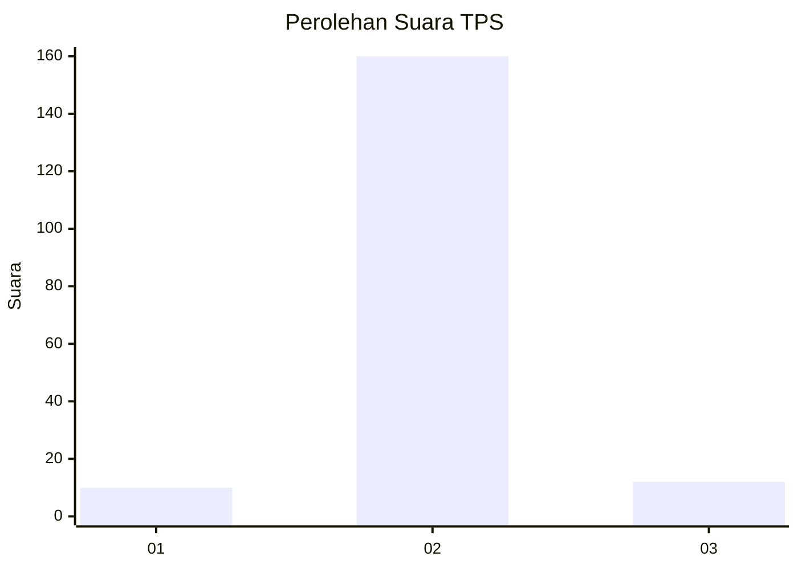
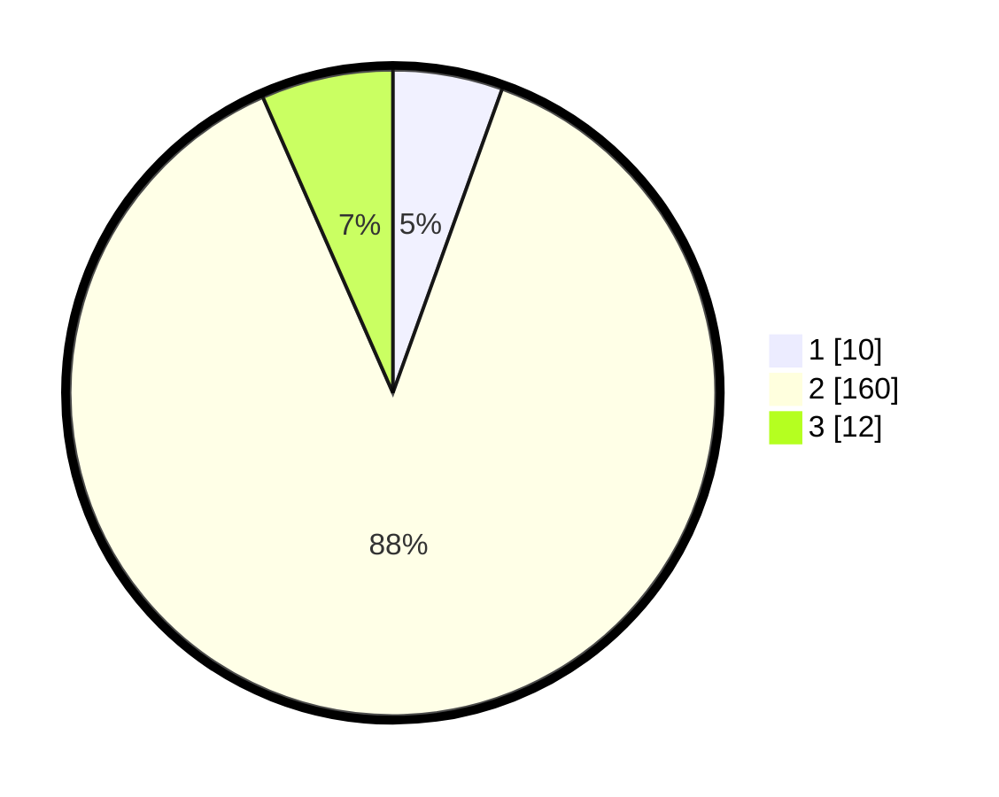

# Hasil

## Grafik

## Tabel

| No. | Nama Paslon    | Suara | Suara (raw) | Persentase |
|:--- |:-------------- | -----:| -----------:| ----------:|
| 1   | ANIES MUHAIMIN | 10    | [10][p-1]   | 5,49       |
| 2   | PRABOWO GIBRAN | 160   | [160][p-2]  | 87,91      |
| 3   | GANJAR MAHFUD  | 12    | [12][p-3]   | 6,59       |

[p-1]: https://github.com/gigit-pemilu/pemilu-2024/blob/main/pilpres/hitung-suara/sub/32-jawa-barat/sub/13-subang/sub/17-cibogo/sub/2001-sumurbarang/sub/002-tps/sub/paslon-1.txt
[p-2]: https://github.com/gigit-pemilu/pemilu-2024/blob/main/pilpres/hitung-suara/sub/32-jawa-barat/sub/13-subang/sub/17-cibogo/sub/2001-sumurbarang/sub/002-tps/sub/paslon-2.txt
[p-3]: https://github.com/gigit-pemilu/pemilu-2024/blob/main/pilpres/hitung-suara/sub/32-jawa-barat/sub/13-subang/sub/17-cibogo/sub/2001-sumurbarang/sub/002-tps/sub/paslon-3.txt

## Foto C Plano

https://sirekap-obj-formc.kpu.go.id/5f2e/pemilu/ppwp/32/13/17/20/01/3213172001002-20240214-214213--2e36093c-ecac-421d-9595-8c5de9aad554.jpg

https://sirekap-obj-formc.kpu.go.id/5f2e/pemilu/ppwp/32/13/17/20/01/3213172001002-20240214-213551--27c46d49-0926-4c56-9d83-329766ab25c0.jpg

https://sirekap-obj-formc.kpu.go.id/5f2e/pemilu/ppwp/32/13/17/20/01/3213172001002-20240214-220135--4e60065c-5406-46cb-bffb-a97ce40fdddf.jpg

## Metadata

| Key        | Value               |
| ---------- | ------------------- |
| Time Stamp | 2024-02-19 17:00:00 |

