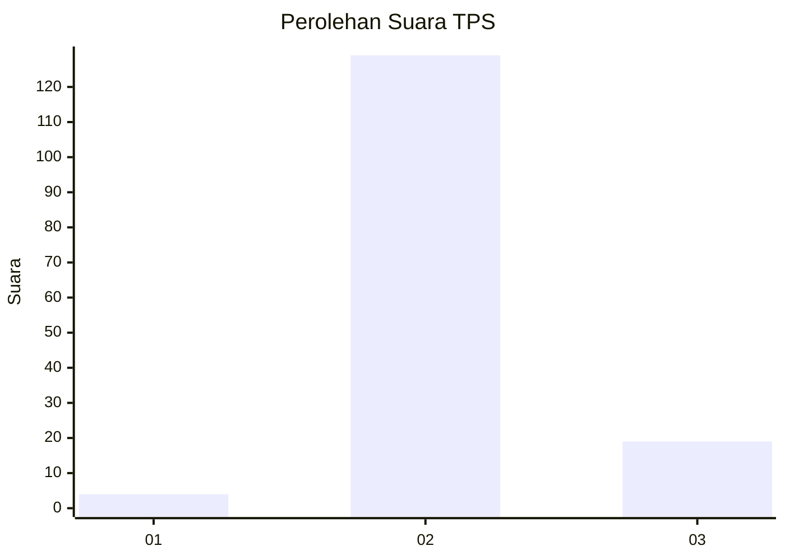
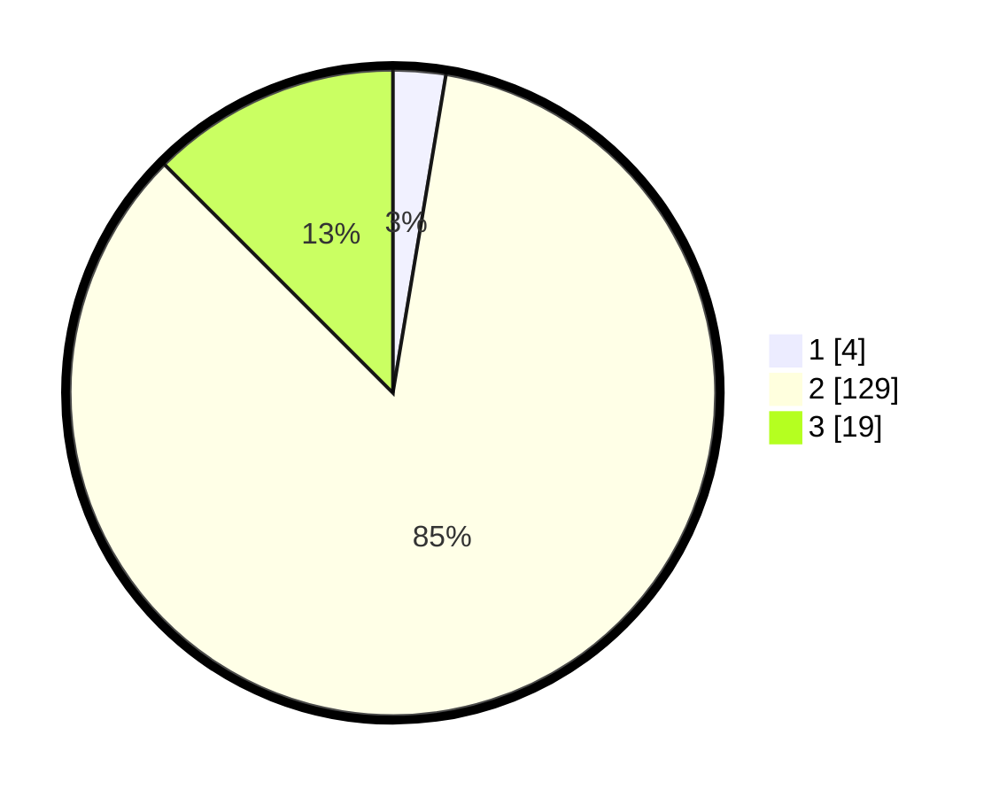

# Hasil

## Grafik

## Tabel

| No. | Nama Paslon    | Suara | Suara (raw) | Persentase |
|:--- |:-------------- | -----:| -----------:| ----------:|
| 1   | ANIES MUHAIMIN | 4     | [4][p-1]    | 2,63       |
| 2   | PRABOWO GIBRAN | 129   | [129][p-2]  | 84,87      |
| 3   | GANJAR MAHFUD  | 19    | [19][p-3]   | 12,50      |

[p-1]: https://github.com/gigit-pemilu/pemilu-2024/blob/main/pilpres/hitung-suara/sub/32-jawa-barat/sub/13-subang/sub/17-cibogo/sub/2001-sumurbarang/sub/008-tps/sub/paslon-1.txt
[p-2]: https://github.com/gigit-pemilu/pemilu-2024/blob/main/pilpres/hitung-suara/sub/32-jawa-barat/sub/13-subang/sub/17-cibogo/sub/2001-sumurbarang/sub/008-tps/sub/paslon-2.txt
[p-3]: https://github.com/gigit-pemilu/pemilu-2024/blob/main/pilpres/hitung-suara/sub/32-jawa-barat/sub/13-subang/sub/17-cibogo/sub/2001-sumurbarang/sub/008-tps/sub/paslon-3.txt

## Foto C Plano

https://sirekap-obj-formc.kpu.go.id/a127/pemilu/ppwp/32/13/17/20/01/3213172001008-20240215-005304--07e35d02-c39e-4ea0-a83f-a74a6b6da60d.jpg

https://sirekap-obj-formc.kpu.go.id/a127/pemilu/ppwp/32/13/17/20/01/3213172001008-20240215-005405--4e848e36-57b6-403b-bfce-0b7edb8da496.jpg

https://sirekap-obj-formc.kpu.go.id/a127/pemilu/ppwp/32/13/17/20/01/3213172001008-20240215-005452--af77de5c-f3f2-429d-aca8-163b14d9221d.jpg

## Metadata

| Key        | Value               |
| ---------- | ------------------- |
| Time Stamp | 2024-02-19 14:00:00 |

