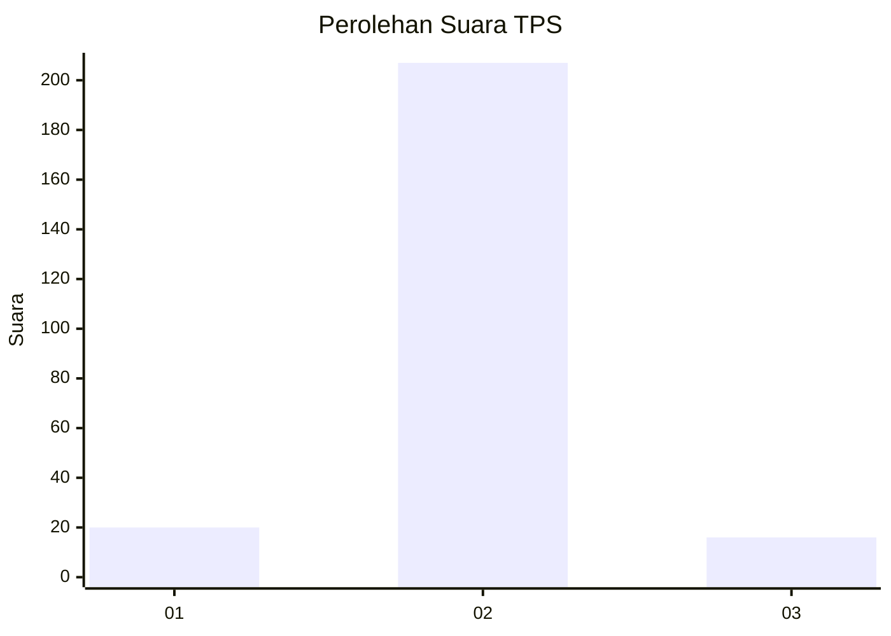
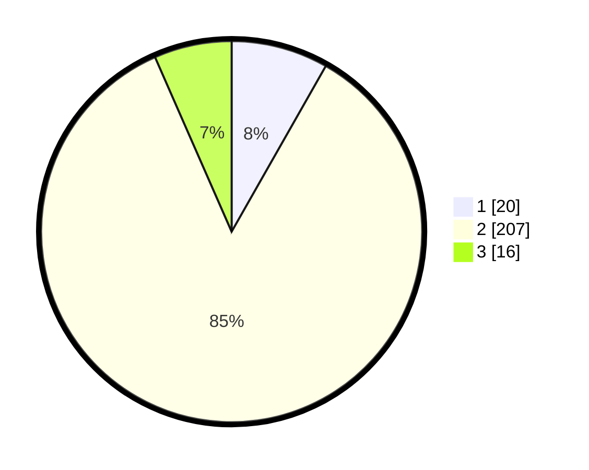

# Hasil

## Grafik

## Tabel

| No. | Nama Paslon    | Suara | Suara (raw) | Persentase |
|:--- |:-------------- | -----:| -----------:| ----------:|
| 1   | ANIES MUHAIMIN | 20    | [20][p-1]   | 8,23       |
| 2   | PRABOWO GIBRAN | 207   | [207][p-2]  | 85,19      |
| 3   | GANJAR MAHFUD  | 16    | [16][p-3]   | 6,58       |

[p-1]: https://github.com/gigit-pemilu/pemilu-2024-32-jawa-barat/blob/main/pilpres/hitung-suara/sub/32-jawa-barat/sub/13-subang/sub/18-cipunagara/sub/2001-wanasari/sub/009-tps/sub/paslon-1.txt
[p-2]: https://github.com/gigit-pemilu/pemilu-2024-32-jawa-barat/blob/main/pilpres/hitung-suara/sub/32-jawa-barat/sub/13-subang/sub/18-cipunagara/sub/2001-wanasari/sub/009-tps/sub/paslon-2.txt
[p-3]: https://github.com/gigit-pemilu/pemilu-2024-32-jawa-barat/blob/main/pilpres/hitung-suara/sub/32-jawa-barat/sub/13-subang/sub/18-cipunagara/sub/2001-wanasari/sub/009-tps/sub/paslon-3.txt

## Foto C Plano

https://sirekap-obj-formc.kpu.go.id/c1b3/pemilu/ppwp/32/13/18/20/01/3213182001009-20240214-224855--c1568145-9a25-40b3-a84d-dd6d6c433636.jpg

https://sirekap-obj-formc.kpu.go.id/c1b3/pemilu/ppwp/32/13/18/20/01/3213182001009-20240214-202737--f11bc02b-2580-48e4-be94-33708586e0f2.jpg

https://sirekap-obj-formc.kpu.go.id/c1b3/pemilu/ppwp/32/13/18/20/01/3213182001009-20240214-210529--34f9b064-e936-418d-bc69-8df47bd87c74.jpg

## Metadata

| Key        | Value               |
| ---------- | ------------------- |
| Time Stamp | 2024-02-19 18:00:00 |

