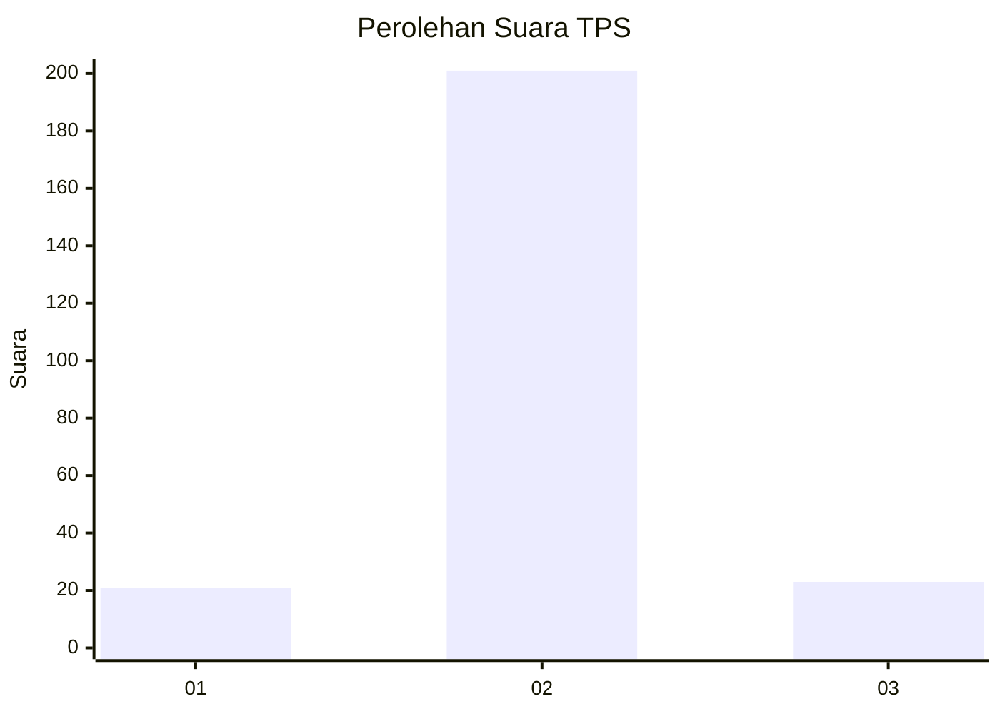
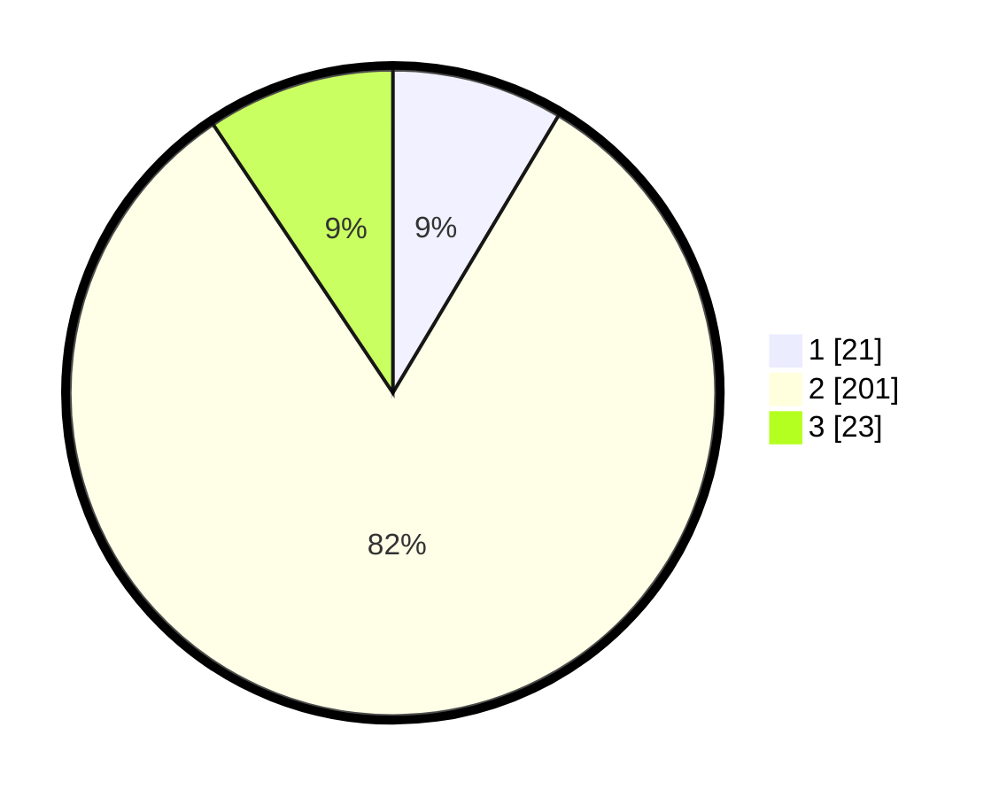

# Hasil

## Grafik

## Tabel

| No. | Nama Paslon    | Suara | Suara (raw) | Persentase |
|:--- |:-------------- | -----:| -----------:| ----------:|
| 1   | ANIES MUHAIMIN | 21    | [21][p-1]   | 8,57       |
| 2   | PRABOWO GIBRAN | 201   | [201][p-2]  | 82,04      |
| 3   | GANJAR MAHFUD  | 23    | [23][p-3]   | 9,39       |

[p-1]: https://github.com/gigit-pemilu/pemilu-2024-32-jawa-barat/blob/main/pilpres/hitung-suara/sub/32-jawa-barat/sub/13-subang/sub/18-cipunagara/sub/2001-wanasari/sub/012-tps/sub/paslon-1.txt
[p-2]: https://github.com/gigit-pemilu/pemilu-2024-32-jawa-barat/blob/main/pilpres/hitung-suara/sub/32-jawa-barat/sub/13-subang/sub/18-cipunagara/sub/2001-wanasari/sub/012-tps/sub/paslon-2.txt
[p-3]: https://github.com/gigit-pemilu/pemilu-2024-32-jawa-barat/blob/main/pilpres/hitung-suara/sub/32-jawa-barat/sub/13-subang/sub/18-cipunagara/sub/2001-wanasari/sub/012-tps/sub/paslon-3.txt

## Foto C Plano

https://sirekap-obj-formc.kpu.go.id/643d/pemilu/ppwp/32/13/18/20/01/3213182001012-20240214-213154--6d9d783d-edb8-4e21-93dc-5a9e1c9414c2.jpg

https://sirekap-obj-formc.kpu.go.id/643d/pemilu/ppwp/32/13/18/20/01/3213182001012-20240214-213238--1d242753-a990-475d-9b7e-89fcc69fef99.jpg

https://sirekap-obj-formc.kpu.go.id/643d/pemilu/ppwp/32/13/18/20/01/3213182001012-20240214-213311--cba81f71-9d10-41d5-bf5f-8cbaa1642b1a.jpg

## Metadata

| Key        | Value               |
| ---------- | ------------------- |
| Time Stamp | 2024-02-19 16:00:00 |

