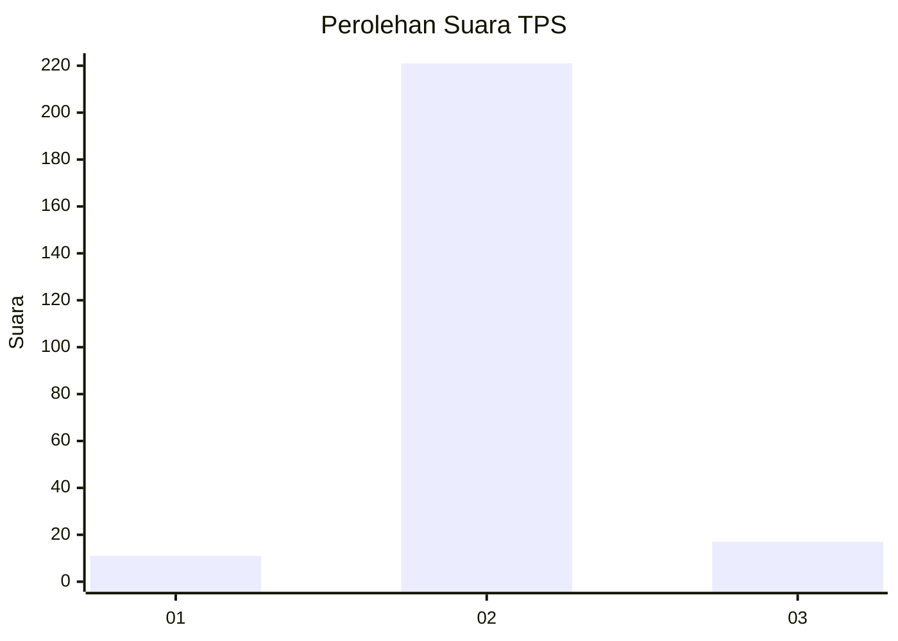
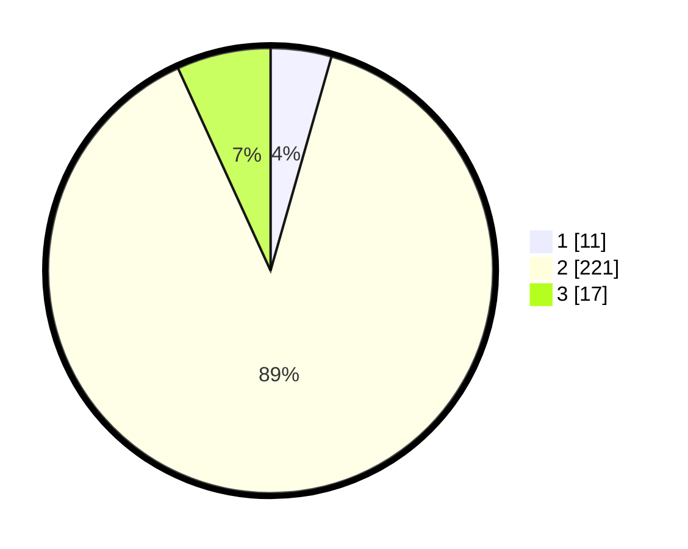

# Hasil

## Grafik

## Tabel

| No. | Nama Paslon    | Suara | Suara (raw) | Persentase |
|:--- |:-------------- | -----:| -----------:| ----------:|
| 1   | ANIES MUHAIMIN | 11    | [11][p-1]   | 4,42       |
| 2   | PRABOWO GIBRAN | 221   | [221][p-2]  | 88,76      |
| 3   | GANJAR MAHFUD  | 17    | [17][p-3]   | 6,83       |

[p-1]: https://github.com/gigit-pemilu/pemilu-2024/blob/main/pilpres/hitung-suara/sub/32-jawa-barat/sub/13-subang/sub/18-cipunagara/sub/2010-manyingsal/sub/007-tps/sub/paslon-1.txt
[p-2]: https://github.com/gigit-pemilu/pemilu-2024/blob/main/pilpres/hitung-suara/sub/32-jawa-barat/sub/13-subang/sub/18-cipunagara/sub/2010-manyingsal/sub/007-tps/sub/paslon-2.txt
[p-3]: https://github.com/gigit-pemilu/pemilu-2024/blob/main/pilpres/hitung-suara/sub/32-jawa-barat/sub/13-subang/sub/18-cipunagara/sub/2010-manyingsal/sub/007-tps/sub/paslon-3.txt

## Foto C Plano

https://sirekap-obj-formc.kpu.go.id/0c20/pemilu/ppwp/32/13/18/20/10/3213182010007-20240214-232639--a83a0d77-cc4c-464d-8331-27618f29f171.jpg

https://sirekap-obj-formc.kpu.go.id/0c20/pemilu/ppwp/32/13/18/20/10/3213182010007-20240214-232847--73b87bc2-cfcf-4872-a845-9e6fdb443bdf.jpg

https://sirekap-obj-formc.kpu.go.id/0c20/pemilu/ppwp/32/13/18/20/10/3213182010007-20240214-232951--be6b478b-c944-4dfa-b46b-84c81280c2ee.jpg

## Metadata

| Key        | Value               |
| ---------- | ------------------- |
| Time Stamp | 2024-02-19 16:00:00 |

