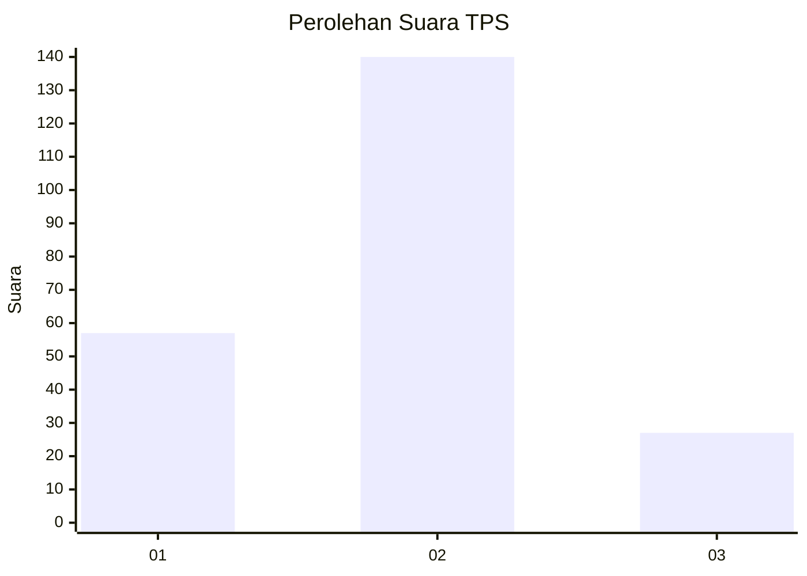
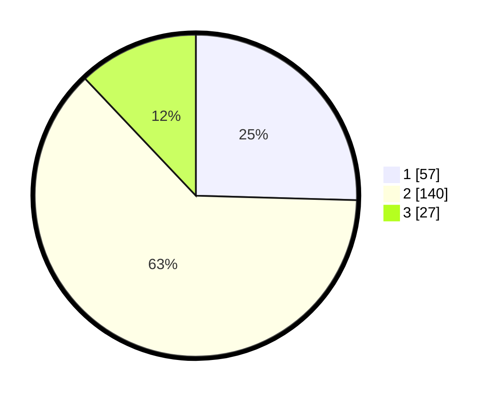

# Hasil

## Grafik

## Tabel

| No. | Nama Paslon    | Suara | Suara (raw) | Persentase |
|:--- |:-------------- | -----:| -----------:| ----------:|
| 1   | ANIES MUHAIMIN | 57    | [57][p-1]   | 25,45      |
| 2   | PRABOWO GIBRAN | 140   | [140][p-2]  | 62,50      |
| 3   | GANJAR MAHFUD  | 27    | [27][p-3]   | 12,05      |

[p-1]: https://github.com/gigit-pemilu/pemilu-2024-32-jawa-barat/blob/main/pilpres/hitung-suara/sub/32-jawa-barat/sub/13-subang/sub/19-cijambe/sub/2001-gunungtua/sub/006-tps/sub/paslon-1.txt
[p-2]: https://github.com/gigit-pemilu/pemilu-2024-32-jawa-barat/blob/main/pilpres/hitung-suara/sub/32-jawa-barat/sub/13-subang/sub/19-cijambe/sub/2001-gunungtua/sub/006-tps/sub/paslon-2.txt
[p-3]: https://github.com/gigit-pemilu/pemilu-2024-32-jawa-barat/blob/main/pilpres/hitung-suara/sub/32-jawa-barat/sub/13-subang/sub/19-cijambe/sub/2001-gunungtua/sub/006-tps/sub/paslon-3.txt

## Foto C Plano

https://sirekap-obj-formc.kpu.go.id/1f57/pemilu/ppwp/32/13/19/20/01/3213192001006-20240215-024655--c5315e72-e6b1-497d-89aa-a6656ee74f66.jpg

https://sirekap-obj-formc.kpu.go.id/1f57/pemilu/ppwp/32/13/19/20/01/3213192001006-20240215-025244--e89d51ff-147b-4ba8-affb-86e4a2ed8416.jpg

https://sirekap-obj-formc.kpu.go.id/1f57/pemilu/ppwp/32/13/19/20/01/3213192001006-20240215-025340--f7a997cb-0e80-4729-8828-db3e95d391dd.jpg

## Metadata

| Key        | Value               |
| ---------- | ------------------- |
| Time Stamp | 2024-02-19 16:00:00 |

