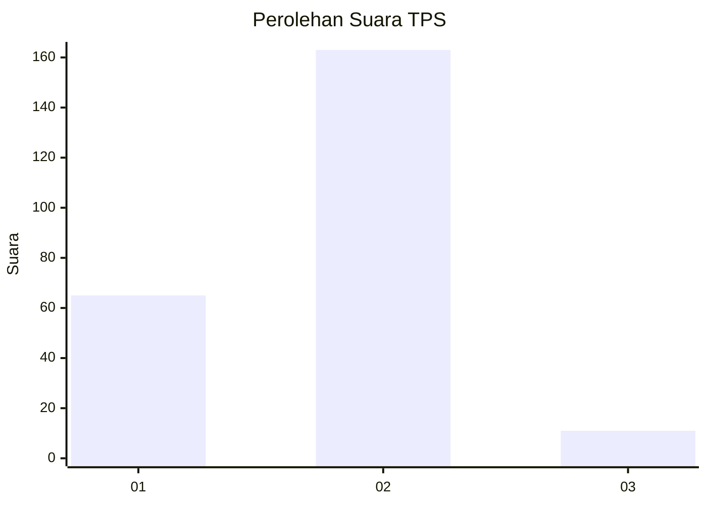
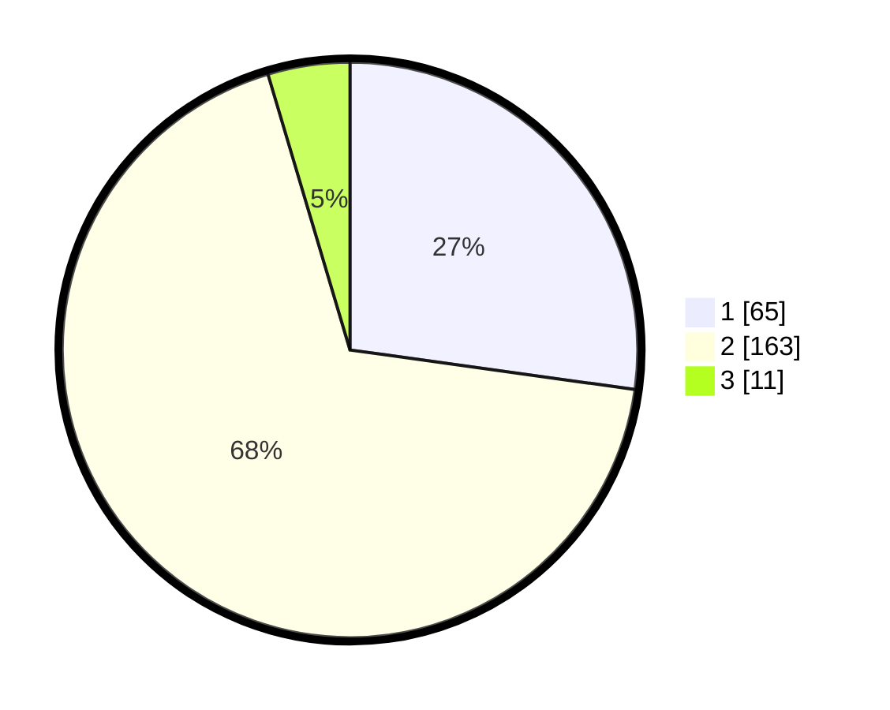

# Hasil

## Grafik

## Tabel

| No. | Nama Paslon    | Suara | Suara (raw) | Persentase |
|:--- |:-------------- | -----:| -----------:| ----------:|
| 1   | ANIES MUHAIMIN | 65    | [65][p-1]   | 27,20      |
| 2   | PRABOWO GIBRAN | 163   | [163][p-2]  | 68,20      |
| 3   | GANJAR MAHFUD  | 11    | [11][p-3]   | 4,60       |

[p-1]: https://github.com/gigit-pemilu/pemilu-2024/blob/main/pilpres/hitung-suara/sub/32-jawa-barat/sub/13-subang/sub/19-cijambe/sub/2001-gunungtua/sub/007-tps/sub/paslon-1.txt
[p-2]: https://github.com/gigit-pemilu/pemilu-2024/blob/main/pilpres/hitung-suara/sub/32-jawa-barat/sub/13-subang/sub/19-cijambe/sub/2001-gunungtua/sub/007-tps/sub/paslon-2.txt
[p-3]: https://github.com/gigit-pemilu/pemilu-2024/blob/main/pilpres/hitung-suara/sub/32-jawa-barat/sub/13-subang/sub/19-cijambe/sub/2001-gunungtua/sub/007-tps/sub/paslon-3.txt

## Foto C Plano

https://sirekap-obj-formc.kpu.go.id/cdd7/pemilu/ppwp/32/13/19/20/01/3213192001007-20240215-014127--03042dca-2806-4860-a0fd-b9e27b1e5d20.jpg

https://sirekap-obj-formc.kpu.go.id/cdd7/pemilu/ppwp/32/13/19/20/01/3213192001007-20240215-014319--3f11e0da-ef59-4940-973d-5147b63e1521.jpg

https://sirekap-obj-formc.kpu.go.id/cdd7/pemilu/ppwp/32/13/19/20/01/3213192001007-20240215-014455--114c3a80-e3ac-460b-a080-1c9ebaae500e.jpg

## Metadata

| Key        | Value               |
| ---------- | ------------------- |
| Time Stamp | 2024-02-19 16:00:00 |

