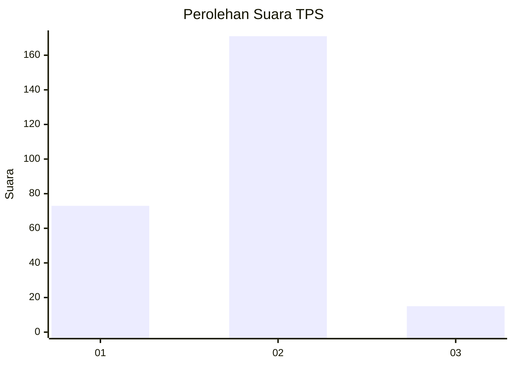
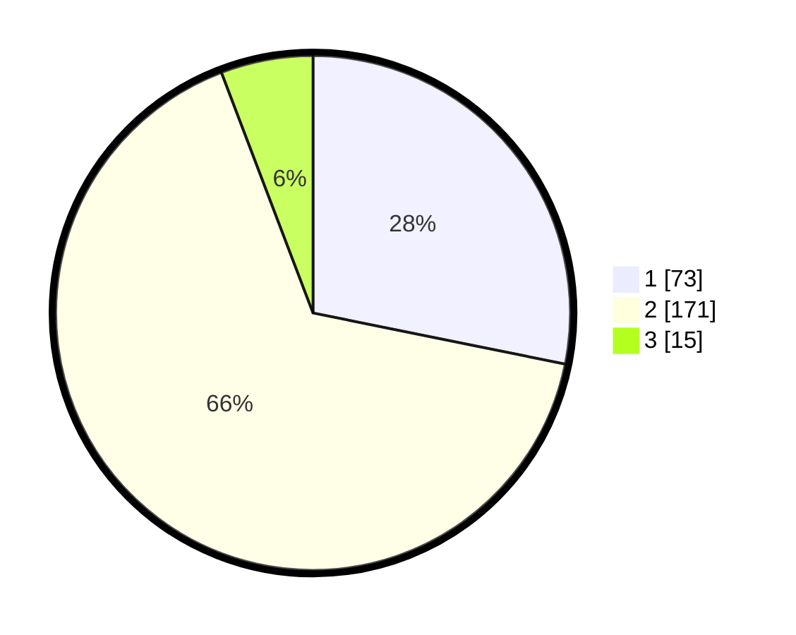

# Hasil

## Grafik

## Tabel

| No. | Nama Paslon    | Suara | Suara (raw) | Persentase |
|:--- |:-------------- | -----:| -----------:| ----------:|
| 1   | ANIES MUHAIMIN | 73    | [73][p-1]   | 28,19      |
| 2   | PRABOWO GIBRAN | 171   | [171][p-2]  | 66,02      |
| 3   | GANJAR MAHFUD  | 15    | [15][p-3]   | 5,79       |

[p-1]: https://github.com/gigit-pemilu/pemilu-2024/blob/main/pilpres/hitung-suara/sub/32-jawa-barat/sub/13-subang/sub/19-cijambe/sub/2001-gunungtua/sub/008-tps/sub/paslon-1.txt
[p-2]: https://github.com/gigit-pemilu/pemilu-2024/blob/main/pilpres/hitung-suara/sub/32-jawa-barat/sub/13-subang/sub/19-cijambe/sub/2001-gunungtua/sub/008-tps/sub/paslon-2.txt
[p-3]: https://github.com/gigit-pemilu/pemilu-2024/blob/main/pilpres/hitung-suara/sub/32-jawa-barat/sub/13-subang/sub/19-cijambe/sub/2001-gunungtua/sub/008-tps/sub/paslon-3.txt

## Foto C Plano

https://sirekap-obj-formc.kpu.go.id/a1a8/pemilu/ppwp/32/13/19/20/01/3213192001008-20240215-015944--34030c13-f5bb-4cc7-b705-2f37672599f2.jpg

https://sirekap-obj-formc.kpu.go.id/a1a8/pemilu/ppwp/32/13/19/20/01/3213192001008-20240215-020024--a7589e76-67aa-4b6c-914f-cb20f68b1b54.jpg

https://sirekap-obj-formc.kpu.go.id/a1a8/pemilu/ppwp/32/13/19/20/01/3213192001008-20240215-020133--97d51c15-c0d0-45df-8054-86762bf6353b.jpg

## Metadata

| Key        | Value               |
| ---------- | ------------------- |
| Time Stamp | 2024-02-19 18:00:00 |

