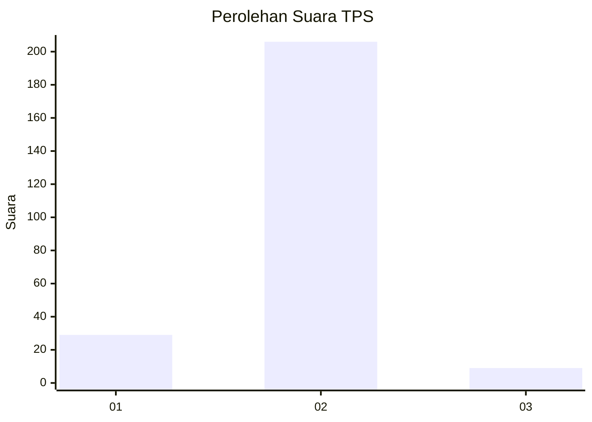
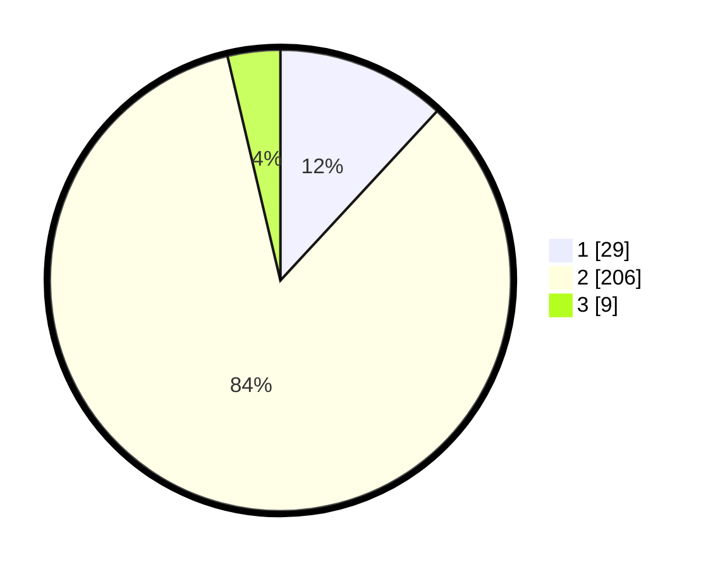

# Hasil

## Grafik

## Tabel

| No. | Nama Paslon    | Suara | Suara (raw) | Persentase |
|:--- |:-------------- | -----:| -----------:| ----------:|
| 1   | ANIES MUHAIMIN | 29    | [29][p-1]   | 11,89      |
| 2   | PRABOWO GIBRAN | 206   | [206][p-2]  | 84,43      |
| 3   | GANJAR MAHFUD  | 9     | [9][p-3]    | 3,69       |

[p-1]: https://github.com/gigit-pemilu/pemilu-2024-32-jawa-barat/blob/main/pilpres/hitung-suara/sub/32-jawa-barat/sub/13-subang/sub/19-cijambe/sub/2004-cimenteng/sub/007-tps/sub/paslon-1.txt
[p-2]: https://github.com/gigit-pemilu/pemilu-2024-32-jawa-barat/blob/main/pilpres/hitung-suara/sub/32-jawa-barat/sub/13-subang/sub/19-cijambe/sub/2004-cimenteng/sub/007-tps/sub/paslon-2.txt
[p-3]: https://github.com/gigit-pemilu/pemilu-2024-32-jawa-barat/blob/main/pilpres/hitung-suara/sub/32-jawa-barat/sub/13-subang/sub/19-cijambe/sub/2004-cimenteng/sub/007-tps/sub/paslon-3.txt

## Foto C Plano

https://sirekap-obj-formc.kpu.go.id/938f/pemilu/ppwp/32/13/19/20/04/3213192004007-20240215-032653--9c5cb35f-dfc7-47b7-a297-cbafd9248e76.jpg

https://sirekap-obj-formc.kpu.go.id/938f/pemilu/ppwp/32/13/19/20/04/3213192004007-20240214-223407--3779fffb-4d6f-4f81-87f6-86a7094d5b0f.jpg

https://sirekap-obj-formc.kpu.go.id/938f/pemilu/ppwp/32/13/19/20/04/3213192004007-20240214-223435--053c272a-4cbc-4b25-ace7-e2aa8ac4eee1.jpg

## Metadata

| Key        | Value               |
| ---------- | ------------------- |
| Time Stamp | 2024-02-19 18:00:00 |

