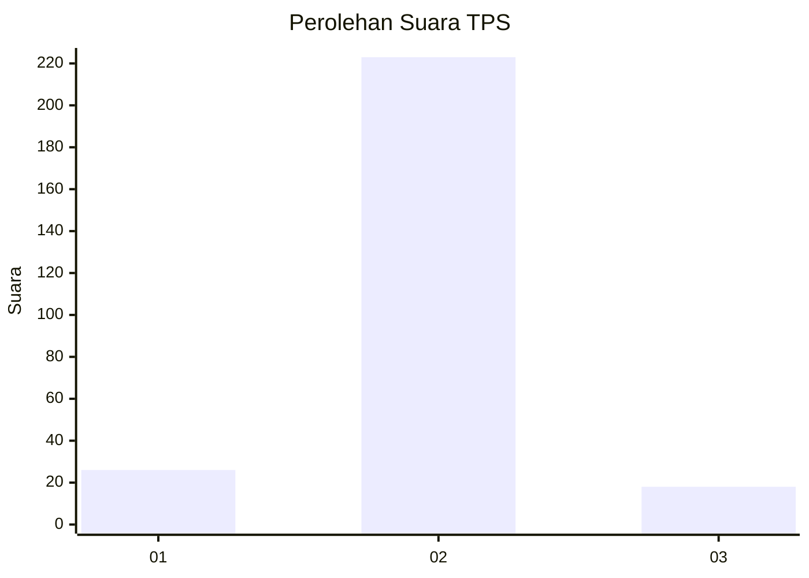
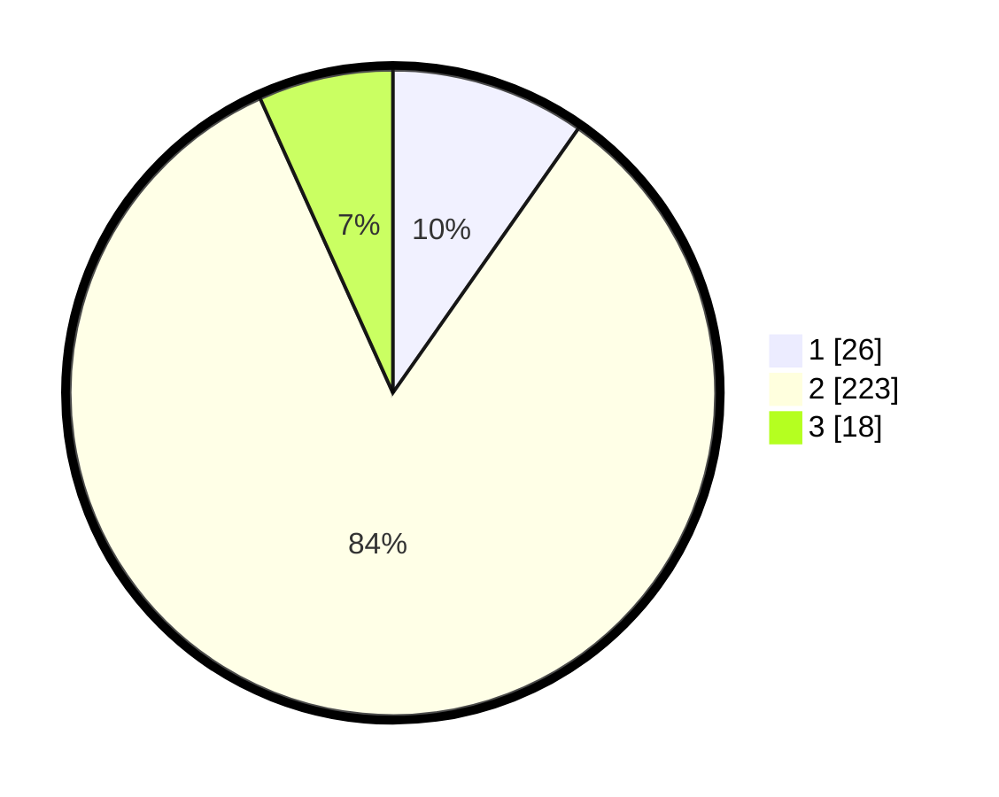

# Hasil

## Grafik

## Tabel

| No. | Nama Paslon    | Suara | Suara (raw) | Persentase |
|:--- |:-------------- | -----:| -----------:| ----------:|
| 1   | ANIES MUHAIMIN | 26    | [26][p-1]   | 9,74       |
| 2   | PRABOWO GIBRAN | 223   | [223][p-2]  | 83,52      |
| 3   | GANJAR MAHFUD  | 18    | [18][p-3]   | 6,74       |

[p-1]: https://github.com/gigit-pemilu/pemilu-2024-32-jawa-barat/blob/main/pilpres/hitung-suara/sub/32-jawa-barat/sub/13-subang/sub/19-cijambe/sub/2005-bantarsari/sub/007-tps/sub/paslon-1.txt
[p-2]: https://github.com/gigit-pemilu/pemilu-2024-32-jawa-barat/blob/main/pilpres/hitung-suara/sub/32-jawa-barat/sub/13-subang/sub/19-cijambe/sub/2005-bantarsari/sub/007-tps/sub/paslon-2.txt
[p-3]: https://github.com/gigit-pemilu/pemilu-2024-32-jawa-barat/blob/main/pilpres/hitung-suara/sub/32-jawa-barat/sub/13-subang/sub/19-cijambe/sub/2005-bantarsari/sub/007-tps/sub/paslon-3.txt

## Foto C Plano

https://sirekap-obj-formc.kpu.go.id/e6ab/pemilu/ppwp/32/13/19/20/05/3213192005007-20240215-104419--a824cf77-9f72-4b48-901a-f89c5fbc9731.jpg

https://sirekap-obj-formc.kpu.go.id/e6ab/pemilu/ppwp/32/13/19/20/05/3213192005007-20240215-064809--5144ff5f-c3ba-4eb2-873d-25e34c98bcf0.jpg

https://sirekap-obj-formc.kpu.go.id/e6ab/pemilu/ppwp/32/13/19/20/05/3213192005007-20240215-064831--afe245ba-7e5a-4e72-ac6a-bb824f231644.jpg

## Metadata

| Key        | Value               |
| ---------- | ------------------- |
| Time Stamp | 2024-02-19 16:00:00 |

