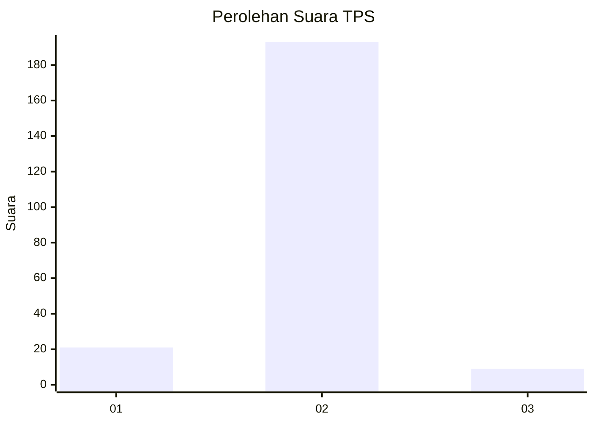
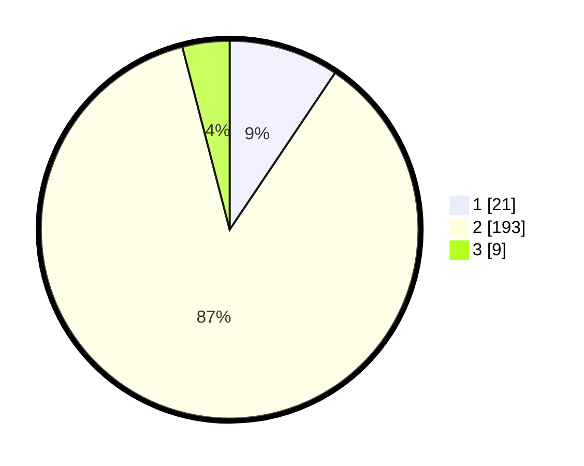

# Hasil

## Grafik

## Tabel

| No. | Nama Paslon    | Suara | Suara (raw) | Persentase |
|:--- |:-------------- | -----:| -----------:| ----------:|
| 1   | ANIES MUHAIMIN | 21    | [21][p-1]   | 9,42       |
| 2   | PRABOWO GIBRAN | 193   | [193][p-2]  | 86,55      |
| 3   | GANJAR MAHFUD  | 9     | [9][p-3]    | 4,04       |

[p-1]: https://github.com/gigit-pemilu/pemilu-2024-32-jawa-barat/blob/main/pilpres/hitung-suara/sub/32-jawa-barat/sub/13-subang/sub/20-cipeundeuy/sub/2001-karangmukti/sub/001-tps/sub/paslon-1.txt
[p-2]: https://github.com/gigit-pemilu/pemilu-2024-32-jawa-barat/blob/main/pilpres/hitung-suara/sub/32-jawa-barat/sub/13-subang/sub/20-cipeundeuy/sub/2001-karangmukti/sub/001-tps/sub/paslon-2.txt
[p-3]: https://github.com/gigit-pemilu/pemilu-2024-32-jawa-barat/blob/main/pilpres/hitung-suara/sub/32-jawa-barat/sub/13-subang/sub/20-cipeundeuy/sub/2001-karangmukti/sub/001-tps/sub/paslon-3.txt

## Foto C Plano

https://sirekap-obj-formc.kpu.go.id/ed83/pemilu/ppwp/32/13/20/20/01/3213202001001-20240215-022705--5acb2039-9b5f-4aff-a18d-bbb28105a3f9.jpg

https://sirekap-obj-formc.kpu.go.id/ed83/pemilu/ppwp/32/13/20/20/01/3213202001001-20240215-022728--bcd422a8-f123-40ab-a970-7ba7c9a15aec.jpg

https://sirekap-obj-formc.kpu.go.id/ed83/pemilu/ppwp/32/13/20/20/01/3213202001001-20240215-022819--8ba06254-c7bb-49ce-bcdc-239d214becae.jpg

## Metadata

| Key        | Value               |
| ---------- | ------------------- |
| Time Stamp | 2024-02-19 14:00:00 |

