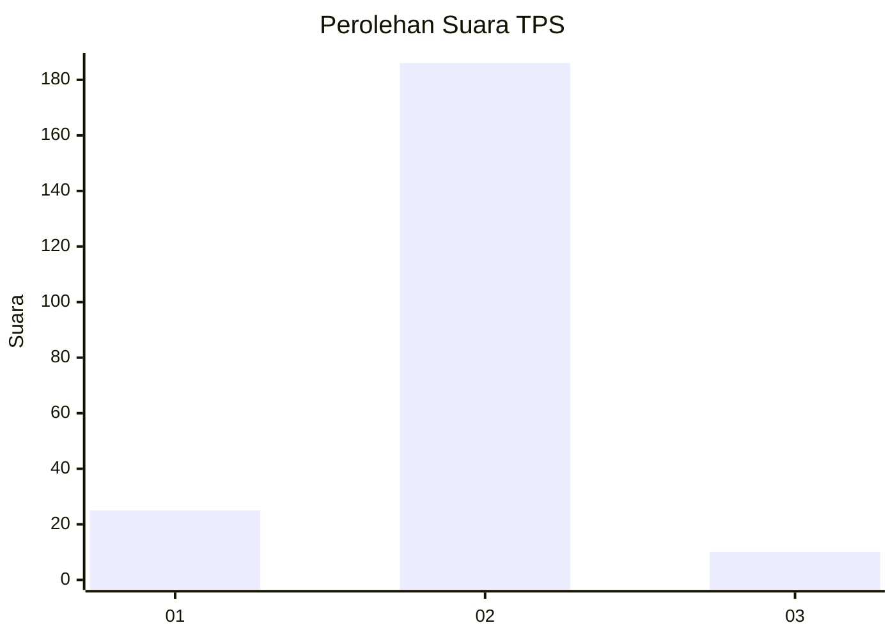
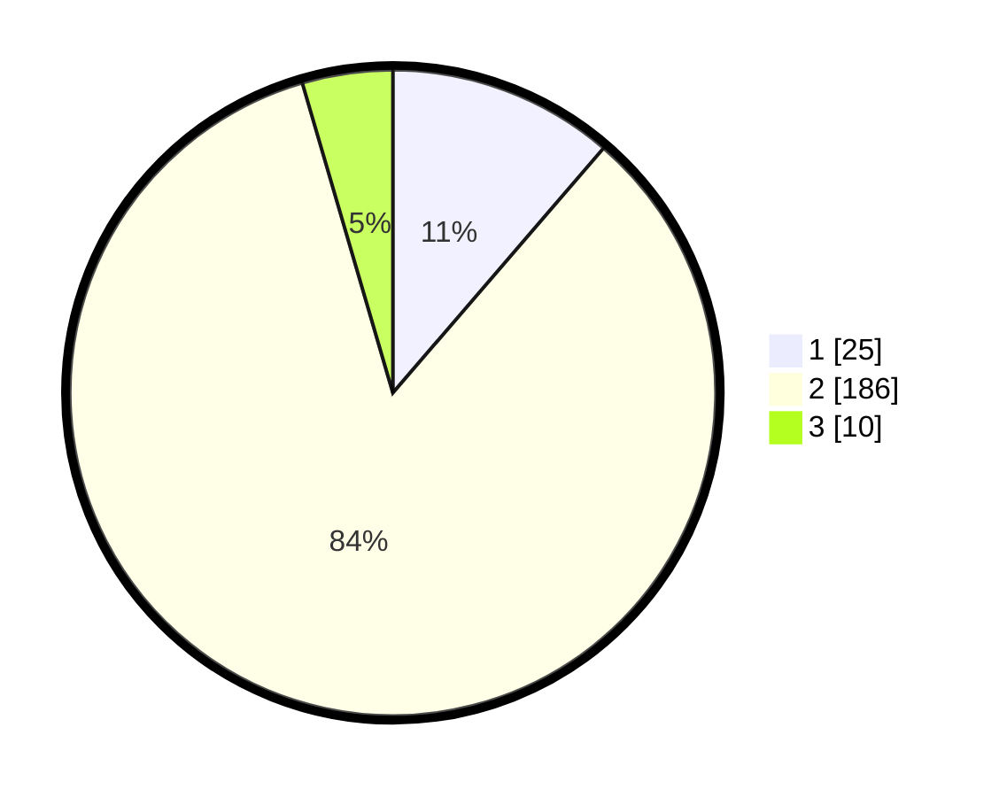

# Hasil

## Grafik

## Tabel

| No. | Nama Paslon    | Suara | Suara (raw) | Persentase |
|:--- |:-------------- | -----:| -----------:| ----------:|
| 1   | ANIES MUHAIMIN | 25    | [25][p-1]   | 11,31      |
| 2   | PRABOWO GIBRAN | 186   | [186][p-2]  | 84,16      |
| 3   | GANJAR MAHFUD  | 10    | [10][p-3]   | 4,52       |

[p-1]: https://github.com/gigit-pemilu/pemilu-2024-32-jawa-barat/blob/main/pilpres/hitung-suara/sub/32-jawa-barat/sub/13-subang/sub/20-cipeundeuy/sub/2001-karangmukti/sub/003-tps/sub/paslon-1.txt
[p-2]: https://github.com/gigit-pemilu/pemilu-2024-32-jawa-barat/blob/main/pilpres/hitung-suara/sub/32-jawa-barat/sub/13-subang/sub/20-cipeundeuy/sub/2001-karangmukti/sub/003-tps/sub/paslon-2.txt
[p-3]: https://github.com/gigit-pemilu/pemilu-2024-32-jawa-barat/blob/main/pilpres/hitung-suara/sub/32-jawa-barat/sub/13-subang/sub/20-cipeundeuy/sub/2001-karangmukti/sub/003-tps/sub/paslon-3.txt

## Foto C Plano

https://sirekap-obj-formc.kpu.go.id/dd86/pemilu/ppwp/32/13/20/20/01/3213202001003-20240214-185321--f1fe6378-84e0-4e52-a295-39281c0631b1.jpg

https://sirekap-obj-formc.kpu.go.id/dd86/pemilu/ppwp/32/13/20/20/01/3213202001003-20240214-190851--bafac7ff-c681-46d9-b96f-c0105249fd4e.jpg

https://sirekap-obj-formc.kpu.go.id/dd86/pemilu/ppwp/32/13/20/20/01/3213202001003-20240214-190814--e18c5dcc-373d-4749-94ca-98c9e534ac5e.jpg

## Metadata

| Key        | Value               |
| ---------- | ------------------- |
| Time Stamp | 2024-02-19 16:00:00 |

