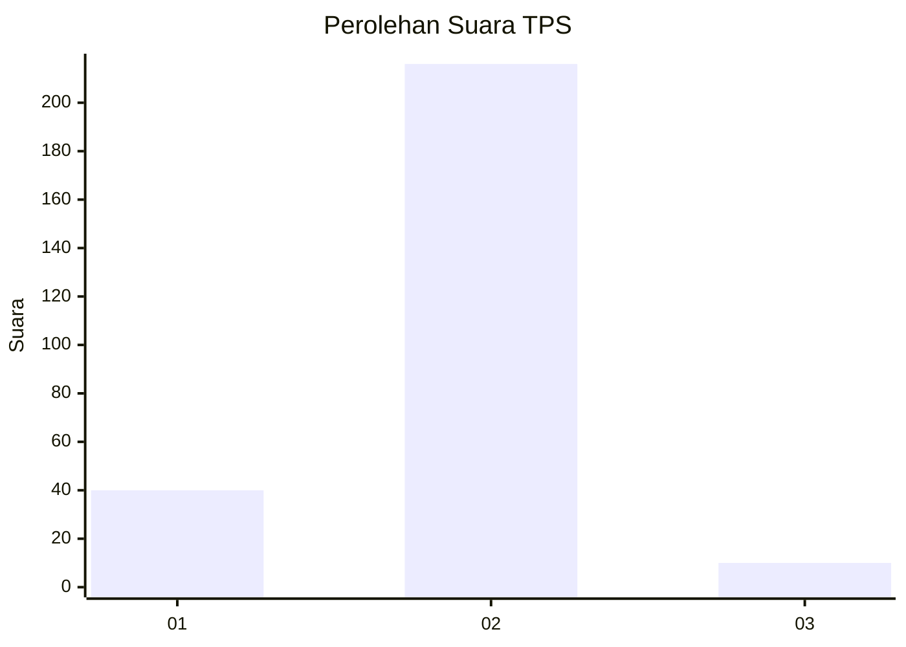
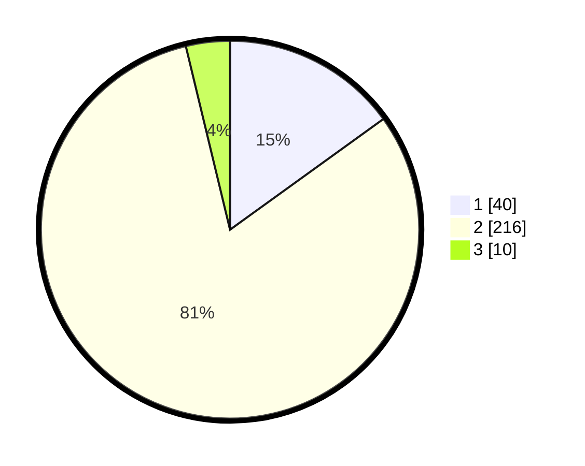

# Hasil

## Grafik

## Tabel

| No. | Nama Paslon    | Suara | Suara (raw) | Persentase |
|:--- |:-------------- | -----:| -----------:| ----------:|
| 1   | ANIES MUHAIMIN | 40    | [40][p-1]   | 15,04      |
| 2   | PRABOWO GIBRAN | 216   | [216][p-2]  | 81,20      |
| 3   | GANJAR MAHFUD  | 10    | [10][p-3]   | 3,76       |

[p-1]: https://github.com/gigit-pemilu/pemilu-2024/blob/main/pilpres/hitung-suara/sub/32-jawa-barat/sub/13-subang/sub/20-cipeundeuy/sub/2001-karangmukti/sub/005-tps/sub/paslon-1.txt
[p-2]: https://github.com/gigit-pemilu/pemilu-2024/blob/main/pilpres/hitung-suara/sub/32-jawa-barat/sub/13-subang/sub/20-cipeundeuy/sub/2001-karangmukti/sub/005-tps/sub/paslon-2.txt
[p-3]: https://github.com/gigit-pemilu/pemilu-2024/blob/main/pilpres/hitung-suara/sub/32-jawa-barat/sub/13-subang/sub/20-cipeundeuy/sub/2001-karangmukti/sub/005-tps/sub/paslon-3.txt

## Foto C Plano

https://sirekap-obj-formc.kpu.go.id/f50d/pemilu/ppwp/32/13/20/20/01/3213202001005-20240214-210128--81dd2486-c80f-4509-b26a-8b0b2e5df9f3.jpg

https://sirekap-obj-formc.kpu.go.id/f50d/pemilu/ppwp/32/13/20/20/01/3213202001005-20240214-210225--f53894c4-9158-4937-ae09-7457a1a81ca4.jpg

https://sirekap-obj-formc.kpu.go.id/f50d/pemilu/ppwp/32/13/20/20/01/3213202001005-20240214-210333--c6f16194-9406-44a4-95e9-e7296b7c9a33.jpg

## Metadata

| Key        | Value               |
| ---------- | ------------------- |
| Time Stamp | 2024-02-19 16:00:00 |

