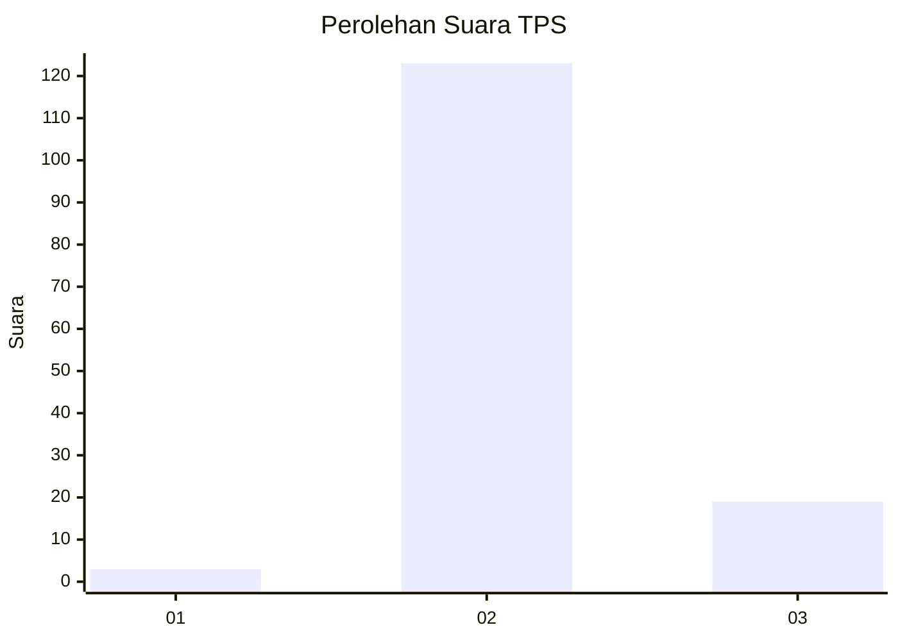
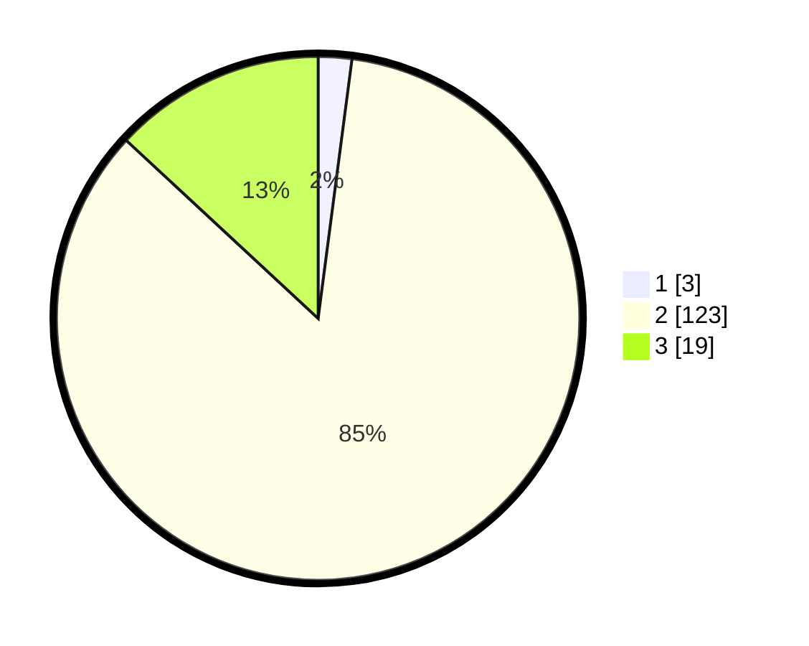

# Hasil

## Grafik

## Tabel

| No. | Nama Paslon    | Suara | Suara (raw) | Persentase |
|:--- |:-------------- | -----:| -----------:| ----------:|
| 1   | ANIES MUHAIMIN | 3     | [3][p-1]    | 2,07       |
| 2   | PRABOWO GIBRAN | 123   | [123][p-2]  | 84,83      |
| 3   | GANJAR MAHFUD  | 19    | [19][p-3]   | 13,10      |

[p-1]: https://github.com/gigit-pemilu/pemilu-2024-32-jawa-barat/blob/main/pilpres/hitung-suara/sub/32-jawa-barat/sub/13-subang/sub/21-legonkulon/sub/2001-tegalurung/sub/008-tps/sub/paslon-1.txt
[p-2]: https://github.com/gigit-pemilu/pemilu-2024-32-jawa-barat/blob/main/pilpres/hitung-suara/sub/32-jawa-barat/sub/13-subang/sub/21-legonkulon/sub/2001-tegalurung/sub/008-tps/sub/paslon-2.txt
[p-3]: https://github.com/gigit-pemilu/pemilu-2024-32-jawa-barat/blob/main/pilpres/hitung-suara/sub/32-jawa-barat/sub/13-subang/sub/21-legonkulon/sub/2001-tegalurung/sub/008-tps/sub/paslon-3.txt

## Foto C Plano

https://sirekap-obj-formc.kpu.go.id/b2e4/pemilu/ppwp/32/13/21/20/01/3213212001008-20240214-215131--74be6b43-ed01-44da-8412-07c90d2357ba.jpg

https://sirekap-obj-formc.kpu.go.id/b2e4/pemilu/ppwp/32/13/21/20/01/3213212001008-20240214-215229--28a85501-d741-4ccc-84ca-7ab95960c48f.jpg

https://sirekap-obj-formc.kpu.go.id/b2e4/pemilu/ppwp/32/13/21/20/01/3213212001008-20240214-215401--32cadb40-bb88-411c-af69-3fdc5f458ef7.jpg

## Metadata

| Key        | Value               |
| ---------- | ------------------- |
| Time Stamp | 2024-02-19 19:00:00 |

