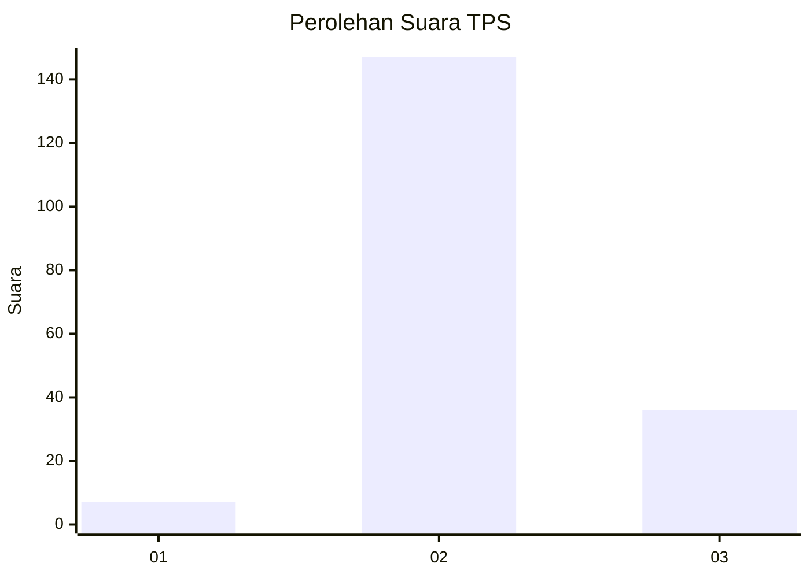
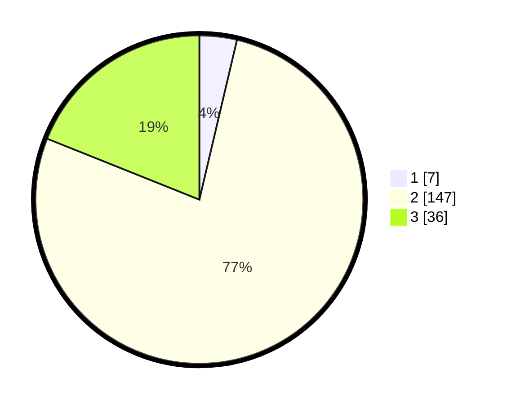

# Hasil

## Grafik

## Tabel

| No. | Nama Paslon    | Suara | Suara (raw) | Persentase |
|:--- |:-------------- | -----:| -----------:| ----------:|
| 1   | ANIES MUHAIMIN | 7     | [7][p-1]    | 3,68       |
| 2   | PRABOWO GIBRAN | 147   | [147][p-2]  | 77,37      |
| 3   | GANJAR MAHFUD  | 36    | [36][p-3]   | 18,95      |

[p-1]: https://github.com/gigit-pemilu/pemilu-2024/blob/main/pilpres/hitung-suara/sub/32-jawa-barat/sub/13-subang/sub/21-legonkulon/sub/2001-tegalurung/sub/010-tps/sub/paslon-1.txt
[p-2]: https://github.com/gigit-pemilu/pemilu-2024/blob/main/pilpres/hitung-suara/sub/32-jawa-barat/sub/13-subang/sub/21-legonkulon/sub/2001-tegalurung/sub/010-tps/sub/paslon-2.txt
[p-3]: https://github.com/gigit-pemilu/pemilu-2024/blob/main/pilpres/hitung-suara/sub/32-jawa-barat/sub/13-subang/sub/21-legonkulon/sub/2001-tegalurung/sub/010-tps/sub/paslon-3.txt

## Foto C Plano

https://sirekap-obj-formc.kpu.go.id/3a74/pemilu/ppwp/32/13/21/20/01/3213212001010-20240215-195134--cdc1285c-3ee3-47ed-b2ae-7fad486fa5b3.jpg

https://sirekap-obj-formc.kpu.go.id/3a74/pemilu/ppwp/32/13/21/20/01/3213212001010-20240215-231231--0dee5873-4977-4de5-b7bb-9b16cd2ffe3a.jpg

https://sirekap-obj-formc.kpu.go.id/3a74/pemilu/ppwp/32/13/21/20/01/3213212001010-20240215-231240--2218ff8b-be2e-4636-ba2e-0f325b321d18.jpg

## Metadata

| Key        | Value               |
| ---------- | ------------------- |
| Time Stamp | 2024-02-19 17:00:00 |

