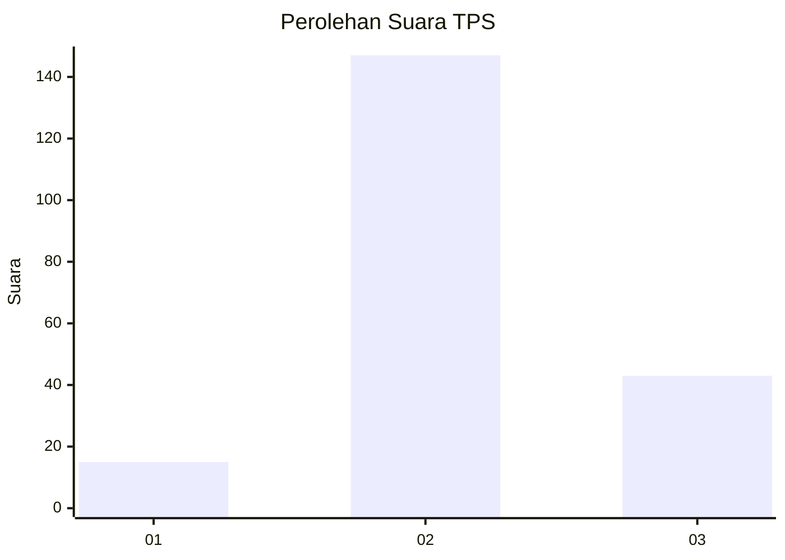

# Hasil

## Grafik

## Tabel

| No. | Nama Paslon    | Suara | Suara (raw) | Persentase |
|:--- |:-------------- | -----:| -----------:| ----------:|
| 1   | ANIES MUHAIMIN | 15    | [15][p-1]   | 7,32       |
| 2   | PRABOWO GIBRAN | 147   | [147][p-2]  | 71,71      |
| 3   | GANJAR MAHFUD  | 43    | [43][p-3]   | 20,98      |

[p-1]: https://github.com/gigit-pemilu/pemilu-2024/blob/main/pilpres/hitung-suara/sub/32-jawa-barat/sub/13-subang/sub/21-legonkulon/sub/2001-tegalurung/sub/012-tps/sub/paslon-1.txt
[p-2]: https://github.com/gigit-pemilu/pemilu-2024/blob/main/pilpres/hitung-suara/sub/32-jawa-barat/sub/13-subang/sub/21-legonkulon/sub/2001-tegalurung/sub/012-tps/sub/paslon-2.txt
[p-3]: https://github.com/gigit-pemilu/pemilu-2024/blob/main/pilpres/hitung-suara/sub/32-jawa-barat/sub/13-subang/sub/21-legonkulon/sub/2001-tegalurung/sub/012-tps/sub/paslon-3.txt

## Foto C Plano

https://sirekap-obj-formc.kpu.go.id/a111/pemilu/ppwp/32/13/21/20/01/3213212001012-20240215-005821--a3f5f877-2233-4fdb-ab8d-025967d0717b.jpg

https://sirekap-obj-formc.kpu.go.id/a111/pemilu/ppwp/32/13/21/20/01/3213212001012-20240215-005713--d7d3c422-8215-4d1a-8b73-445f046f8838.jpg

https://sirekap-obj-formc.kpu.go.id/a111/pemilu/ppwp/32/13/21/20/01/3213212001012-20240215-005846--636e8c3a-4c9d-4470-bfa3-a7f4456dd737.jpg

## Metadata

| Key        | Value               |
| ---------- | ------------------- |
| Time Stamp | 2024-02-19 17:00:00 |

