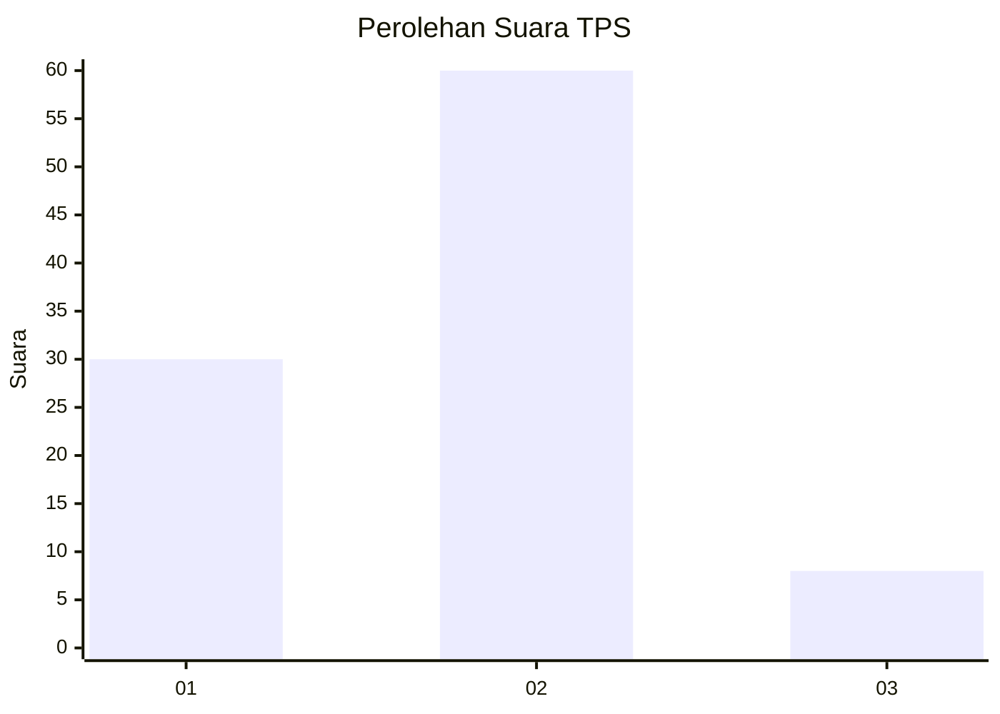
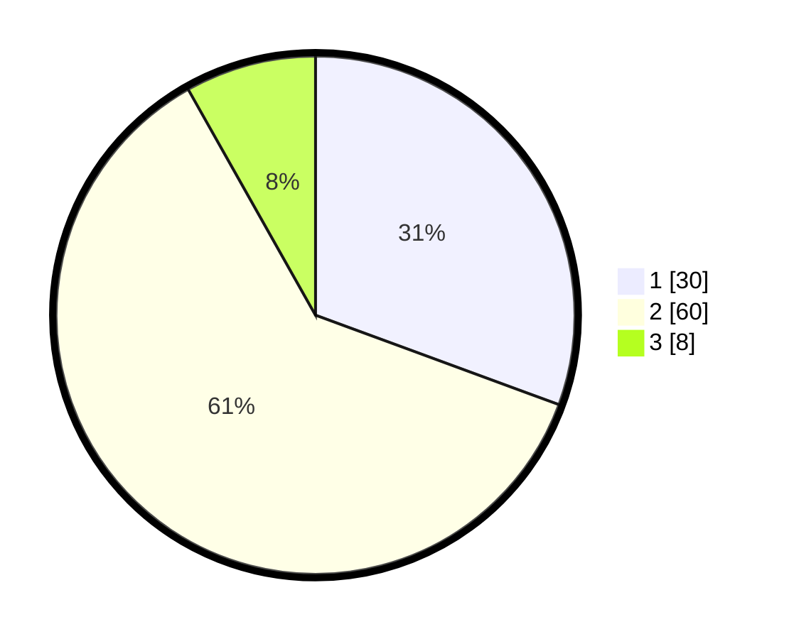

# Hasil

## Grafik

## Tabel

| No. | Nama Paslon    | Suara | Suara (raw) | Persentase |
|:--- |:-------------- | -----:| -----------:| ----------:|
| 1   | ANIES MUHAIMIN | 30    | [30][p-1]   | 30,61      |
| 2   | PRABOWO GIBRAN | 60    | [60][p-2]   | 61,22      |
| 3   | GANJAR MAHFUD  | 8     | [8][p-3]    | 8,16       |

[p-1]: https://github.com/gigit-pemilu/pemilu-2024/blob/main/pilpres/hitung-suara/sub/32-jawa-barat/sub/13-subang/sub/21-legonkulon/sub/2007-karangmulya/sub/011-tps/sub/paslon-1.txt
[p-2]: https://github.com/gigit-pemilu/pemilu-2024/blob/main/pilpres/hitung-suara/sub/32-jawa-barat/sub/13-subang/sub/21-legonkulon/sub/2007-karangmulya/sub/011-tps/sub/paslon-2.txt
[p-3]: https://github.com/gigit-pemilu/pemilu-2024/blob/main/pilpres/hitung-suara/sub/32-jawa-barat/sub/13-subang/sub/21-legonkulon/sub/2007-karangmulya/sub/011-tps/sub/paslon-3.txt

## Foto C Plano

https://sirekap-obj-formc.kpu.go.id/147c/pemilu/ppwp/32/13/21/20/07/3213212007011-20240214-232327--8a303a62-2495-4989-bed0-28f446a38e10.jpg

https://sirekap-obj-formc.kpu.go.id/147c/pemilu/ppwp/32/13/21/20/07/3213212007011-20240214-232623--8a8b484b-c8b2-4763-ba17-eb522e6612c2.jpg

https://sirekap-obj-formc.kpu.go.id/147c/pemilu/ppwp/32/13/21/20/07/3213212007011-20240214-232758--48633626-3847-4180-99d5-451a0d710dc4.jpg

## Metadata

| Key        | Value               |
| ---------- | ------------------- |
| Time Stamp | 2024-02-19 20:00:00 |

