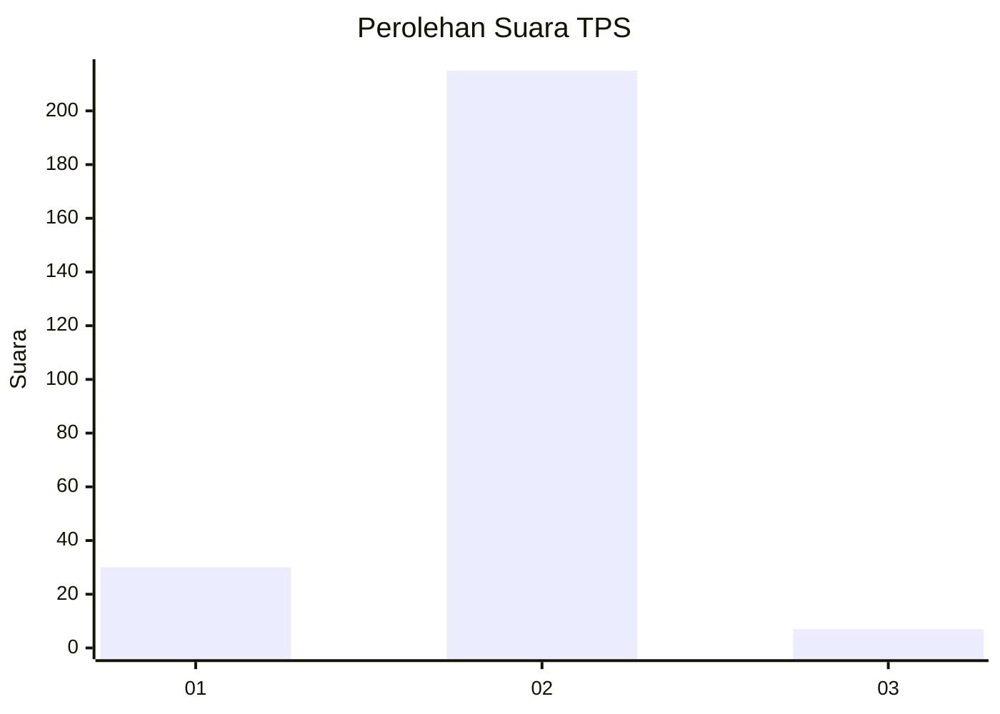
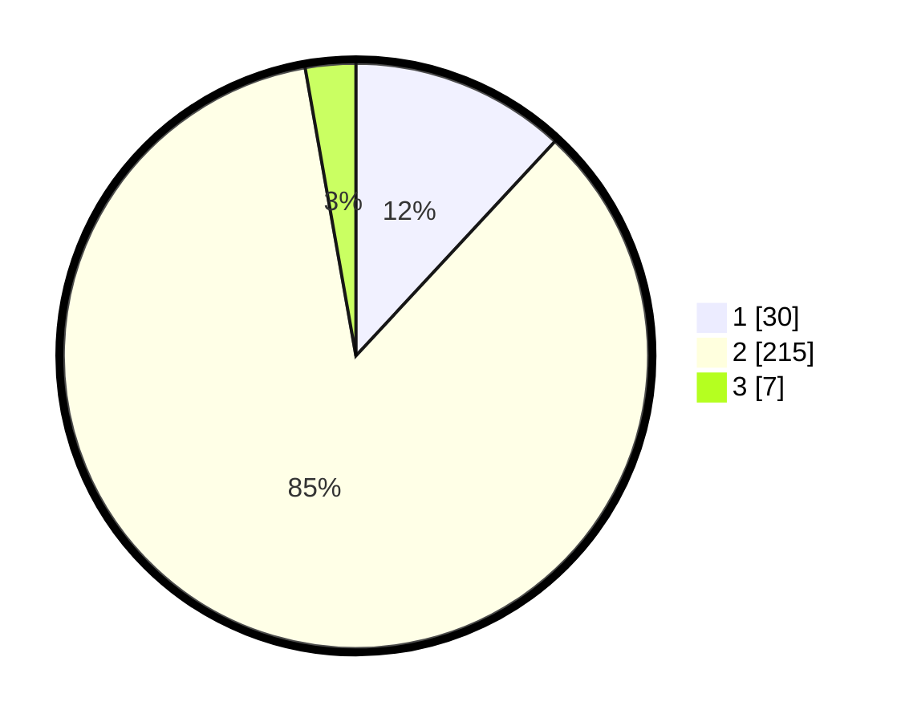

# Hasil

## Grafik

## Tabel

| No. | Nama Paslon    | Suara | Suara (raw) | Persentase |
|:--- |:-------------- | -----:| -----------:| ----------:|
| 1   | ANIES MUHAIMIN | 30    | [30][p-1]   | 11,90      |
| 2   | PRABOWO GIBRAN | 215   | [215][p-2]  | 85,32      |
| 3   | GANJAR MAHFUD  | 7     | [7][p-3]    | 2,78       |

[p-1]: https://github.com/gigit-pemilu/pemilu-2024/blob/main/pilpres/hitung-suara/sub/32-jawa-barat/sub/13-subang/sub/22-cikaum/sub/2001-kawunganten/sub/002-tps/sub/paslon-1.txt
[p-2]: https://github.com/gigit-pemilu/pemilu-2024/blob/main/pilpres/hitung-suara/sub/32-jawa-barat/sub/13-subang/sub/22-cikaum/sub/2001-kawunganten/sub/002-tps/sub/paslon-2.txt
[p-3]: https://github.com/gigit-pemilu/pemilu-2024/blob/main/pilpres/hitung-suara/sub/32-jawa-barat/sub/13-subang/sub/22-cikaum/sub/2001-kawunganten/sub/002-tps/sub/paslon-3.txt

## Foto C Plano

https://sirekap-obj-formc.kpu.go.id/6a1d/pemilu/ppwp/32/13/22/20/01/3213222001002-20240221-113203--cea5d5a2-b5bd-46a9-9534-6fb2f299fe78.jpg

https://sirekap-obj-formc.kpu.go.id/6a1d/pemilu/ppwp/32/13/22/20/01/3213222001002-20240221-113004--9db5b7a3-ce71-4578-afe3-052f4d126fa3.jpg

https://sirekap-obj-formc.kpu.go.id/6a1d/pemilu/ppwp/32/13/22/20/01/3213222001002-20240221-113049--a435ac51-b6a2-4208-9bde-3201b1e9764d.jpg

## Metadata

| Key        | Value               |
| ---------- | ------------------- |
| Time Stamp | 2024-02-21 12:00:00 |

