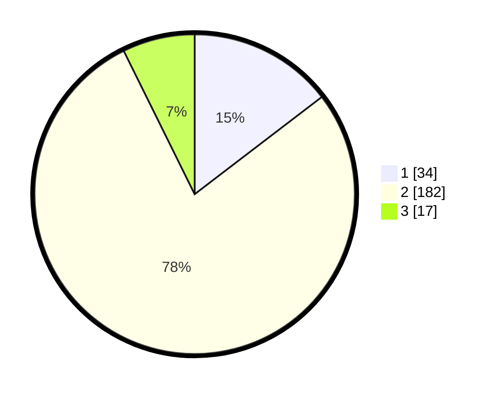

# Hasil

## Grafik

## Tabel

| No. | Nama Paslon    | Suara | Suara (raw) | Persentase |
|:--- |:-------------- | -----:| -----------:| ----------:|
| 1   | ANIES MUHAIMIN | 34    | [34][p-1]   | 14,59      |
| 2   | PRABOWO GIBRAN | 182   | [182][p-2]  | 78,11      |
| 3   | GANJAR MAHFUD  | 17    | [17][p-3]   | 7,30       |

[p-1]: https://github.com/gigit-pemilu/pemilu-2024-32-jawa-barat/blob/main/pilpres/hitung-suara/sub/32-jawa-barat/sub/13-subang/sub/22-cikaum/sub/2001-kawunganten/sub/005-tps/sub/paslon-1.txt
[p-2]: https://github.com/gigit-pemilu/pemilu-2024-32-jawa-barat/blob/main/pilpres/hitung-suara/sub/32-jawa-barat/sub/13-subang/sub/22-cikaum/sub/2001-kawunganten/sub/005-tps/sub/paslon-2.txt
[p-3]: https://github.com/gigit-pemilu/pemilu-2024-32-jawa-barat/blob/main/pilpres/hitung-suara/sub/32-jawa-barat/sub/13-subang/sub/22-cikaum/sub/2001-kawunganten/sub/005-tps/sub/paslon-3.txt

## Foto C Plano

https://sirekap-obj-formc.kpu.go.id/33e1/pemilu/ppwp/32/13/22/20/01/3213222001005-20240214-155454--1d359ad0-b0f1-412a-9b03-6fe46cd039cb.jpg

https://sirekap-obj-formc.kpu.go.id/33e1/pemilu/ppwp/32/13/22/20/01/3213222001005-20240214-155202--6f687060-4b7b-4478-86b5-abc7601c0f92.jpg

https://sirekap-obj-formc.kpu.go.id/33e1/pemilu/ppwp/32/13/22/20/01/3213222001005-20240214-155300--b97ab228-5f2a-4983-9bcf-85652b039a22.jpg

## Metadata

| Key        | Value               |
| ---------- | ------------------- |
| Time Stamp | 2024-02-19 13:00:00 |

