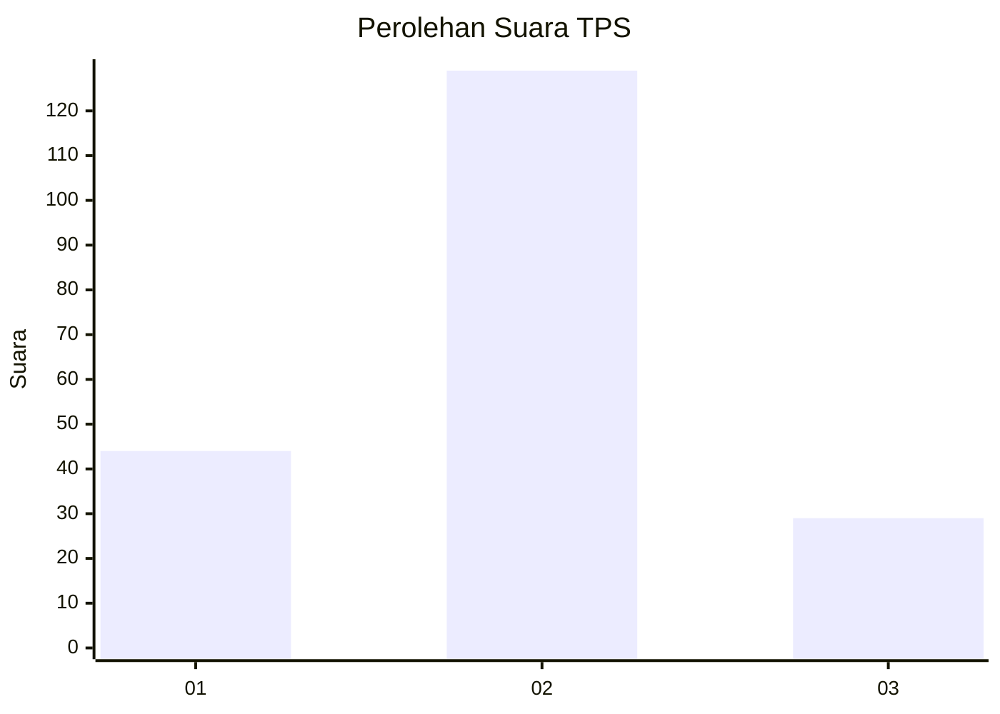
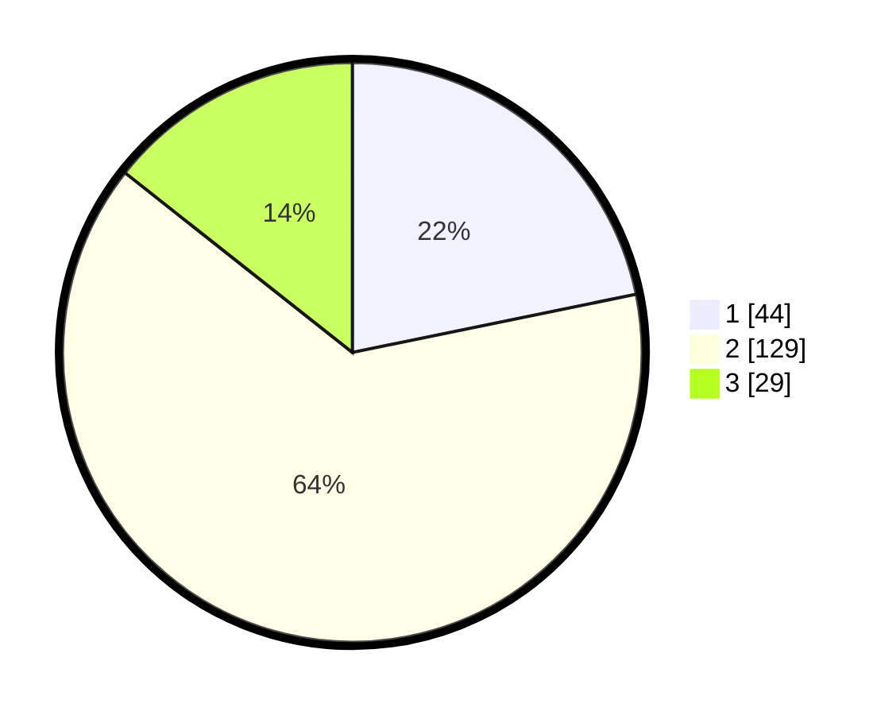

# Hasil

## Grafik

## Tabel

| No. | Nama Paslon    | Suara | Suara (raw) | Persentase |
|:--- |:-------------- | -----:| -----------:| ----------:|
| 1   | ANIES MUHAIMIN | 44    | [44][p-1]   | 21,78      |
| 2   | PRABOWO GIBRAN | 129   | [129][p-2]  | 63,86      |
| 3   | GANJAR MAHFUD  | 29    | [29][p-3]   | 14,36      |

[p-1]: https://github.com/gigit-pemilu/pemilu-2024/blob/main/pilpres/hitung-suara/sub/32-jawa-barat/sub/13-subang/sub/22-cikaum/sub/2005-tanjungsari-barat/sub/002-tps/sub/paslon-1.txt
[p-2]: https://github.com/gigit-pemilu/pemilu-2024/blob/main/pilpres/hitung-suara/sub/32-jawa-barat/sub/13-subang/sub/22-cikaum/sub/2005-tanjungsari-barat/sub/002-tps/sub/paslon-2.txt
[p-3]: https://github.com/gigit-pemilu/pemilu-2024/blob/main/pilpres/hitung-suara/sub/32-jawa-barat/sub/13-subang/sub/22-cikaum/sub/2005-tanjungsari-barat/sub/002-tps/sub/paslon-3.txt

## Foto C Plano

https://sirekap-obj-formc.kpu.go.id/69fb/pemilu/ppwp/32/13/22/20/05/3213222005002-20240214-231930--68909c4a-804d-4467-8dc2-374f23a79ae7.jpg

https://sirekap-obj-formc.kpu.go.id/69fb/pemilu/ppwp/32/13/22/20/05/3213222005002-20240214-232008--501c60a3-e08f-4d73-984f-e343e1252663.jpg

https://sirekap-obj-formc.kpu.go.id/69fb/pemilu/ppwp/32/13/22/20/05/3213222005002-20240214-215202--69bf9d24-a477-453b-9941-b9d1726d66a4.jpg

## Metadata

| Key        | Value               |
| ---------- | ------------------- |
| Time Stamp | 2024-02-19 13:00:00 |

