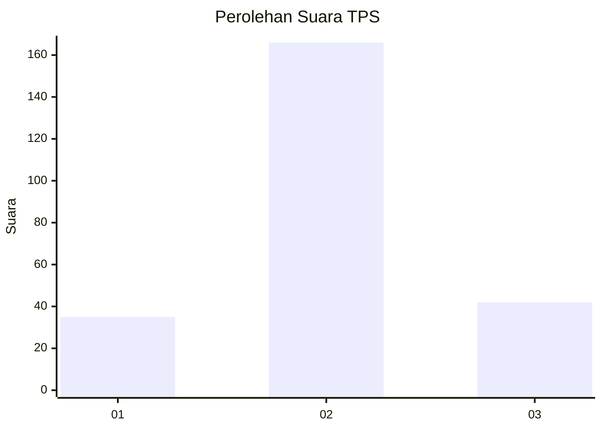
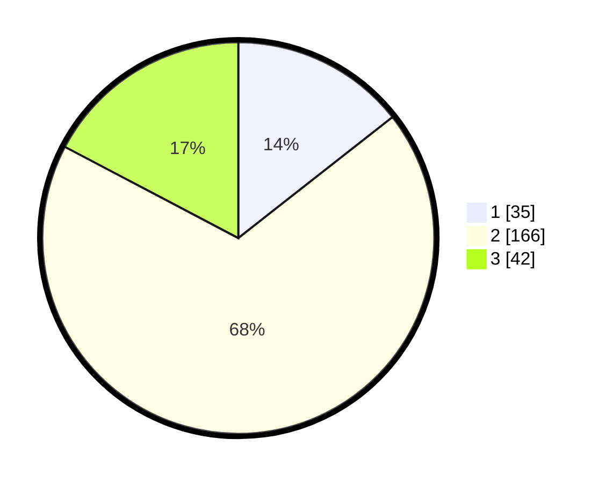

# Hasil

## Grafik

## Tabel

| No. | Nama Paslon    | Suara | Suara (raw) | Persentase |
|:--- |:-------------- | -----:| -----------:| ----------:|
| 1   | ANIES MUHAIMIN | 35    | [35][p-1]   | 14,40      |
| 2   | PRABOWO GIBRAN | 166   | [166][p-2]  | 68,31      |
| 3   | GANJAR MAHFUD  | 42    | [42][p-3]   | 17,28      |

[p-1]: https://github.com/gigit-pemilu/pemilu-2024/blob/main/pilpres/hitung-suara/sub/32-jawa-barat/sub/13-subang/sub/22-cikaum/sub/2007-tanjungsari-timur/sub/004-tps/sub/paslon-1.txt
[p-2]: https://github.com/gigit-pemilu/pemilu-2024/blob/main/pilpres/hitung-suara/sub/32-jawa-barat/sub/13-subang/sub/22-cikaum/sub/2007-tanjungsari-timur/sub/004-tps/sub/paslon-2.txt
[p-3]: https://github.com/gigit-pemilu/pemilu-2024/blob/main/pilpres/hitung-suara/sub/32-jawa-barat/sub/13-subang/sub/22-cikaum/sub/2007-tanjungsari-timur/sub/004-tps/sub/paslon-3.txt

## Foto C Plano

https://sirekap-obj-formc.kpu.go.id/d8ee/pemilu/ppwp/32/13/22/20/07/3213222007004-20240221-140158--43bb9ad2-86d1-4f8a-b9ed-9cc5a40a0ab2.jpg

https://sirekap-obj-formc.kpu.go.id/d8ee/pemilu/ppwp/32/13/22/20/07/3213222007004-20240221-140213--4e55ce38-6cb2-47f3-b311-00d8d9f74db0.jpg

https://sirekap-obj-formc.kpu.go.id/d8ee/pemilu/ppwp/32/13/22/20/07/3213222007004-20240221-140455--0d1b7960-57ca-4a53-a41c-0301c7ad612c.jpg

## Metadata

| Key        | Value               |
| ---------- | ------------------- |
| Time Stamp | 2024-02-21 15:00:00 |

