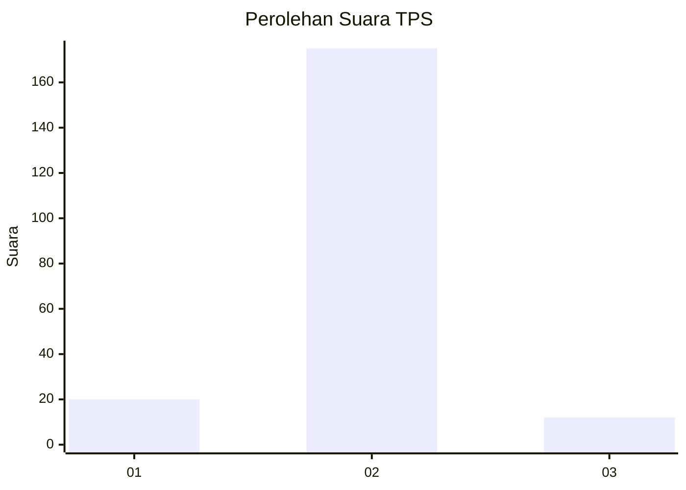
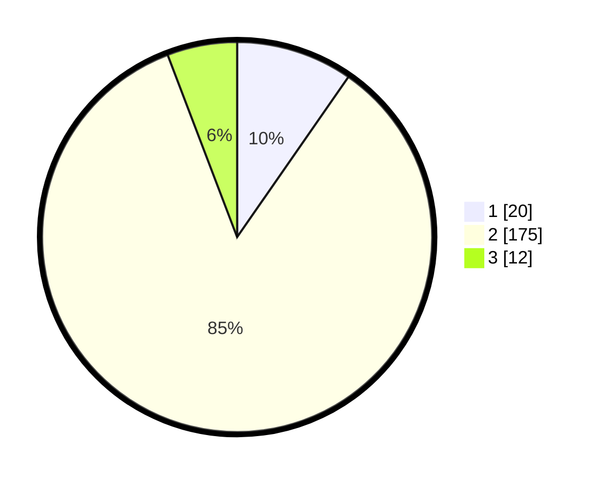

# Hasil

## Grafik

## Tabel

| No. | Nama Paslon    | Suara | Suara (raw) | Persentase |
|:--- |:-------------- | -----:| -----------:| ----------:|
| 1   | ANIES MUHAIMIN | 20    | [20][p-1]   | 9,66       |
| 2   | PRABOWO GIBRAN | 175   | [175][p-2]  | 84,54      |
| 3   | GANJAR MAHFUD  | 12    | [12][p-3]   | 5,80       |

[p-1]: https://github.com/gigit-pemilu/pemilu-2024/blob/main/pilpres/hitung-suara/sub/32-jawa-barat/sub/13-subang/sub/23-serangpanjang/sub/2001-cijengkol/sub/001-tps/sub/paslon-1.txt
[p-2]: https://github.com/gigit-pemilu/pemilu-2024/blob/main/pilpres/hitung-suara/sub/32-jawa-barat/sub/13-subang/sub/23-serangpanjang/sub/2001-cijengkol/sub/001-tps/sub/paslon-2.txt
[p-3]: https://github.com/gigit-pemilu/pemilu-2024/blob/main/pilpres/hitung-suara/sub/32-jawa-barat/sub/13-subang/sub/23-serangpanjang/sub/2001-cijengkol/sub/001-tps/sub/paslon-3.txt

## Foto C Plano

https://sirekap-obj-formc.kpu.go.id/895a/pemilu/ppwp/32/13/23/20/01/3213232001001-20240215-043000--3d1bd7a5-a955-406e-be86-839fd0d7720d.jpg

https://sirekap-obj-formc.kpu.go.id/895a/pemilu/ppwp/32/13/23/20/01/3213232001001-20240215-043051--dea8ef0a-fdcc-4eea-a3d0-ab6f204c4b0f.jpg

https://sirekap-obj-formc.kpu.go.id/895a/pemilu/ppwp/32/13/23/20/01/3213232001001-20240215-043117--4759dd15-4462-471b-8f7a-9bf8ef13b932.jpg

## Metadata

| Key        | Value               |
| ---------- | ------------------- |
| Time Stamp | 2024-02-19 16:00:00 |

