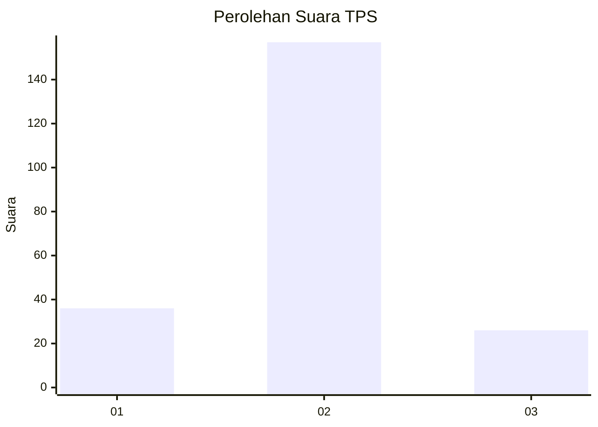
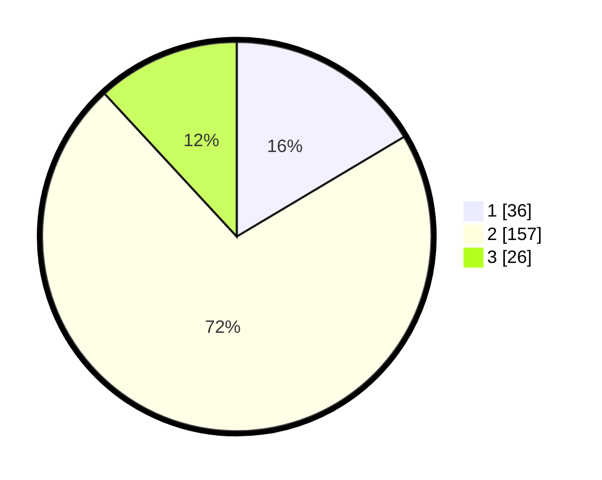

# Hasil

## Grafik

## Tabel

| No. | Nama Paslon    | Suara | Suara (raw) | Persentase |
|:--- |:-------------- | -----:| -----------:| ----------:|
| 1   | ANIES MUHAIMIN | 36    | [36][p-1]   | 16,44      |
| 2   | PRABOWO GIBRAN | 157   | [157][p-2]  | 71,69      |
| 3   | GANJAR MAHFUD  | 26    | [26][p-3]   | 11,87      |

[p-1]: https://github.com/gigit-pemilu/pemilu-2024-32-jawa-barat/blob/main/pilpres/hitung-suara/sub/32-jawa-barat/sub/13-subang/sub/23-serangpanjang/sub/2001-cijengkol/sub/006-tps/sub/paslon-1.txt
[p-2]: https://github.com/gigit-pemilu/pemilu-2024-32-jawa-barat/blob/main/pilpres/hitung-suara/sub/32-jawa-barat/sub/13-subang/sub/23-serangpanjang/sub/2001-cijengkol/sub/006-tps/sub/paslon-2.txt
[p-3]: https://github.com/gigit-pemilu/pemilu-2024-32-jawa-barat/blob/main/pilpres/hitung-suara/sub/32-jawa-barat/sub/13-subang/sub/23-serangpanjang/sub/2001-cijengkol/sub/006-tps/sub/paslon-3.txt

## Foto C Plano

https://sirekap-obj-formc.kpu.go.id/a9ab/pemilu/ppwp/32/13/23/20/01/3213232001006-20240215-010201--162d1fa0-224d-4e29-a40d-ae6960f89e49.jpg

https://sirekap-obj-formc.kpu.go.id/a9ab/pemilu/ppwp/32/13/23/20/01/3213232001006-20240215-010306--fea9a698-c2ab-45bf-bca0-afdb8dd3015b.jpg

https://sirekap-obj-formc.kpu.go.id/a9ab/pemilu/ppwp/32/13/23/20/01/3213232001006-20240215-010439--48666bab-23b2-4187-861b-a9d81a76375a.jpg

## Metadata

| Key        | Value               |
| ---------- | ------------------- |
| Time Stamp | 2024-02-19 16:00:00 |

