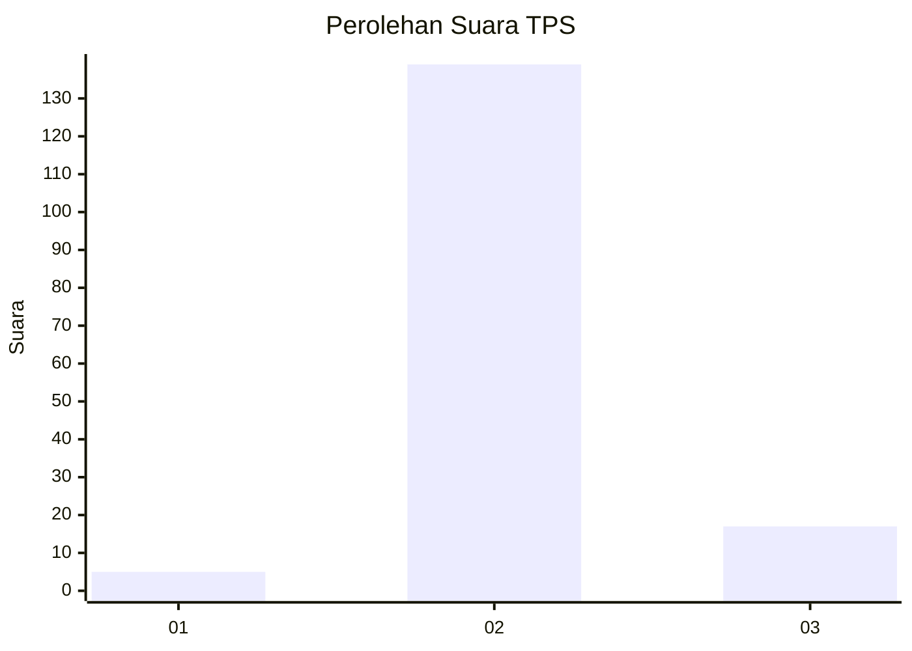
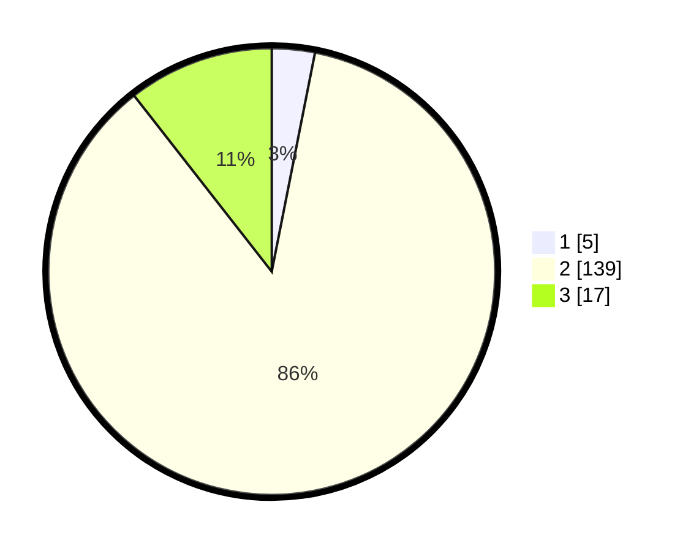

# Hasil

## Grafik

## Tabel

| No. | Nama Paslon    | Suara | Suara (raw) | Persentase |
|:--- |:-------------- | -----:| -----------:| ----------:|
| 1   | ANIES MUHAIMIN | 5     | [5][p-1]    | 3,11       |
| 2   | PRABOWO GIBRAN | 139   | [139][p-2]  | 86,34      |
| 3   | GANJAR MAHFUD  | 17    | [17][p-3]   | 10,56      |

[p-1]: https://github.com/gigit-pemilu/pemilu-2024/blob/main/pilpres/hitung-suara/sub/32-jawa-barat/sub/13-subang/sub/24-sukasari/sub/2001-anggasari/sub/001-tps/sub/paslon-1.txt
[p-2]: https://github.com/gigit-pemilu/pemilu-2024/blob/main/pilpres/hitung-suara/sub/32-jawa-barat/sub/13-subang/sub/24-sukasari/sub/2001-anggasari/sub/001-tps/sub/paslon-2.txt
[p-3]: https://github.com/gigit-pemilu/pemilu-2024/blob/main/pilpres/hitung-suara/sub/32-jawa-barat/sub/13-subang/sub/24-sukasari/sub/2001-anggasari/sub/001-tps/sub/paslon-3.txt

## Foto C Plano

https://sirekap-obj-formc.kpu.go.id/c609/pemilu/ppwp/32/13/24/20/01/3213242001001-20240214-224411--eaeb1f30-50b8-4872-8c98-ba8a30731edb.jpg

https://sirekap-obj-formc.kpu.go.id/c609/pemilu/ppwp/32/13/24/20/01/3213242001001-20240215-015618--4aa1f381-fc3a-483b-873a-8558aaa11c44.jpg

https://sirekap-obj-formc.kpu.go.id/c609/pemilu/ppwp/32/13/24/20/01/3213242001001-20240215-015737--72c2e0f1-8461-452a-a111-f925270c0405.jpg

## Metadata

| Key        | Value               |
| ---------- | ------------------- |
| Time Stamp | 2024-02-19 16:00:00 |

