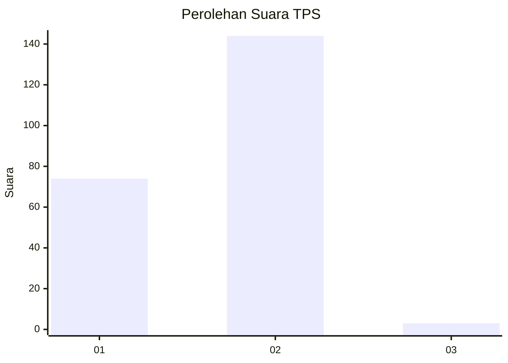
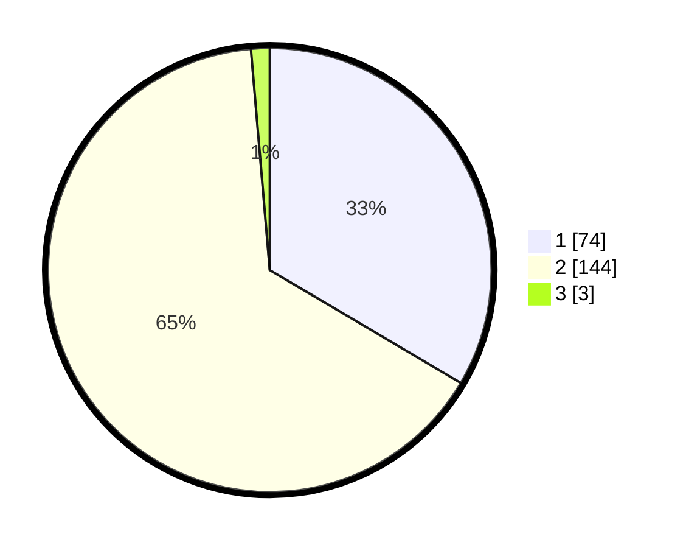

# Hasil

## Grafik

## Tabel

| No. | Nama Paslon    | Suara | Suara (raw) | Persentase |
|:--- |:-------------- | -----:| -----------:| ----------:|
| 1   | ANIES MUHAIMIN | 74    | [74][p-1]   | 33,48      |
| 2   | PRABOWO GIBRAN | 144   | [144][p-2]  | 65,16      |
| 3   | GANJAR MAHFUD  | 3     | [3][p-3]    | 1,36       |

[p-1]: https://github.com/gigit-pemilu/pemilu-2024/blob/main/pilpres/hitung-suara/sub/32-jawa-barat/sub/13-subang/sub/26-kasomalang/sub/2001-sindangsari/sub/009-tps/sub/paslon-1.txt
[p-2]: https://github.com/gigit-pemilu/pemilu-2024/blob/main/pilpres/hitung-suara/sub/32-jawa-barat/sub/13-subang/sub/26-kasomalang/sub/2001-sindangsari/sub/009-tps/sub/paslon-2.txt
[p-3]: https://github.com/gigit-pemilu/pemilu-2024/blob/main/pilpres/hitung-suara/sub/32-jawa-barat/sub/13-subang/sub/26-kasomalang/sub/2001-sindangsari/sub/009-tps/sub/paslon-3.txt

## Foto C Plano

https://sirekap-obj-formc.kpu.go.id/a369/pemilu/ppwp/32/13/26/20/01/3213262001009-20240214-230700--c6c4eef5-4d79-4c96-a517-8ef439f7e860.jpg

https://sirekap-obj-formc.kpu.go.id/a369/pemilu/ppwp/32/13/26/20/01/3213262001009-20240214-230752--96ae125e-fc04-468a-a02a-9d7f58157a93.jpg

https://sirekap-obj-formc.kpu.go.id/a369/pemilu/ppwp/32/13/26/20/01/3213262001009-20240214-230926--616163ba-cad2-4384-92cc-925ffa629f55.jpg

## Metadata

| Key        | Value               |
| ---------- | ------------------- |
| Time Stamp | 2024-02-19 18:00:00 |

